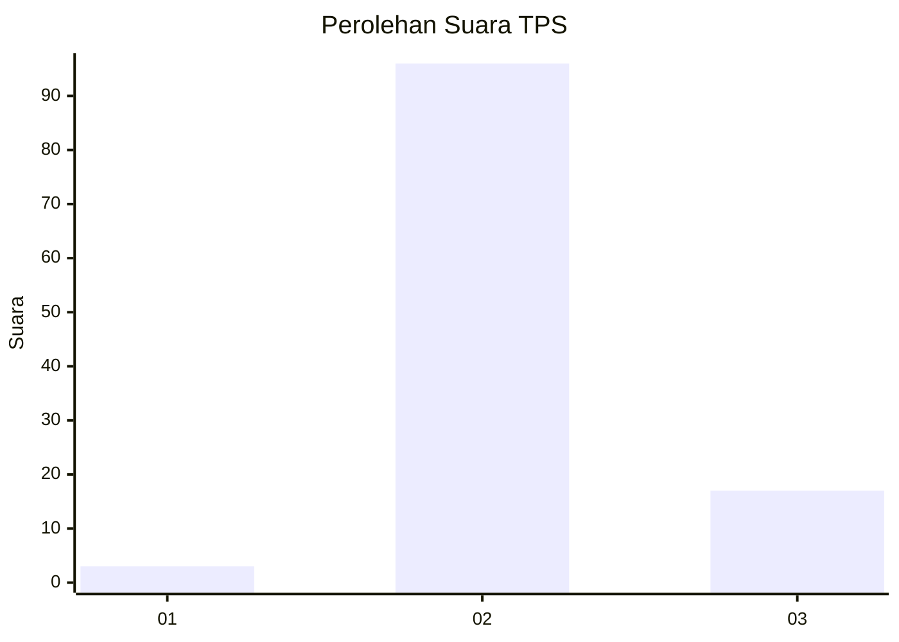
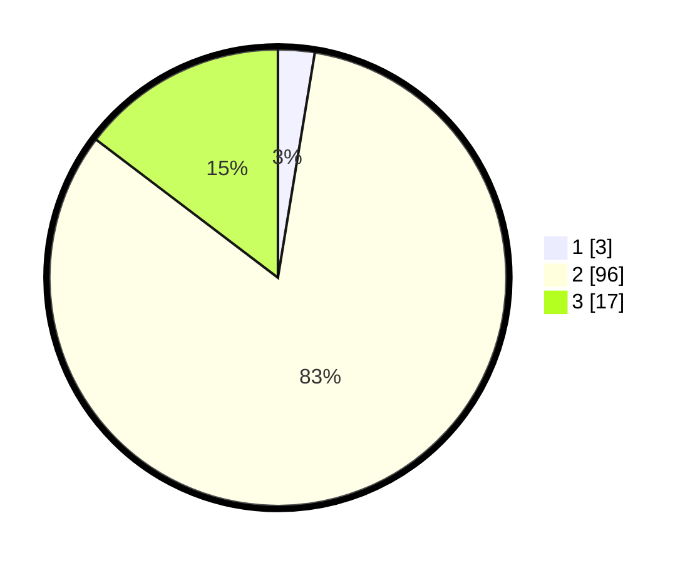

# Hasil

## Grafik

## Tabel

| No. | Nama Paslon    | Suara | Suara (raw) | Persentase |
|:--- |:-------------- | -----:| -----------:| ----------:|
| 1   | ANIES MUHAIMIN | 3     | [3][p-1]    | 2,59       |
| 2   | PRABOWO GIBRAN | 96    | [96][p-2]   | 82,76      |
| 3   | GANJAR MAHFUD  | 17    | [17][p-3]   | 14,66      |

[p-1]: https://github.com/gigit-pemilu/pemilu-2024/blob/main/pilpres/hitung-suara/sub/12-sumatera-utara/sub/14-nias-selatan/sub/03-lahusa/sub/2026-sinar-baru-darodaro/sub/001-tps/sub/paslon-1.txt
[p-2]: https://github.com/gigit-pemilu/pemilu-2024/blob/main/pilpres/hitung-suara/sub/12-sumatera-utara/sub/14-nias-selatan/sub/03-lahusa/sub/2026-sinar-baru-darodaro/sub/001-tps/sub/paslon-2.txt
[p-3]: https://github.com/gigit-pemilu/pemilu-2024/blob/main/pilpres/hitung-suara/sub/12-sumatera-utara/sub/14-nias-selatan/sub/03-lahusa/sub/2026-sinar-baru-darodaro/sub/001-tps/sub/paslon-3.txt

## Foto C Plano

https://sirekap-obj-formc.kpu.go.id/cca5/pemilu/ppwp/12/14/03/20/26/1214032026001-20240215-000546--1c6f69b4-9569-4723-ad38-9a5d5cfdae23.jpg

https://sirekap-obj-formc.kpu.go.id/cca5/pemilu/ppwp/12/14/03/20/26/1214032026001-20240215-001306--40166b41-2edb-40d3-8ec3-a1b0605194db.jpg

https://sirekap-obj-formc.kpu.go.id/cca5/pemilu/ppwp/12/14/03/20/26/1214032026001-20240215-001654--4b7baa56-5d4c-408b-84e4-e05795928ac6.jpg

## Metadata

| Key        | Value               |
| ---------- | ------------------- |
| Time Stamp | 2024-02-15 15:30:25 |

