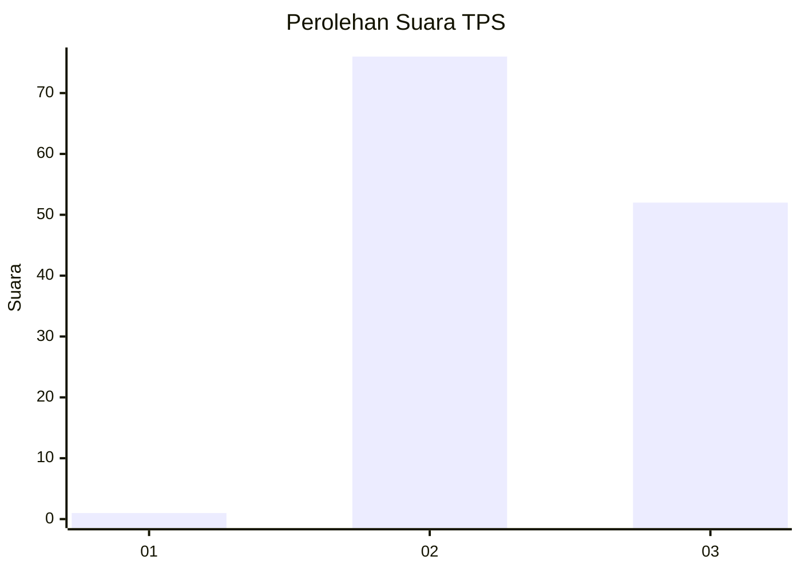
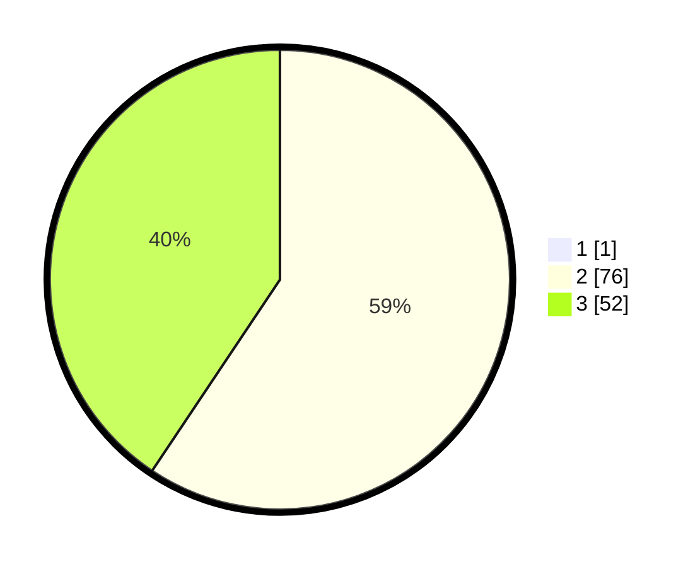

# Hasil

## Grafik

## Tabel

| No. | Nama Paslon    | Suara | Suara (raw) | Persentase |
|:--- |:-------------- | -----:| -----------:| ----------:|
| 1   | ANIES MUHAIMIN | 1     | [1][p-1]    | 0,78       |
| 2   | PRABOWO GIBRAN | 76    | [76][p-2]   | 58,91      |
| 3   | GANJAR MAHFUD  | 52    | [52][p-3]   | 40,31      |

[p-1]: https://github.com/gigit-pemilu/pemilu-2024/blob/main/pilpres/hitung-suara/sub/12-sumatera-utara/sub/14-nias-selatan/sub/03-lahusa/sub/2027-hiliorudua/sub/002-tps/sub/paslon-1.txt
[p-2]: https://github.com/gigit-pemilu/pemilu-2024/blob/main/pilpres/hitung-suara/sub/12-sumatera-utara/sub/14-nias-selatan/sub/03-lahusa/sub/2027-hiliorudua/sub/002-tps/sub/paslon-2.txt
[p-3]: https://github.com/gigit-pemilu/pemilu-2024/blob/main/pilpres/hitung-suara/sub/12-sumatera-utara/sub/14-nias-selatan/sub/03-lahusa/sub/2027-hiliorudua/sub/002-tps/sub/paslon-3.txt

## Foto C Plano

https://sirekap-obj-formc.kpu.go.id/02a3/pemilu/ppwp/12/14/03/20/27/1214032027002-20240215-095814--049ba7b4-e730-48e6-bcba-ce4a1c6e1816.jpg

https://sirekap-obj-formc.kpu.go.id/02a3/pemilu/ppwp/12/14/03/20/27/1214032027002-20240215-095920--37817aec-2f70-41d9-bb11-835312b45833.jpg

https://sirekap-obj-formc.kpu.go.id/02a3/pemilu/ppwp/12/14/03/20/27/1214032027002-20240215-100026--56aaff1a-94a2-4a1b-b9f9-d5bf6a9cd745.jpg

## Metadata

| Key        | Value               |
| ---------- | ------------------- |
| Time Stamp | 2024-02-15 18:30:25 |

