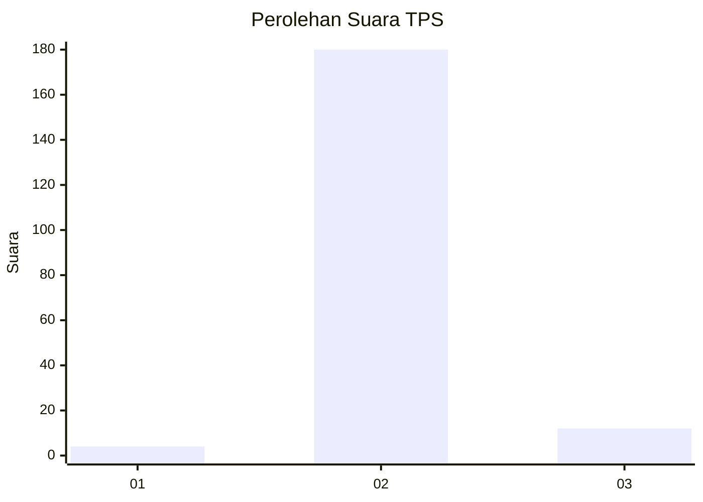
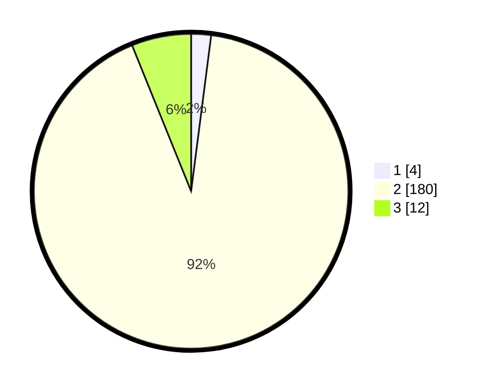

# Hasil

## Grafik

## Tabel

| No. | Nama Paslon    | Suara | Suara (raw) | Persentase |
|:--- |:-------------- | -----:| -----------:| ----------:|
| 1   | ANIES MUHAIMIN | 4     | [4][p-1]    | 2,04       |
| 2   | PRABOWO GIBRAN | 180   | [180][p-2]  | 91,84      |
| 3   | GANJAR MAHFUD  | 12    | [12][p-3]   | 6,12       |

[p-1]: https://github.com/gigit-pemilu/pemilu-2024-12-sumatera-utara/blob/main/pilpres/hitung-suara/sub/12-sumatera-utara/sub/14-nias-selatan/sub/03-lahusa/sub/2038-hilinawalo-balaekha/sub/001-tps/sub/paslon-1.txt
[p-2]: https://github.com/gigit-pemilu/pemilu-2024-12-sumatera-utara/blob/main/pilpres/hitung-suara/sub/12-sumatera-utara/sub/14-nias-selatan/sub/03-lahusa/sub/2038-hilinawalo-balaekha/sub/001-tps/sub/paslon-2.txt
[p-3]: https://github.com/gigit-pemilu/pemilu-2024-12-sumatera-utara/blob/main/pilpres/hitung-suara/sub/12-sumatera-utara/sub/14-nias-selatan/sub/03-lahusa/sub/2038-hilinawalo-balaekha/sub/001-tps/sub/paslon-3.txt

## Foto C Plano

https://sirekap-obj-formc.kpu.go.id/576f/pemilu/ppwp/12/14/03/20/38/1214032038001-20240214-155127--05d93727-4b17-4d5a-b97e-3e6ee69b1d8c.jpg

https://sirekap-obj-formc.kpu.go.id/576f/pemilu/ppwp/12/14/03/20/38/1214032038001-20240214-155446--ddfa1834-f1cb-4100-8cde-abbb95fc003b.jpg

https://sirekap-obj-formc.kpu.go.id/576f/pemilu/ppwp/12/14/03/20/38/1214032038001-20240214-155311--2c31a418-5de0-44ad-b255-1d7068c729e6.jpg

## Metadata

| Key        | Value               |
| ---------- | ------------------- |
| Time Stamp | 2024-02-15 00:41:44 |

