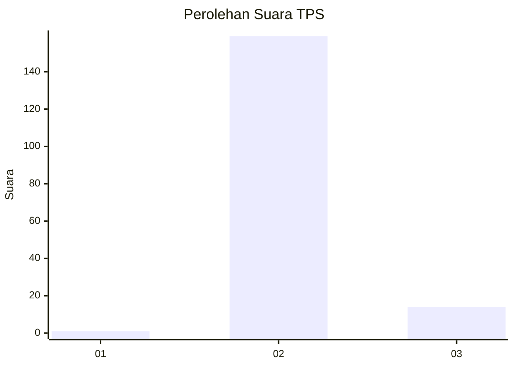
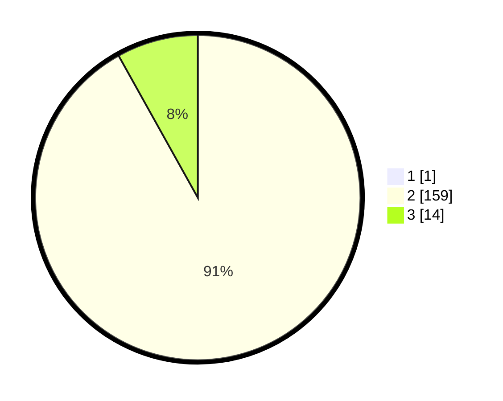

# Hasil

## Grafik

## Tabel

| No. | Nama Paslon    | Suara | Suara (raw) | Persentase |
|:--- |:-------------- | -----:| -----------:| ----------:|
| 1   | ANIES MUHAIMIN | 1     | [1][p-1]    | 0,57       |
| 2   | PRABOWO GIBRAN | 159   | [159][p-2]  | 91,38      |
| 3   | GANJAR MAHFUD  | 14    | [14][p-3]   | 8,05       |

[p-1]: https://github.com/gigit-pemilu/pemilu-2024-12-sumatera-utara/blob/main/pilpres/hitung-suara/sub/12-sumatera-utara/sub/14-nias-selatan/sub/03-lahusa/sub/2043-sinar-baho/sub/001-tps/sub/paslon-1.txt
[p-2]: https://github.com/gigit-pemilu/pemilu-2024-12-sumatera-utara/blob/main/pilpres/hitung-suara/sub/12-sumatera-utara/sub/14-nias-selatan/sub/03-lahusa/sub/2043-sinar-baho/sub/001-tps/sub/paslon-2.txt
[p-3]: https://github.com/gigit-pemilu/pemilu-2024-12-sumatera-utara/blob/main/pilpres/hitung-suara/sub/12-sumatera-utara/sub/14-nias-selatan/sub/03-lahusa/sub/2043-sinar-baho/sub/001-tps/sub/paslon-3.txt

## Foto C Plano

https://sirekap-obj-formc.kpu.go.id/cd5d/pemilu/ppwp/12/14/03/20/43/1214032043001-20240214-160054--e0d7a754-8c6b-4384-9652-63d3ba07429d.jpg

https://sirekap-obj-formc.kpu.go.id/cd5d/pemilu/ppwp/12/14/03/20/43/1214032043001-20240214-160120--9e22456e-8903-4022-8891-a6eb87d9d98d.jpg

https://sirekap-obj-formc.kpu.go.id/cd5d/pemilu/ppwp/12/14/03/20/43/1214032043001-20240214-155921--b8f3c07f-82de-4432-a964-2bc29e3d7d0f.jpg

## Metadata

| Key        | Value               |
| ---------- | ------------------- |
| Time Stamp | 2024-02-15 00:41:44 |

