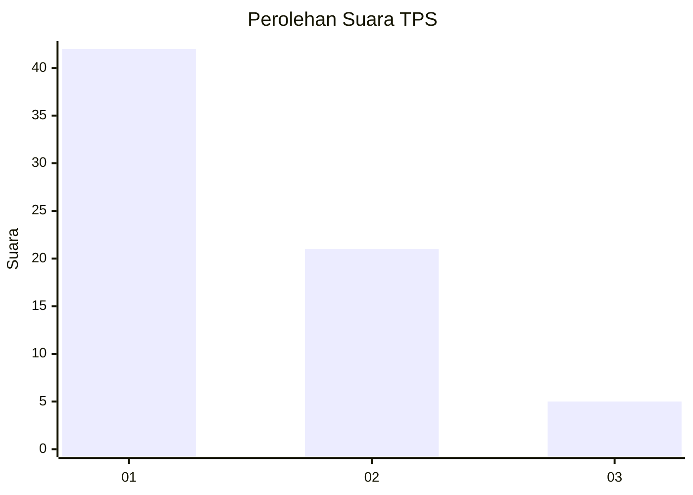
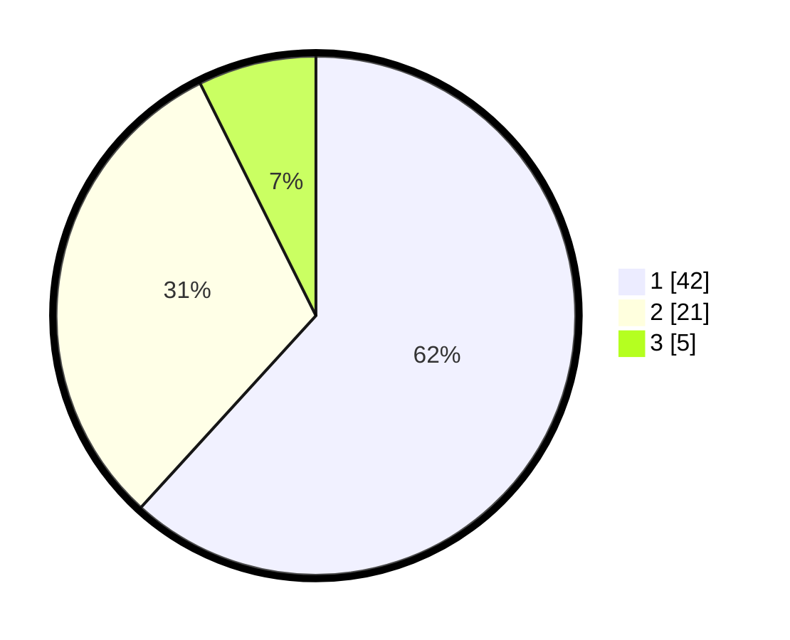

# Hasil

## Grafik

## Tabel

| No. | Nama Paslon    | Suara | Suara (raw) | Persentase |
|:--- |:-------------- | -----:| -----------:| ----------:|
| 1   | ANIES MUHAIMIN | 42    | [42][p-1]   | 61,76      |
| 2   | PRABOWO GIBRAN | 21    | [21][p-2]   | 30,88      |
| 3   | GANJAR MAHFUD  | 5     | [5][p-3]    | 7,35       |

[p-1]: https://github.com/gigit-pemilu/pemilu-2024-12-sumatera-utara/blob/main/pilpres/hitung-suara/sub/12-sumatera-utara/sub/14-nias-selatan/sub/04-hibala/sub/2008-lumbui-melayu/sub/001-tps/sub/paslon-1.txt
[p-2]: https://github.com/gigit-pemilu/pemilu-2024-12-sumatera-utara/blob/main/pilpres/hitung-suara/sub/12-sumatera-utara/sub/14-nias-selatan/sub/04-hibala/sub/2008-lumbui-melayu/sub/001-tps/sub/paslon-2.txt
[p-3]: https://github.com/gigit-pemilu/pemilu-2024-12-sumatera-utara/blob/main/pilpres/hitung-suara/sub/12-sumatera-utara/sub/14-nias-selatan/sub/04-hibala/sub/2008-lumbui-melayu/sub/001-tps/sub/paslon-3.txt

## Foto C Plano

https://sirekap-obj-formc.kpu.go.id/5b16/pemilu/ppwp/12/14/04/20/08/1214042008001-20240215-002811--7a74c87d-5805-4026-8648-847e53d1b531.jpg

https://sirekap-obj-formc.kpu.go.id/5b16/pemilu/ppwp/12/14/04/20/08/1214042008001-20240215-002846--e2447c3b-1eef-4f36-aec8-7c635721f909.jpg

## Metadata

| Key        | Value               |
| ---------- | ------------------- |
| Time Stamp | 2024-02-15 09:00:24 |

