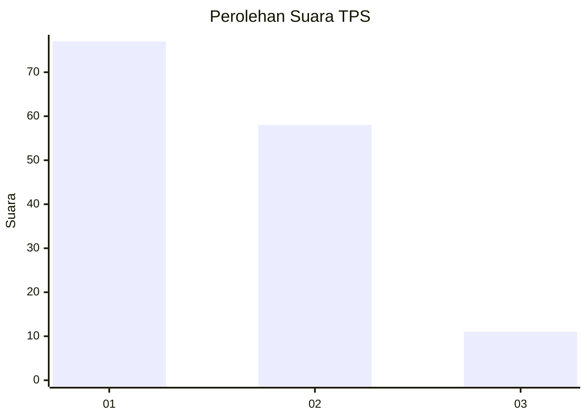
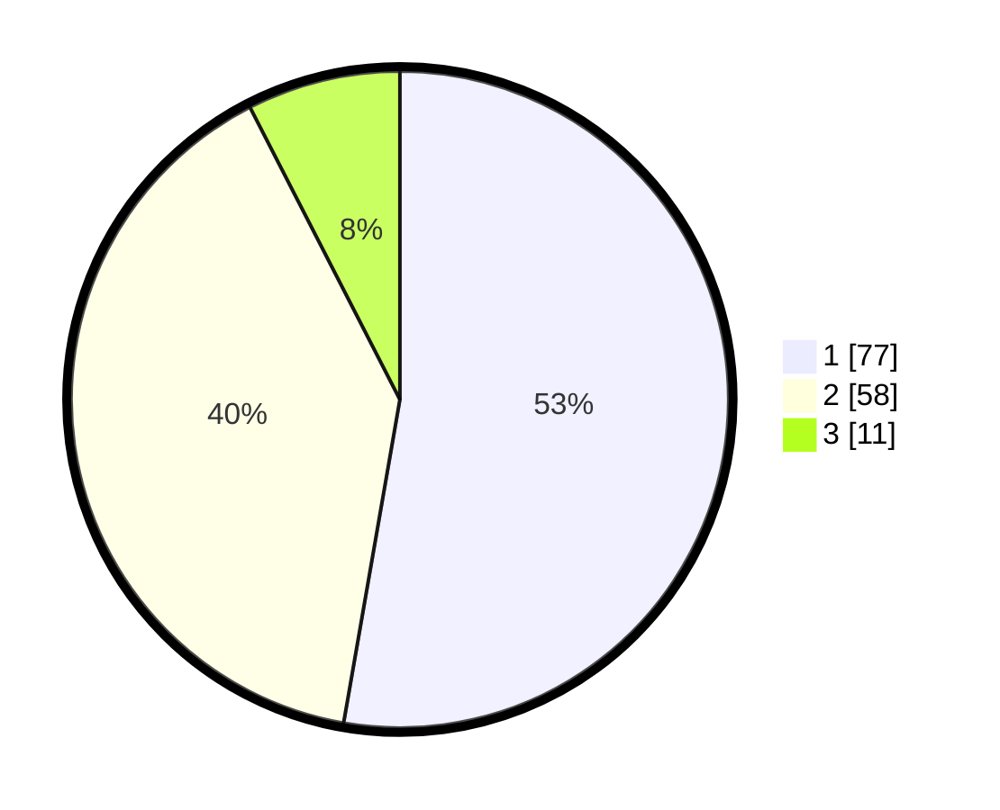

# Hasil

## Grafik

## Tabel

| No. | Nama Paslon    | Suara | Suara (raw) | Persentase |
|:--- |:-------------- | -----:| -----------:| ----------:|
| 1   | ANIES MUHAIMIN | 77    | [77][p-1]   | 52,74      |
| 2   | PRABOWO GIBRAN | 58    | [58][p-2]   | 39,73      |
| 3   | GANJAR MAHFUD  | 11    | [11][p-3]   | 7,53       |

[p-1]: https://github.com/gigit-pemilu/pemilu-2024/blob/main/pilpres/hitung-suara/sub/12-sumatera-utara/sub/14-nias-selatan/sub/05-pulau-pulau-batu/sub/1046-pasar-pulau-tello/sub/002-tps/sub/paslon-1.txt
[p-2]: https://github.com/gigit-pemilu/pemilu-2024/blob/main/pilpres/hitung-suara/sub/12-sumatera-utara/sub/14-nias-selatan/sub/05-pulau-pulau-batu/sub/1046-pasar-pulau-tello/sub/002-tps/sub/paslon-2.txt
[p-3]: https://github.com/gigit-pemilu/pemilu-2024/blob/main/pilpres/hitung-suara/sub/12-sumatera-utara/sub/14-nias-selatan/sub/05-pulau-pulau-batu/sub/1046-pasar-pulau-tello/sub/002-tps/sub/paslon-3.txt

## Foto C Plano

https://sirekap-obj-formc.kpu.go.id/a7a2/pemilu/ppwp/12/14/05/10/46/1214051046002-20240214-204725--78de321c-0778-4bba-8a0d-d572548fe950.jpg

https://sirekap-obj-formc.kpu.go.id/a7a2/pemilu/ppwp/12/14/05/10/46/1214051046002-20240214-155358--0787afee-c426-4200-9f5f-06408dbdea21.jpg

https://sirekap-obj-formc.kpu.go.id/a7a2/pemilu/ppwp/12/14/05/10/46/1214051046002-20240214-204659--8714fb8b-7c88-4539-90a6-15ab6620305b.jpg

## Metadata

| Key        | Value               |
| ---------- | ------------------- |
| Time Stamp | 2024-02-15 19:30:26 |

