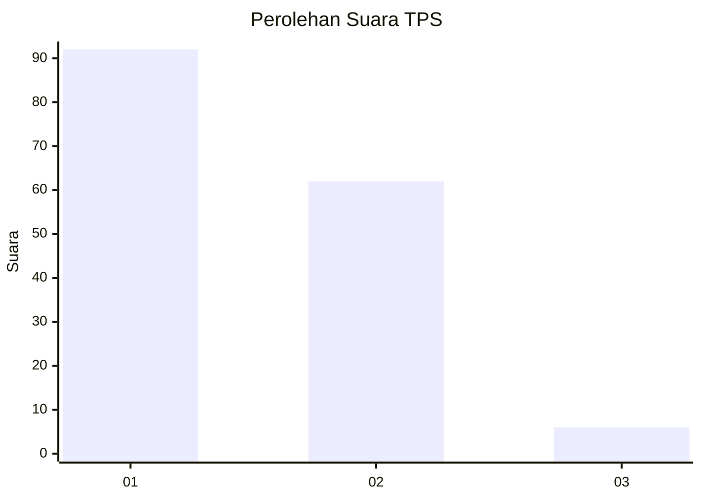
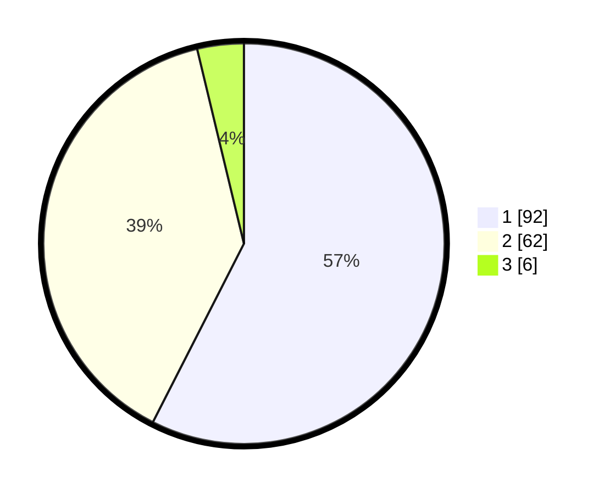

# Hasil

## Grafik

## Tabel

| No. | Nama Paslon    | Suara | Suara (raw) | Persentase |
|:--- |:-------------- | -----:| -----------:| ----------:|
| 1   | ANIES MUHAIMIN | 92    | [92][p-1]   | 57,50      |
| 2   | PRABOWO GIBRAN | 62    | [62][p-2]   | 38,75      |
| 3   | GANJAR MAHFUD  | 6     | [6][p-3]    | 3,75       |

[p-1]: https://github.com/gigit-pemilu/pemilu-2024/blob/main/pilpres/hitung-suara/sub/12-sumatera-utara/sub/14-nias-selatan/sub/05-pulau-pulau-batu/sub/1046-pasar-pulau-tello/sub/004-tps/sub/paslon-1.txt
[p-2]: https://github.com/gigit-pemilu/pemilu-2024/blob/main/pilpres/hitung-suara/sub/12-sumatera-utara/sub/14-nias-selatan/sub/05-pulau-pulau-batu/sub/1046-pasar-pulau-tello/sub/004-tps/sub/paslon-2.txt
[p-3]: https://github.com/gigit-pemilu/pemilu-2024/blob/main/pilpres/hitung-suara/sub/12-sumatera-utara/sub/14-nias-selatan/sub/05-pulau-pulau-batu/sub/1046-pasar-pulau-tello/sub/004-tps/sub/paslon-3.txt

## Foto C Plano

https://sirekap-obj-formc.kpu.go.id/2351/pemilu/ppwp/12/14/05/10/46/1214051046004-20240215-031028--1f73933c-a793-4238-aa14-9e4d7da7fd8c.jpg

https://sirekap-obj-formc.kpu.go.id/2351/pemilu/ppwp/12/14/05/10/46/1214051046004-20240215-031218--5d822703-f08b-472b-9669-2bd488d972f7.jpg

https://sirekap-obj-formc.kpu.go.id/2351/pemilu/ppwp/12/14/05/10/46/1214051046004-20240215-031321--36ad1066-abfc-4d55-8ab8-3107e9dad1dc.jpg

## Metadata

| Key        | Value               |
| ---------- | ------------------- |
| Time Stamp | 2024-02-15 23:29:50 |

