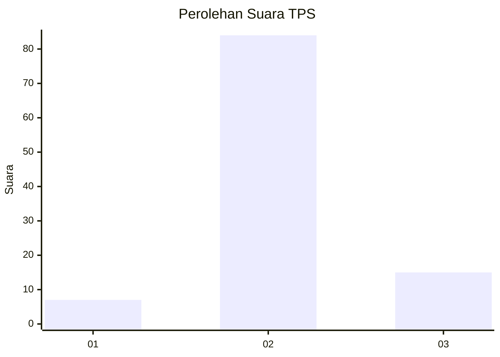
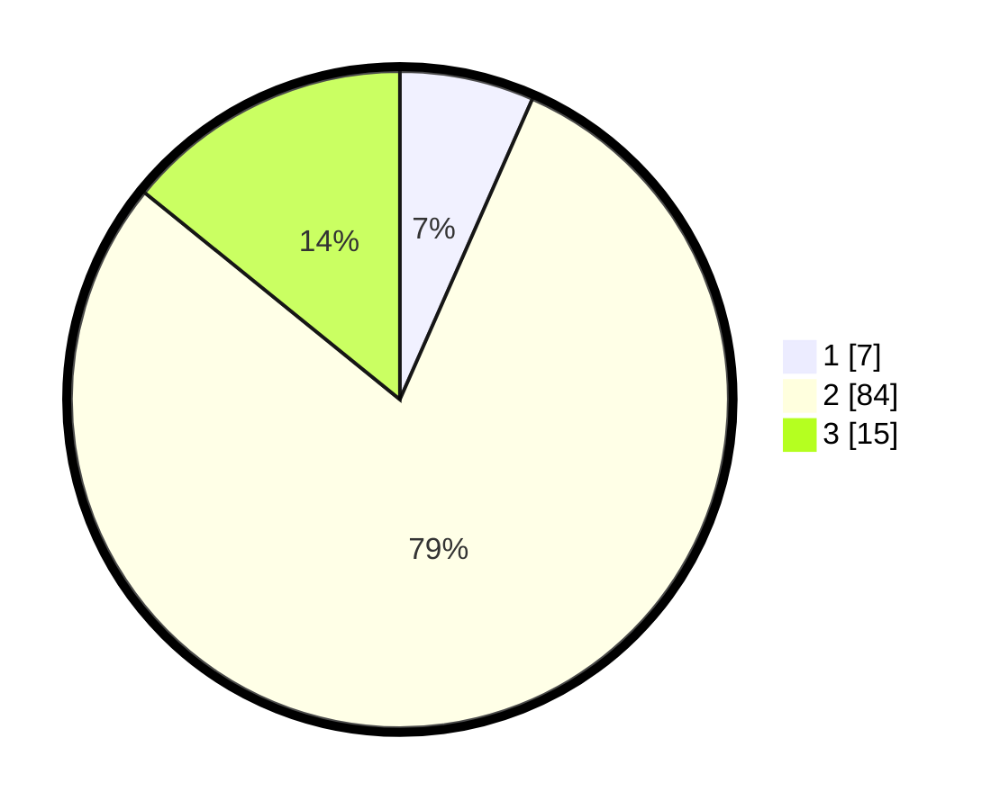

# Hasil

## Grafik

## Tabel

| No. | Nama Paslon    | Suara | Suara (raw) | Persentase |
|:--- |:-------------- | -----:| -----------:| ----------:|
| 1   | ANIES MUHAIMIN | 7     | [7][p-1]    | 6,60       |
| 2   | PRABOWO GIBRAN | 84    | [84][p-2]   | 79,25      |
| 3   | GANJAR MAHFUD  | 15    | [15][p-3]   | 14,15      |

[p-1]: https://github.com/gigit-pemilu/pemilu-2024/blob/main/pilpres/hitung-suara/sub/12-sumatera-utara/sub/14-nias-selatan/sub/05-pulau-pulau-batu/sub/2005-loboi/sub/001-tps/sub/paslon-1.txt
[p-2]: https://github.com/gigit-pemilu/pemilu-2024/blob/main/pilpres/hitung-suara/sub/12-sumatera-utara/sub/14-nias-selatan/sub/05-pulau-pulau-batu/sub/2005-loboi/sub/001-tps/sub/paslon-2.txt
[p-3]: https://github.com/gigit-pemilu/pemilu-2024/blob/main/pilpres/hitung-suara/sub/12-sumatera-utara/sub/14-nias-selatan/sub/05-pulau-pulau-batu/sub/2005-loboi/sub/001-tps/sub/paslon-3.txt

## Foto C Plano

https://sirekap-obj-formc.kpu.go.id/b3f3/pemilu/ppwp/12/14/05/20/05/1214052005001-20240215-025537--047cff6b-2859-4854-9683-3dbdd93f740f.jpg

https://sirekap-obj-formc.kpu.go.id/b3f3/pemilu/ppwp/12/14/05/20/05/1214052005001-20240215-025637--ced8e0ce-31c5-4754-9364-4387891ef72f.jpg

https://sirekap-obj-formc.kpu.go.id/b3f3/pemilu/ppwp/12/14/05/20/05/1214052005001-20240215-025732--040a65dd-aced-4752-ad7b-12a8acae554e.jpg

## Metadata

| Key        | Value               |
| ---------- | ------------------- |
| Time Stamp | 2024-02-15 23:29:50 |

