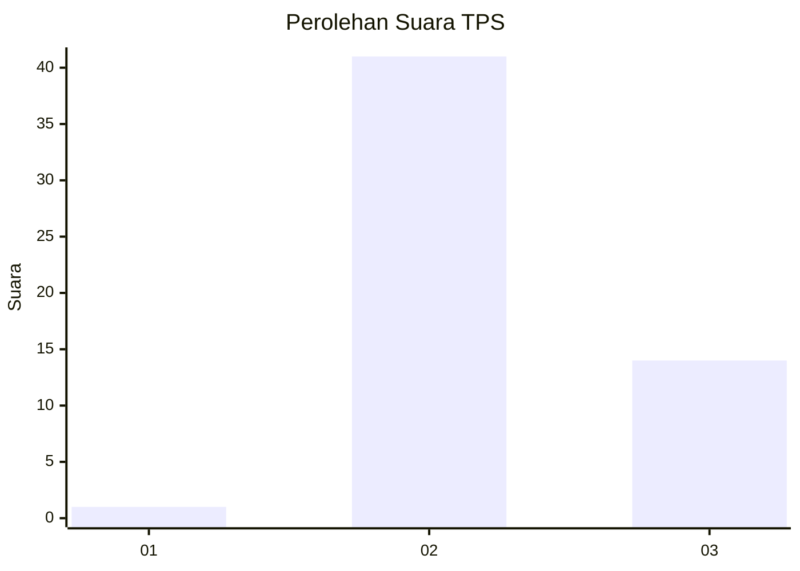
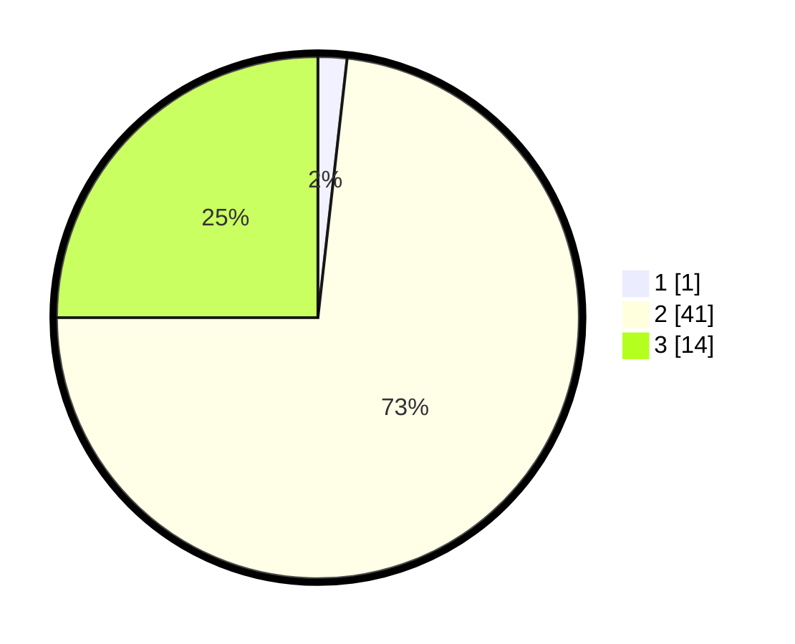

# Hasil

## Grafik

## Tabel

| No. | Nama Paslon    | Suara | Suara (raw) | Persentase |
|:--- |:-------------- | -----:| -----------:| ----------:|
| 1   | ANIES MUHAIMIN | 1     | [1][p-1]    | 1,79       |
| 2   | PRABOWO GIBRAN | 41    | [41][p-2]   | 73,21      |
| 3   | GANJAR MAHFUD  | 14    | [14][p-3]   | 25,00      |

[p-1]: https://github.com/gigit-pemilu/pemilu-2024/blob/main/pilpres/hitung-suara/sub/12-sumatera-utara/sub/14-nias-selatan/sub/05-pulau-pulau-batu/sub/2006-hiliamaodula/sub/001-tps/sub/paslon-1.txt
[p-2]: https://github.com/gigit-pemilu/pemilu-2024/blob/main/pilpres/hitung-suara/sub/12-sumatera-utara/sub/14-nias-selatan/sub/05-pulau-pulau-batu/sub/2006-hiliamaodula/sub/001-tps/sub/paslon-2.txt
[p-3]: https://github.com/gigit-pemilu/pemilu-2024/blob/main/pilpres/hitung-suara/sub/12-sumatera-utara/sub/14-nias-selatan/sub/05-pulau-pulau-batu/sub/2006-hiliamaodula/sub/001-tps/sub/paslon-3.txt

## Foto C Plano

https://sirekap-obj-formc.kpu.go.id/5c3b/pemilu/ppwp/12/14/05/20/06/1214052006001-20240214-214034--38ac6cab-b21f-4727-91cf-5694a9d32348.jpg

https://sirekap-obj-formc.kpu.go.id/5c3b/pemilu/ppwp/12/14/05/20/06/1214052006001-20240214-194737--bdef66fe-ecad-4648-a2bd-2482175e0070.jpg

https://sirekap-obj-formc.kpu.go.id/5c3b/pemilu/ppwp/12/14/05/20/06/1214052006001-20240214-194747--6cb4835b-5b92-4b25-97ea-d61d70cf7f9e.jpg

## Metadata

| Key        | Value               |
| ---------- | ------------------- |
| Time Stamp | 2024-02-15 20:00:44 |

