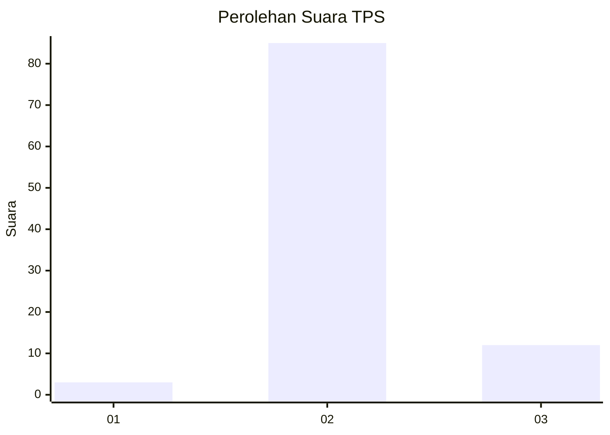
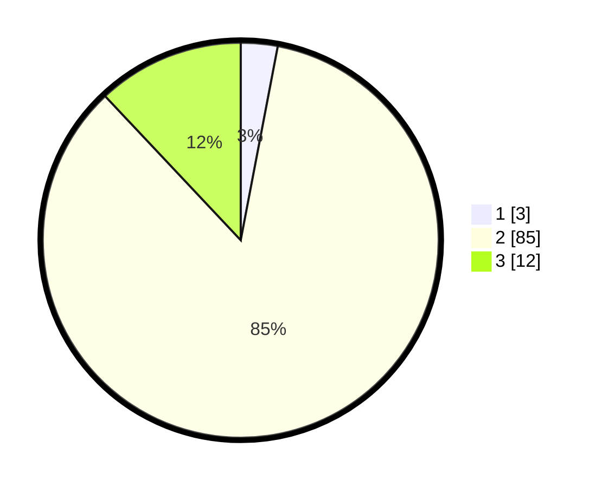

# Hasil

## Grafik

## Tabel

| No. | Nama Paslon    | Suara | Suara (raw) | Persentase |
|:--- |:-------------- | -----:| -----------:| ----------:|
| 1   | ANIES MUHAIMIN | 3     | [3][p-1]    | 3,00       |
| 2   | PRABOWO GIBRAN | 85    | [85][p-2]   | 85,00      |
| 3   | GANJAR MAHFUD  | 12    | [12][p-3]   | 12,00      |

[p-1]: https://github.com/gigit-pemilu/pemilu-2024-12-sumatera-utara/blob/main/pilpres/hitung-suara/sub/12-sumatera-utara/sub/14-nias-selatan/sub/05-pulau-pulau-batu/sub/2008-sifitu-ewali/sub/001-tps/sub/paslon-1.txt
[p-2]: https://github.com/gigit-pemilu/pemilu-2024-12-sumatera-utara/blob/main/pilpres/hitung-suara/sub/12-sumatera-utara/sub/14-nias-selatan/sub/05-pulau-pulau-batu/sub/2008-sifitu-ewali/sub/001-tps/sub/paslon-2.txt
[p-3]: https://github.com/gigit-pemilu/pemilu-2024-12-sumatera-utara/blob/main/pilpres/hitung-suara/sub/12-sumatera-utara/sub/14-nias-selatan/sub/05-pulau-pulau-batu/sub/2008-sifitu-ewali/sub/001-tps/sub/paslon-3.txt

## Foto C Plano

https://sirekap-obj-formc.kpu.go.id/b1c5/pemilu/ppwp/12/14/05/20/08/1214052008001-20240215-052705--45ac24a9-8b04-48d3-ab44-2959b994fcd8.jpg

https://sirekap-obj-formc.kpu.go.id/b1c5/pemilu/ppwp/12/14/05/20/08/1214052008001-20240215-052722--de74fd44-ea0e-4638-a48b-c3158a42fdbb.jpg

https://sirekap-obj-formc.kpu.go.id/b1c5/pemilu/ppwp/12/14/05/20/08/1214052008001-20240215-052732--7674c723-80b8-457b-810f-ed5d2dcc7aab.jpg

## Metadata

| Key        | Value               |
| ---------- | ------------------- |
| Time Stamp | 2024-02-15 19:00:26 |

