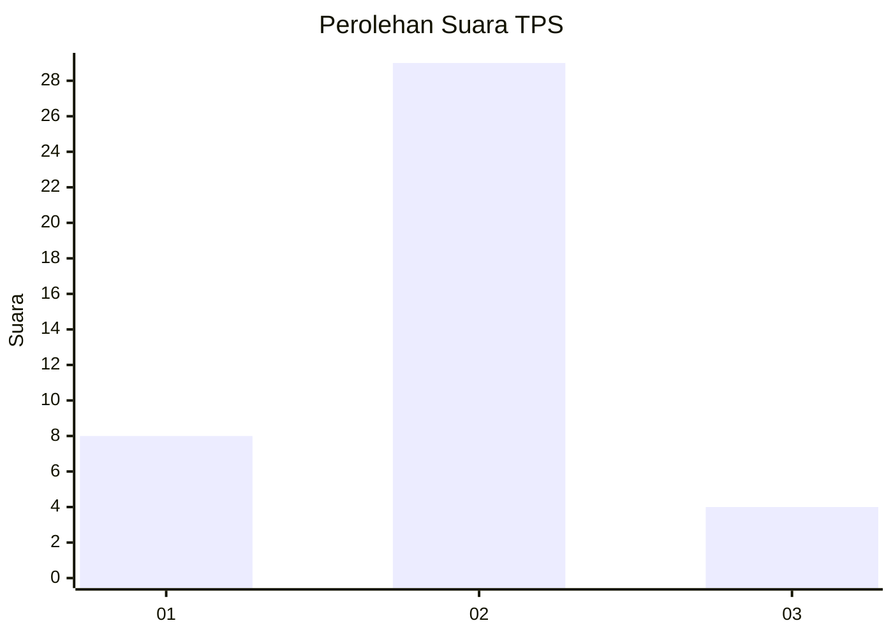
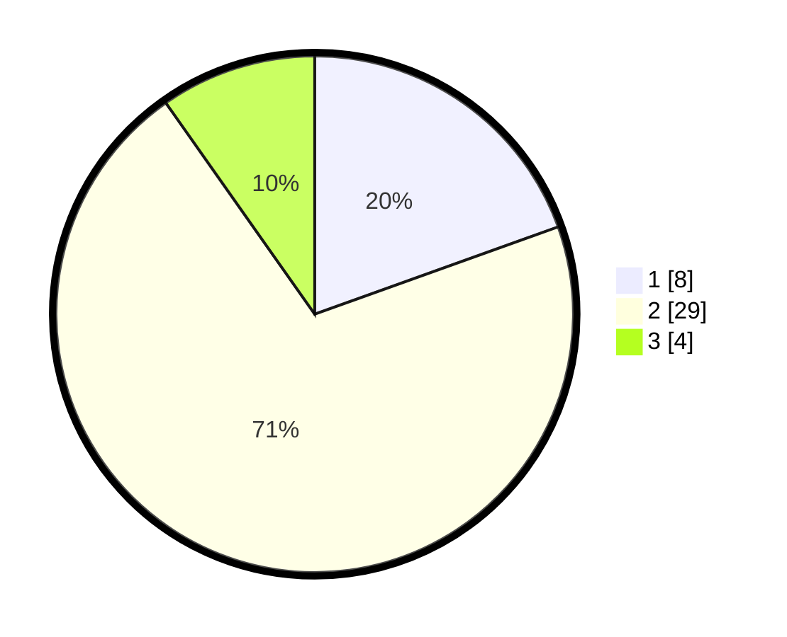

# Hasil

## Grafik

## Tabel

| No. | Nama Paslon    | Suara | Suara (raw) | Persentase |
|:--- |:-------------- | -----:| -----------:| ----------:|
| 1   | ANIES MUHAIMIN | 8     | [8][p-1]    | 19,51      |
| 2   | PRABOWO GIBRAN | 29    | [29][p-2]   | 70,73      |
| 3   | GANJAR MAHFUD  | 4     | [4][p-3]    | 9,76       |

[p-1]: https://github.com/gigit-pemilu/pemilu-2024-12-sumatera-utara/blob/main/pilpres/hitung-suara/sub/12-sumatera-utara/sub/14-nias-selatan/sub/05-pulau-pulau-batu/sub/2009-rapa-rapa-melayu/sub/001-tps/sub/paslon-1.txt
[p-2]: https://github.com/gigit-pemilu/pemilu-2024-12-sumatera-utara/blob/main/pilpres/hitung-suara/sub/12-sumatera-utara/sub/14-nias-selatan/sub/05-pulau-pulau-batu/sub/2009-rapa-rapa-melayu/sub/001-tps/sub/paslon-2.txt
[p-3]: https://github.com/gigit-pemilu/pemilu-2024-12-sumatera-utara/blob/main/pilpres/hitung-suara/sub/12-sumatera-utara/sub/14-nias-selatan/sub/05-pulau-pulau-batu/sub/2009-rapa-rapa-melayu/sub/001-tps/sub/paslon-3.txt

## Foto C Plano

https://sirekap-obj-formc.kpu.go.id/fac7/pemilu/ppwp/12/14/05/20/09/1214052009001-20240215-104155--64772203-b14c-4638-bf69-e1eea882de82.jpg

https://sirekap-obj-formc.kpu.go.id/fac7/pemilu/ppwp/12/14/05/20/09/1214052009001-20240215-001149--30cbc966-3802-4b23-8e57-347244568186.jpg

https://sirekap-obj-formc.kpu.go.id/fac7/pemilu/ppwp/12/14/05/20/09/1214052009001-20240215-001316--046d4301-4886-404c-a02c-41e96d96f1ed.jpg

## Metadata

| Key        | Value               |
| ---------- | ------------------- |
| Time Stamp | 2024-02-15 23:29:50 |

