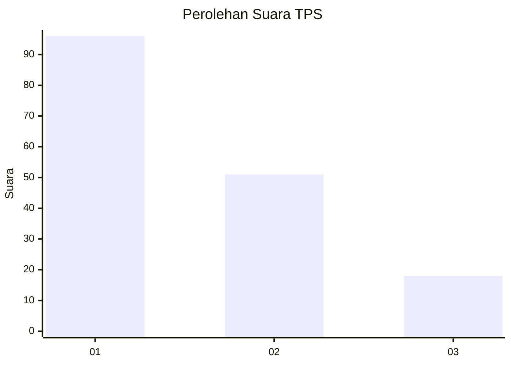
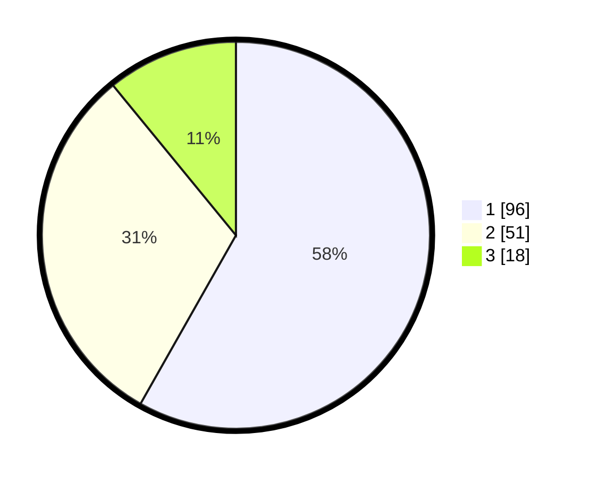

# Hasil

## Grafik

## Tabel

| No. | Nama Paslon    | Suara | Suara (raw) | Persentase |
|:--- |:-------------- | -----:| -----------:| ----------:|
| 1   | ANIES MUHAIMIN | 96    | [96][p-1]   | 58,18      |
| 2   | PRABOWO GIBRAN | 51    | [51][p-2]   | 30,91      |
| 3   | GANJAR MAHFUD  | 18    | [18][p-3]   | 10,91      |

[p-1]: https://github.com/gigit-pemilu/pemilu-2024-12-sumatera-utara/blob/main/pilpres/hitung-suara/sub/12-sumatera-utara/sub/14-nias-selatan/sub/05-pulau-pulau-batu/sub/2010-sinauru/sub/001-tps/sub/paslon-1.txt
[p-2]: https://github.com/gigit-pemilu/pemilu-2024-12-sumatera-utara/blob/main/pilpres/hitung-suara/sub/12-sumatera-utara/sub/14-nias-selatan/sub/05-pulau-pulau-batu/sub/2010-sinauru/sub/001-tps/sub/paslon-2.txt
[p-3]: https://github.com/gigit-pemilu/pemilu-2024-12-sumatera-utara/blob/main/pilpres/hitung-suara/sub/12-sumatera-utara/sub/14-nias-selatan/sub/05-pulau-pulau-batu/sub/2010-sinauru/sub/001-tps/sub/paslon-3.txt

## Foto C Plano

https://sirekap-obj-formc.kpu.go.id/5b3e/pemilu/ppwp/12/14/05/20/10/1214052010001-20240215-021219--c601d125-073d-460c-9890-db09a2857ce9.jpg

https://sirekap-obj-formc.kpu.go.id/5b3e/pemilu/ppwp/12/14/05/20/10/1214052010001-20240215-021318--b694cd21-a2e6-487e-bd76-0018b999fc8b.jpg

https://sirekap-obj-formc.kpu.go.id/5b3e/pemilu/ppwp/12/14/05/20/10/1214052010001-20240215-021423--72129eb9-7a4e-4da4-a516-ac9b0b0c28c5.jpg

## Metadata

| Key        | Value               |
| ---------- | ------------------- |
| Time Stamp | 2024-02-15 20:00:44 |

