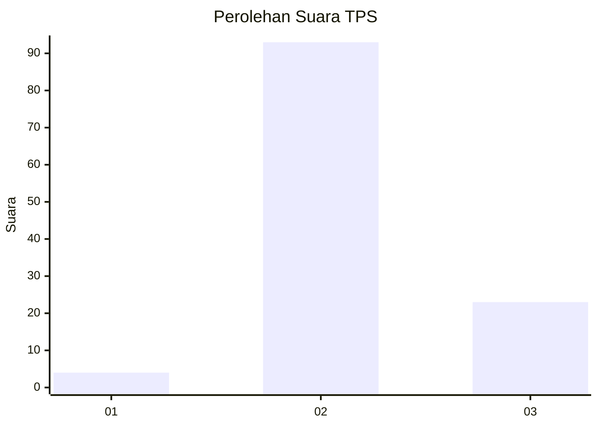
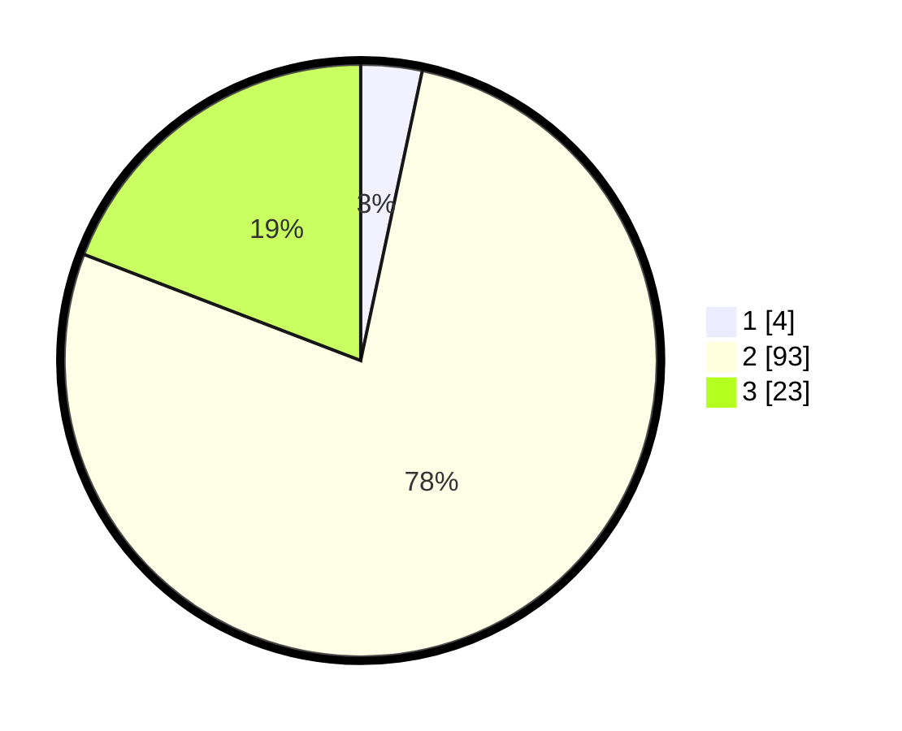

# Hasil

## Grafik

## Tabel

| No. | Nama Paslon    | Suara | Suara (raw) | Persentase |
|:--- |:-------------- | -----:| -----------:| ----------:|
| 1   | ANIES MUHAIMIN | 4     | [4][p-1]    | 3,33       |
| 2   | PRABOWO GIBRAN | 93    | [93][p-2]   | 77,50      |
| 3   | GANJAR MAHFUD  | 23    | [23][p-3]   | 19,17      |

[p-1]: https://github.com/gigit-pemilu/pemilu-2024-12-sumatera-utara/blob/main/pilpres/hitung-suara/sub/12-sumatera-utara/sub/14-nias-selatan/sub/05-pulau-pulau-batu/sub/2013-silima-ewali/sub/002-tps/sub/paslon-1.txt
[p-2]: https://github.com/gigit-pemilu/pemilu-2024-12-sumatera-utara/blob/main/pilpres/hitung-suara/sub/12-sumatera-utara/sub/14-nias-selatan/sub/05-pulau-pulau-batu/sub/2013-silima-ewali/sub/002-tps/sub/paslon-2.txt
[p-3]: https://github.com/gigit-pemilu/pemilu-2024-12-sumatera-utara/blob/main/pilpres/hitung-suara/sub/12-sumatera-utara/sub/14-nias-selatan/sub/05-pulau-pulau-batu/sub/2013-silima-ewali/sub/002-tps/sub/paslon-3.txt

## Foto C Plano

https://sirekap-obj-formc.kpu.go.id/86b7/pemilu/ppwp/12/14/05/20/13/1214052013002-20240215-053803--6e3f07f5-2a9e-4d81-a968-96d59e60d3e2.jpg

https://sirekap-obj-formc.kpu.go.id/86b7/pemilu/ppwp/12/14/05/20/13/1214052013002-20240215-053837--95dbd469-7629-48a6-b4fe-0b01e5568d2a.jpg

https://sirekap-obj-formc.kpu.go.id/86b7/pemilu/ppwp/12/14/05/20/13/1214052013002-20240215-053858--05123bc1-6cd8-4f49-9bf9-40a9d00ae3aa.jpg

## Metadata

| Key        | Value               |
| ---------- | ------------------- |
| Time Stamp | 2024-02-15 23:29:50 |

