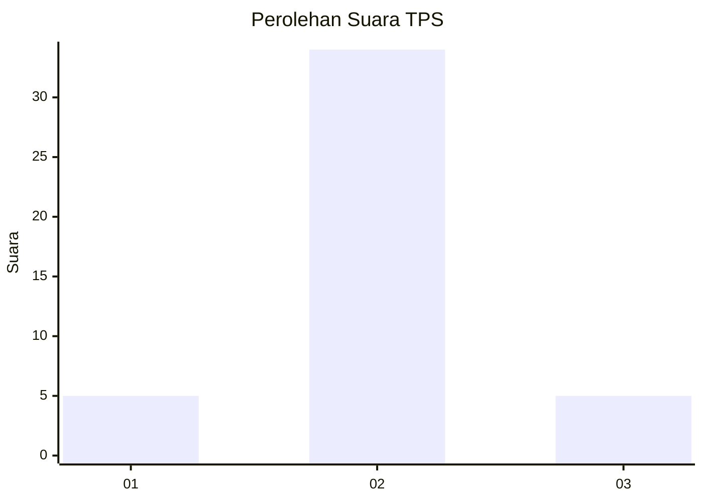
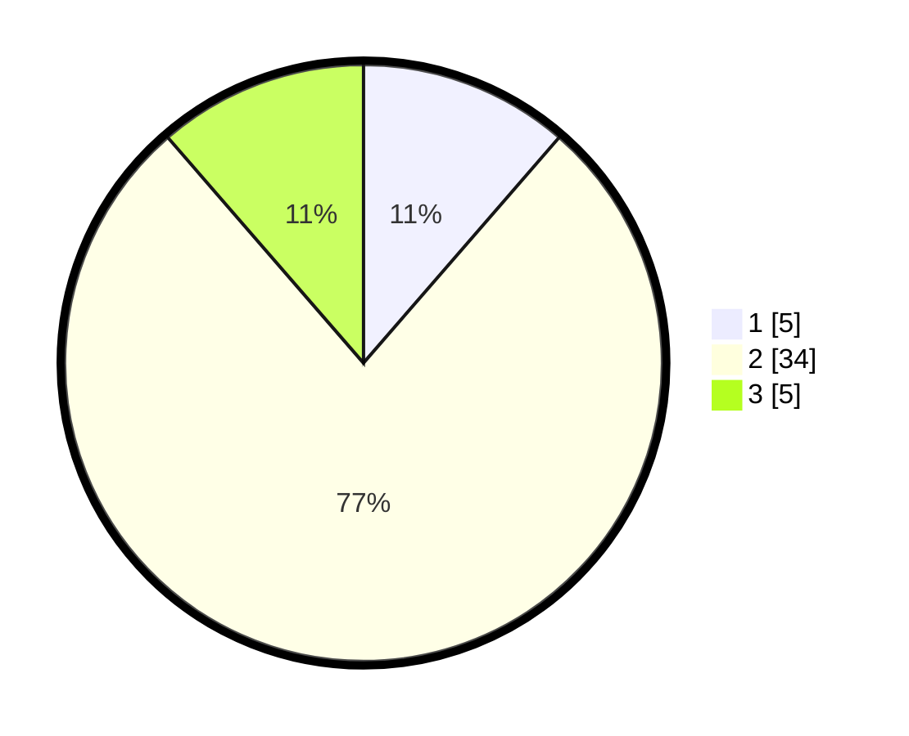

# Hasil

## Grafik

## Tabel

| No. | Nama Paslon    | Suara | Suara (raw) | Persentase |
|:--- |:-------------- | -----:| -----------:| ----------:|
| 1   | ANIES MUHAIMIN | 5     | [5][p-1]    | 11,36      |
| 2   | PRABOWO GIBRAN | 34    | [34][p-2]   | 77,27      |
| 3   | GANJAR MAHFUD  | 5     | [5][p-3]    | 11,36      |

[p-1]: https://github.com/gigit-pemilu/pemilu-2024-12-sumatera-utara/blob/main/pilpres/hitung-suara/sub/12-sumatera-utara/sub/14-nias-selatan/sub/05-pulau-pulau-batu/sub/2027-balogia/sub/002-tps/sub/paslon-1.txt
[p-2]: https://github.com/gigit-pemilu/pemilu-2024-12-sumatera-utara/blob/main/pilpres/hitung-suara/sub/12-sumatera-utara/sub/14-nias-selatan/sub/05-pulau-pulau-batu/sub/2027-balogia/sub/002-tps/sub/paslon-2.txt
[p-3]: https://github.com/gigit-pemilu/pemilu-2024-12-sumatera-utara/blob/main/pilpres/hitung-suara/sub/12-sumatera-utara/sub/14-nias-selatan/sub/05-pulau-pulau-batu/sub/2027-balogia/sub/002-tps/sub/paslon-3.txt

## Foto C Plano

https://sirekap-obj-formc.kpu.go.id/a43b/pemilu/ppwp/12/14/05/20/27/1214052027002-20240215-093705--b17f8f35-47d3-4c37-bd40-2643c41a79d3.jpg

https://sirekap-obj-formc.kpu.go.id/a43b/pemilu/ppwp/12/14/05/20/27/1214052027002-20240215-093838--1301729a-af0f-4c4f-a6ce-756f46e7e2d5.jpg

https://sirekap-obj-formc.kpu.go.id/a43b/pemilu/ppwp/12/14/05/20/27/1214052027002-20240215-093953--af397a9a-bd04-4eaa-b9e6-c30b218b0f63.jpg

## Metadata

| Key        | Value               |
| ---------- | ------------------- |
| Time Stamp | 2024-02-15 23:29:50 |

