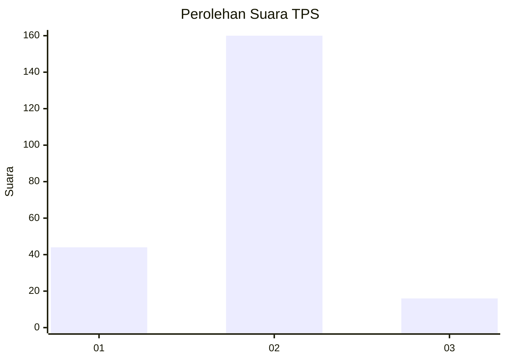
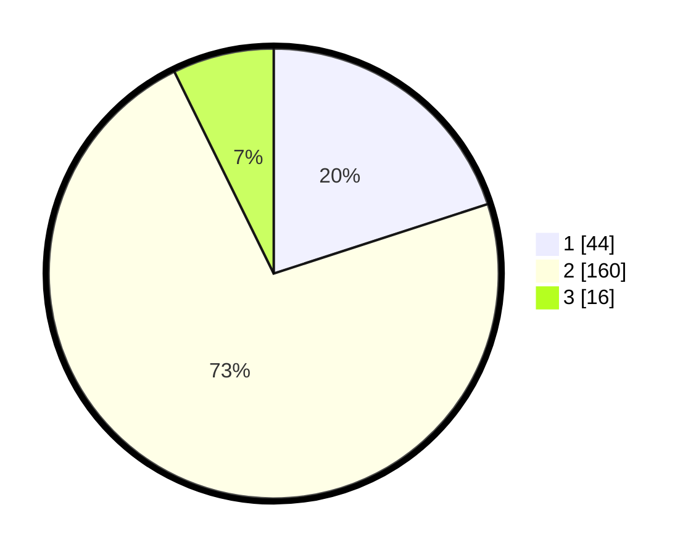

# Hasil

## Grafik

## Tabel

| No. | Nama Paslon    | Suara | Suara (raw) | Persentase |
|:--- |:-------------- | -----:| -----------:| ----------:|
| 1   | ANIES MUHAIMIN | 44    | [44][p-1]   | 20,00      |
| 2   | PRABOWO GIBRAN | 160   | [160][p-2]  | 72,73      |
| 3   | GANJAR MAHFUD  | 16    | [16][p-3]   | 7,27       |

[p-1]: https://github.com/gigit-pemilu/pemilu-2024-12-sumatera-utara/blob/main/pilpres/hitung-suara/sub/12-sumatera-utara/sub/14-nias-selatan/sub/06-teluk-dalam/sub/1008-pasar-teluk-dalam/sub/003-tps/sub/paslon-1.txt
[p-2]: https://github.com/gigit-pemilu/pemilu-2024-12-sumatera-utara/blob/main/pilpres/hitung-suara/sub/12-sumatera-utara/sub/14-nias-selatan/sub/06-teluk-dalam/sub/1008-pasar-teluk-dalam/sub/003-tps/sub/paslon-2.txt
[p-3]: https://github.com/gigit-pemilu/pemilu-2024-12-sumatera-utara/blob/main/pilpres/hitung-suara/sub/12-sumatera-utara/sub/14-nias-selatan/sub/06-teluk-dalam/sub/1008-pasar-teluk-dalam/sub/003-tps/sub/paslon-3.txt

## Foto C Plano

https://sirekap-obj-formc.kpu.go.id/0388/pemilu/ppwp/12/14/06/10/08/1214061008003-20240214-204944--e7311052-5b31-4a2b-913f-4d275db204a0.jpg

https://sirekap-obj-formc.kpu.go.id/0388/pemilu/ppwp/12/14/06/10/08/1214061008003-20240214-222448--086493eb-df14-4d95-a431-adf71a55cf74.jpg

https://sirekap-obj-formc.kpu.go.id/0388/pemilu/ppwp/12/14/06/10/08/1214061008003-20240214-205904--bf648915-bced-45d3-8d18-8784d2c65d60.jpg

## Metadata

| Key        | Value               |
| ---------- | ------------------- |
| Time Stamp | 2024-02-15 15:00:29 |

