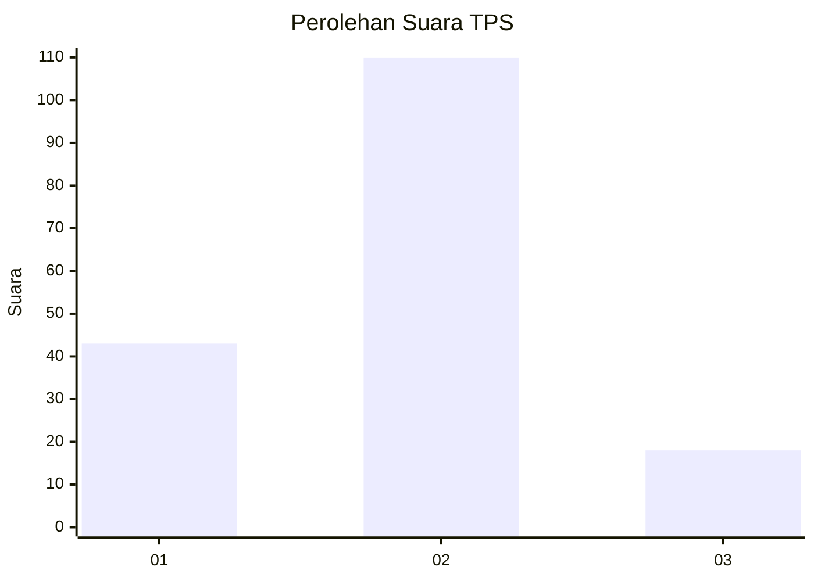
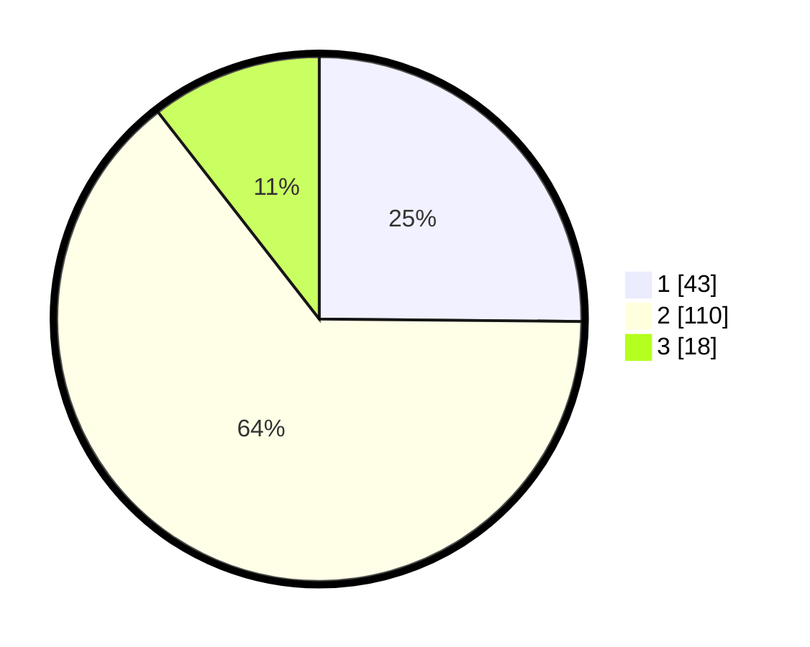

# Hasil

## Grafik

## Tabel

| No. | Nama Paslon    | Suara | Suara (raw) | Persentase |
|:--- |:-------------- | -----:| -----------:| ----------:|
| 1   | ANIES MUHAIMIN | 43    | [43][p-1]   | 25,15      |
| 2   | PRABOWO GIBRAN | 110   | [110][p-2]  | 64,33      |
| 3   | GANJAR MAHFUD  | 18    | [18][p-3]   | 10,53      |

[p-1]: https://github.com/gigit-pemilu/pemilu-2024-12-sumatera-utara/blob/main/pilpres/hitung-suara/sub/12-sumatera-utara/sub/14-nias-selatan/sub/06-teluk-dalam/sub/1008-pasar-teluk-dalam/sub/005-tps/sub/paslon-1.txt
[p-2]: https://github.com/gigit-pemilu/pemilu-2024-12-sumatera-utara/blob/main/pilpres/hitung-suara/sub/12-sumatera-utara/sub/14-nias-selatan/sub/06-teluk-dalam/sub/1008-pasar-teluk-dalam/sub/005-tps/sub/paslon-2.txt
[p-3]: https://github.com/gigit-pemilu/pemilu-2024-12-sumatera-utara/blob/main/pilpres/hitung-suara/sub/12-sumatera-utara/sub/14-nias-selatan/sub/06-teluk-dalam/sub/1008-pasar-teluk-dalam/sub/005-tps/sub/paslon-3.txt

## Foto C Plano

https://sirekap-obj-formc.kpu.go.id/2102/pemilu/ppwp/12/14/06/10/08/1214061008005-20240215-004930--2af86855-84a6-49ef-9c12-b31869fe2638.jpg

https://sirekap-obj-formc.kpu.go.id/2102/pemilu/ppwp/12/14/06/10/08/1214061008005-20240215-005220--a2668b85-ab53-4681-bbb6-72e1f63fdc72.jpg

https://sirekap-obj-formc.kpu.go.id/2102/pemilu/ppwp/12/14/06/10/08/1214061008005-20240215-005627--b46d196a-590c-42c8-a80d-a7da1362c06e.jpg

## Metadata

| Key        | Value               |
| ---------- | ------------------- |
| Time Stamp | 2024-02-15 19:00:26 |

