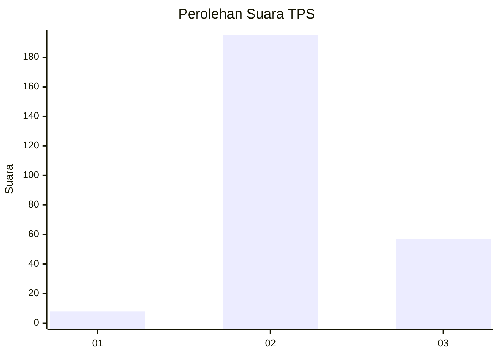
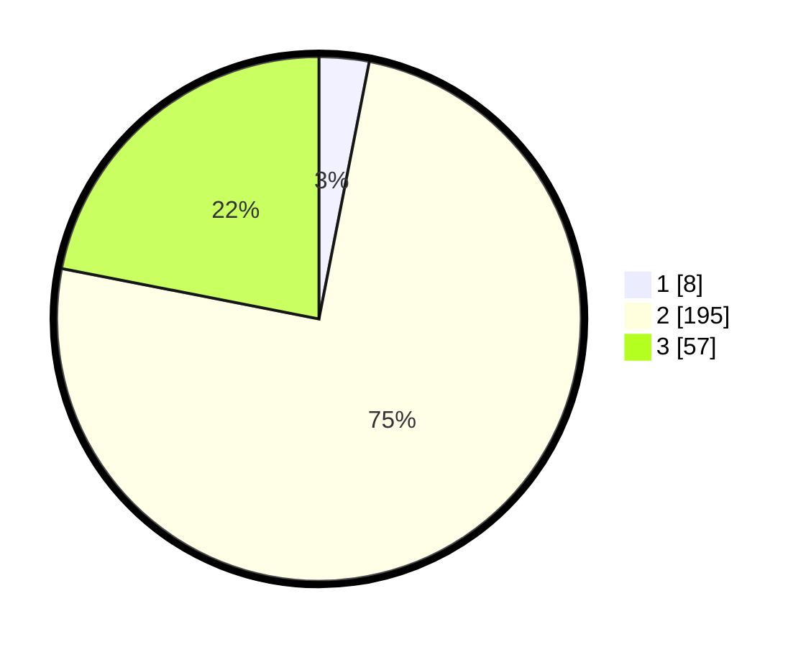

# Hasil

## Grafik

## Tabel

| No. | Nama Paslon    | Suara | Suara (raw) | Persentase |
|:--- |:-------------- | -----:| -----------:| ----------:|
| 1   | ANIES MUHAIMIN | 8     | [8][p-1]    | 3,08       |
| 2   | PRABOWO GIBRAN | 195   | [195][p-2]  | 75,00      |
| 3   | GANJAR MAHFUD  | 57    | [57][p-3]   | 21,92      |

[p-1]: https://github.com/gigit-pemilu/pemilu-2024/blob/main/pilpres/hitung-suara/sub/12-sumatera-utara/sub/14-nias-selatan/sub/06-teluk-dalam/sub/1008-pasar-teluk-dalam/sub/011-tps/sub/paslon-1.txt
[p-2]: https://github.com/gigit-pemilu/pemilu-2024/blob/main/pilpres/hitung-suara/sub/12-sumatera-utara/sub/14-nias-selatan/sub/06-teluk-dalam/sub/1008-pasar-teluk-dalam/sub/011-tps/sub/paslon-2.txt
[p-3]: https://github.com/gigit-pemilu/pemilu-2024/blob/main/pilpres/hitung-suara/sub/12-sumatera-utara/sub/14-nias-selatan/sub/06-teluk-dalam/sub/1008-pasar-teluk-dalam/sub/011-tps/sub/paslon-3.txt

## Foto C Plano

https://sirekap-obj-formc.kpu.go.id/87ec/pemilu/ppwp/12/14/06/10/08/1214061008011-20240215-025621--cba1361a-6217-44cd-99dd-b6053c86000d.jpg

https://sirekap-obj-formc.kpu.go.id/87ec/pemilu/ppwp/12/14/06/10/08/1214061008011-20240215-030958--c5499a13-750d-4676-a807-eb1197a4237c.jpg

https://sirekap-obj-formc.kpu.go.id/87ec/pemilu/ppwp/12/14/06/10/08/1214061008011-20240215-031044--6a610e77-f24e-45eb-a44f-ddb894c5e41e.jpg

## Metadata

| Key        | Value               |
| ---------- | ------------------- |
| Time Stamp | 2024-02-15 23:29:50 |

