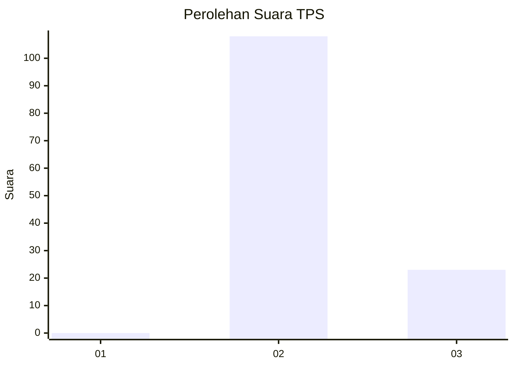
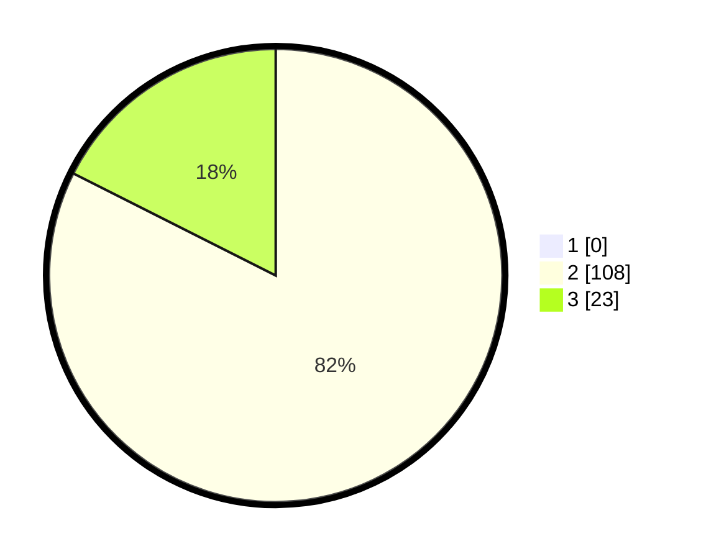

# Hasil

## Grafik

## Tabel

| No. | Nama Paslon    | Suara | Suara (raw) | Persentase |
|:--- |:-------------- | -----:| -----------:| ----------:|
| 1   | ANIES MUHAIMIN | 0     | [0][p-1]    | 0,00       |
| 2   | PRABOWO GIBRAN | 108   | [108][p-2]  | 82,44      |
| 3   | GANJAR MAHFUD  | 23    | [23][p-3]   | 17,56      |

[p-1]: https://github.com/gigit-pemilu/pemilu-2024-12-sumatera-utara/blob/main/pilpres/hitung-suara/sub/12-sumatera-utara/sub/14-nias-selatan/sub/06-teluk-dalam/sub/2026-hilisondrekha/sub/001-tps/sub/paslon-1.txt
[p-2]: https://github.com/gigit-pemilu/pemilu-2024-12-sumatera-utara/blob/main/pilpres/hitung-suara/sub/12-sumatera-utara/sub/14-nias-selatan/sub/06-teluk-dalam/sub/2026-hilisondrekha/sub/001-tps/sub/paslon-2.txt
[p-3]: https://github.com/gigit-pemilu/pemilu-2024-12-sumatera-utara/blob/main/pilpres/hitung-suara/sub/12-sumatera-utara/sub/14-nias-selatan/sub/06-teluk-dalam/sub/2026-hilisondrekha/sub/001-tps/sub/paslon-3.txt

## Foto C Plano

https://sirekap-obj-formc.kpu.go.id/5d4f/pemilu/ppwp/12/14/06/20/26/1214062026001-20240215-094107--537469b7-5882-49bf-a071-1e9dd5bf031a.jpg

https://sirekap-obj-formc.kpu.go.id/5d4f/pemilu/ppwp/12/14/06/20/26/1214062026001-20240215-094229--ce708fa7-75ea-434d-9517-47adfb37bf24.jpg

https://sirekap-obj-formc.kpu.go.id/5d4f/pemilu/ppwp/12/14/06/20/26/1214062026001-20240215-094403--35f81129-271a-4f44-b6cc-825e1b271ad9.jpg

## Metadata

| Key        | Value               |
| ---------- | ------------------- |
| Time Stamp | 2024-02-15 23:29:50 |

