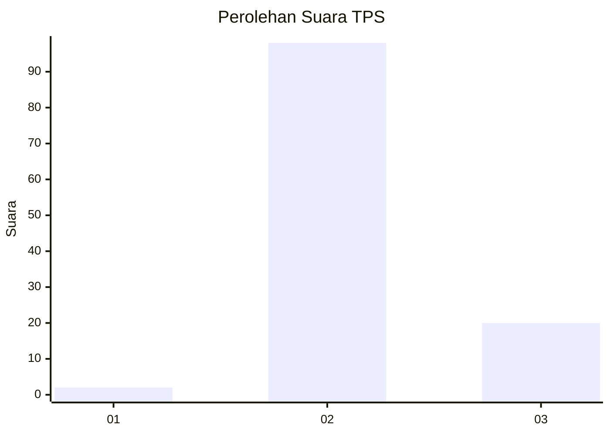
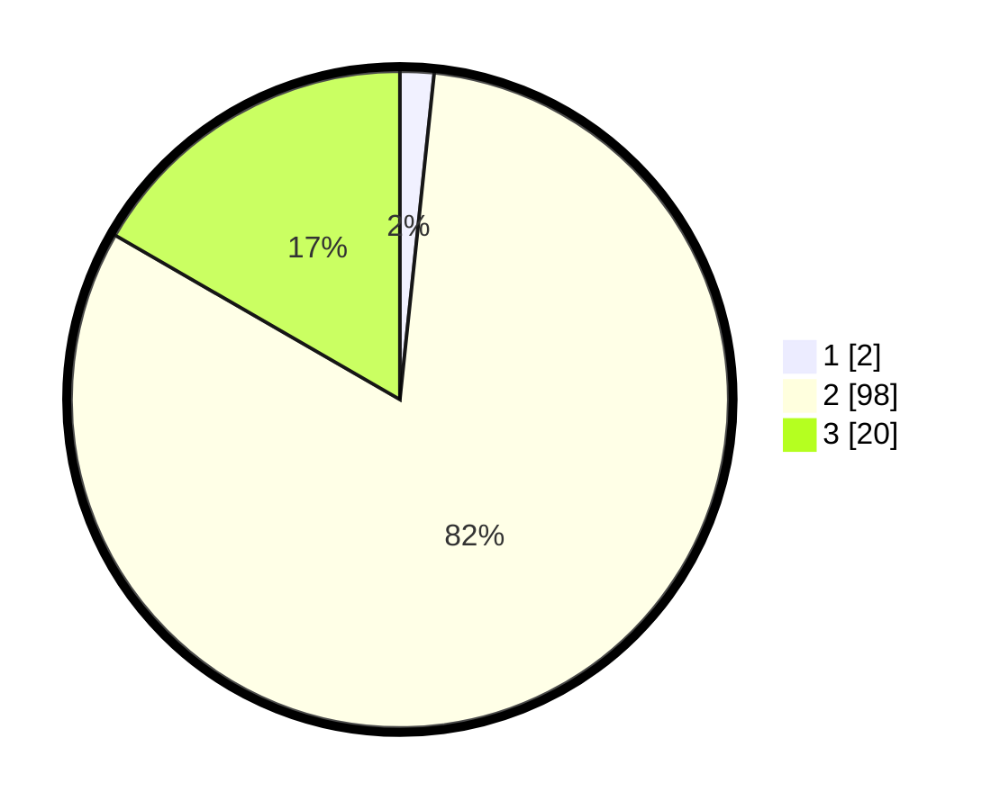

# Hasil

## Grafik

## Tabel

| No. | Nama Paslon    | Suara | Suara (raw) | Persentase |
|:--- |:-------------- | -----:| -----------:| ----------:|
| 1   | ANIES MUHAIMIN | 2     | [2][p-1]    | 1,67       |
| 2   | PRABOWO GIBRAN | 98    | [98][p-2]   | 81,67      |
| 3   | GANJAR MAHFUD  | 20    | [20][p-3]   | 16,67      |

[p-1]: https://github.com/gigit-pemilu/pemilu-2024/blob/main/pilpres/hitung-suara/sub/12-sumatera-utara/sub/14-nias-selatan/sub/07-amandraya/sub/2012-lolozaria/sub/001-tps/sub/paslon-1.txt
[p-2]: https://github.com/gigit-pemilu/pemilu-2024/blob/main/pilpres/hitung-suara/sub/12-sumatera-utara/sub/14-nias-selatan/sub/07-amandraya/sub/2012-lolozaria/sub/001-tps/sub/paslon-2.txt
[p-3]: https://github.com/gigit-pemilu/pemilu-2024/blob/main/pilpres/hitung-suara/sub/12-sumatera-utara/sub/14-nias-selatan/sub/07-amandraya/sub/2012-lolozaria/sub/001-tps/sub/paslon-3.txt

## Foto C Plano

https://sirekap-obj-formc.kpu.go.id/e267/pemilu/ppwp/12/14/07/20/12/1214072012001-20240219-141457--4a7504f3-b392-4800-a5b4-ed7c85761f6b.jpg

https://sirekap-obj-formc.kpu.go.id/e267/pemilu/ppwp/12/14/07/20/12/1214072012001-20240219-141550--a4c9e796-4d38-433c-841d-92a815b0af84.jpg

https://sirekap-obj-formc.kpu.go.id/e267/pemilu/ppwp/12/14/07/20/12/1214072012001-20240219-141716--ce47c27e-3290-450d-8dc6-543f5d3ff551.jpg

## Metadata

| Key        | Value               |
| ---------- | ------------------- |
| Time Stamp | 2024-02-25 00:00:00 |

