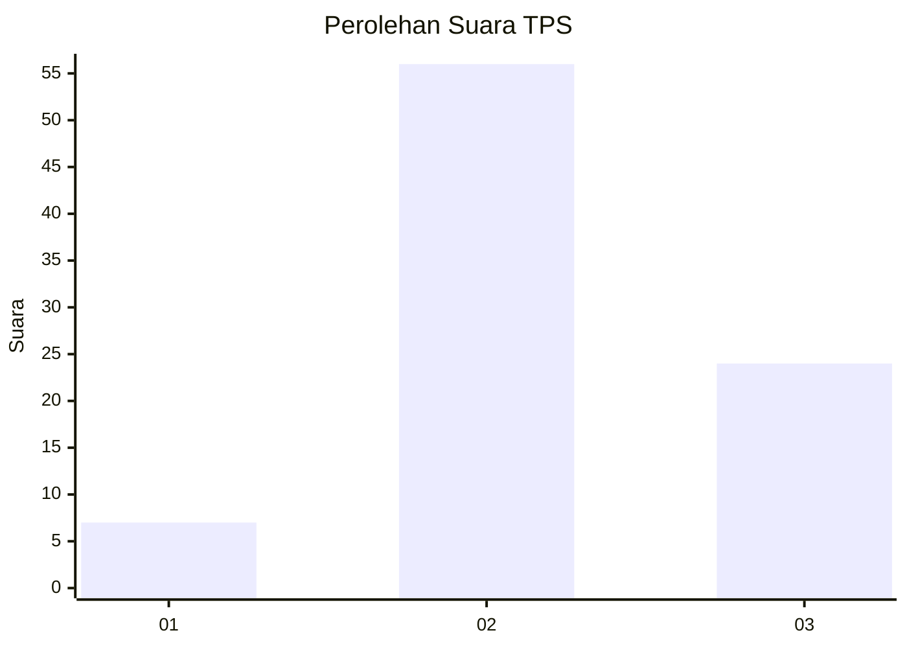
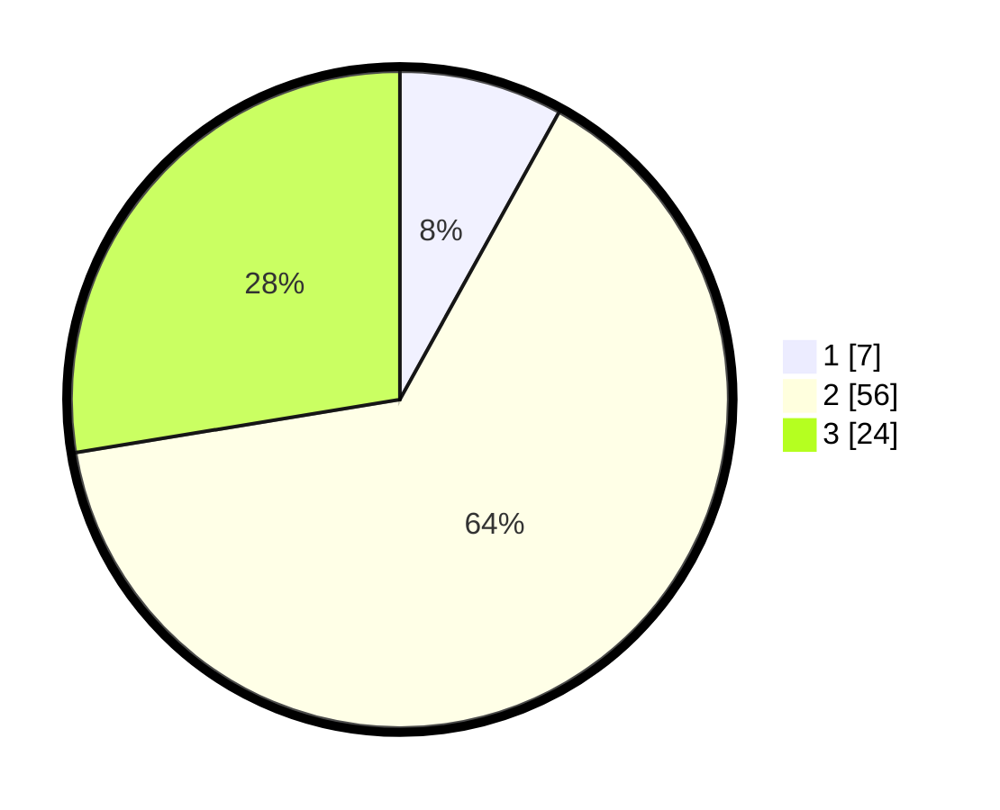

# Hasil

## Grafik

## Tabel

| No. | Nama Paslon    | Suara | Suara (raw) | Persentase |
|:--- |:-------------- | -----:| -----------:| ----------:|
| 1   | ANIES MUHAIMIN | 7     | [7][p-1]    | 8,05       |
| 2   | PRABOWO GIBRAN | 56    | [56][p-2]   | 64,37      |
| 3   | GANJAR MAHFUD  | 24    | [24][p-3]   | 27,59      |

[p-1]: https://github.com/gigit-pemilu/pemilu-2024/blob/main/pilpres/hitung-suara/sub/12-sumatera-utara/sub/14-nias-selatan/sub/07-amandraya/sub/2015-orahili-eho/sub/002-tps/sub/paslon-1.txt
[p-2]: https://github.com/gigit-pemilu/pemilu-2024/blob/main/pilpres/hitung-suara/sub/12-sumatera-utara/sub/14-nias-selatan/sub/07-amandraya/sub/2015-orahili-eho/sub/002-tps/sub/paslon-2.txt
[p-3]: https://github.com/gigit-pemilu/pemilu-2024/blob/main/pilpres/hitung-suara/sub/12-sumatera-utara/sub/14-nias-selatan/sub/07-amandraya/sub/2015-orahili-eho/sub/002-tps/sub/paslon-3.txt

## Foto C Plano

https://sirekap-obj-formc.kpu.go.id/6839/pemilu/ppwp/12/14/07/20/15/1214072015002-20240215-092042--efe9ca9f-d4e6-4175-803e-ae88e2b14e2f.jpg

https://sirekap-obj-formc.kpu.go.id/6839/pemilu/ppwp/12/14/07/20/15/1214072015002-20240215-092216--b6d39cf9-c347-4668-b309-b81735d4dd87.jpg

https://sirekap-obj-formc.kpu.go.id/6839/pemilu/ppwp/12/14/07/20/15/1214072015002-20240215-092332--33e42bd9-99c0-4841-9bb4-732c2f7b0488.jpg

## Metadata

| Key        | Value               |
| ---------- | ------------------- |
| Time Stamp | 2024-02-15 20:00:44 |

