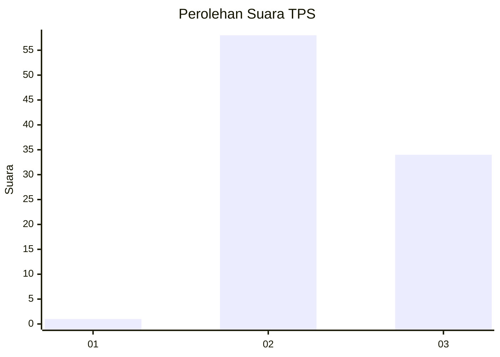
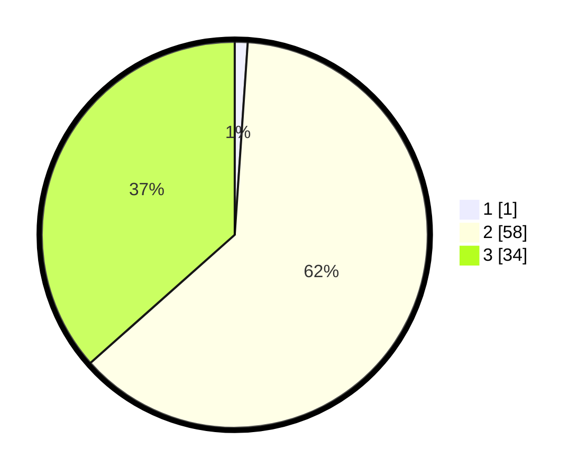

# Hasil

## Grafik

## Tabel

| No. | Nama Paslon    | Suara | Suara (raw) | Persentase |
|:--- |:-------------- | -----:| -----------:| ----------:|
| 1   | ANIES MUHAIMIN | 1     | [1][p-1]    | 1,08       |
| 2   | PRABOWO GIBRAN | 58    | [58][p-2]   | 62,37      |
| 3   | GANJAR MAHFUD  | 34    | [34][p-3]   | 36,56      |

[p-1]: https://github.com/gigit-pemilu/pemilu-2024-12-sumatera-utara/blob/main/pilpres/hitung-suara/sub/12-sumatera-utara/sub/14-nias-selatan/sub/07-amandraya/sub/2016-sisobahili/sub/001-tps/sub/paslon-1.txt
[p-2]: https://github.com/gigit-pemilu/pemilu-2024-12-sumatera-utara/blob/main/pilpres/hitung-suara/sub/12-sumatera-utara/sub/14-nias-selatan/sub/07-amandraya/sub/2016-sisobahili/sub/001-tps/sub/paslon-2.txt
[p-3]: https://github.com/gigit-pemilu/pemilu-2024-12-sumatera-utara/blob/main/pilpres/hitung-suara/sub/12-sumatera-utara/sub/14-nias-selatan/sub/07-amandraya/sub/2016-sisobahili/sub/001-tps/sub/paslon-3.txt

## Foto C Plano

https://sirekap-obj-formc.kpu.go.id/9d6c/pemilu/ppwp/12/14/07/20/16/1214072016001-20240215-125627--18323ca5-f45e-41d5-b5e2-5cbd81b7c740.jpg

https://sirekap-obj-formc.kpu.go.id/9d6c/pemilu/ppwp/12/14/07/20/16/1214072016001-20240215-125651--e913dcdd-175a-4ad0-8405-f34637be8ba6.jpg

https://sirekap-obj-formc.kpu.go.id/9d6c/pemilu/ppwp/12/14/07/20/16/1214072016001-20240215-125713--0b1e9c94-bfb5-4c29-83f6-e277b52826fb.jpg

## Metadata

| Key        | Value               |
| ---------- | ------------------- |
| Time Stamp | 2024-02-15 23:29:50 |

