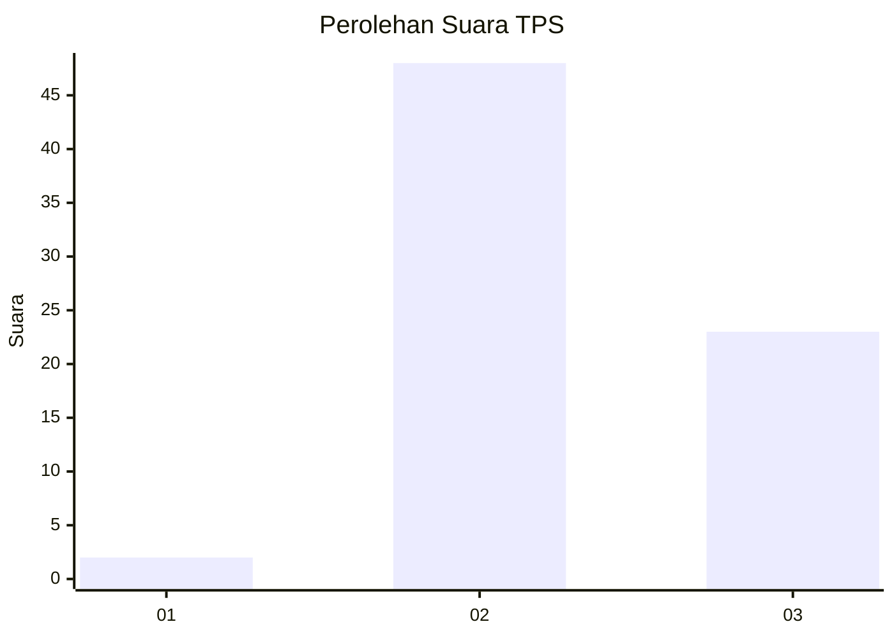
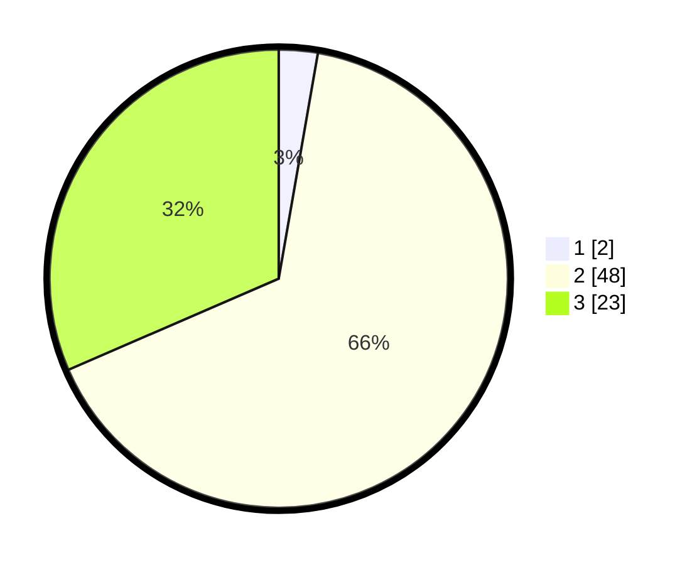

# Hasil

## Grafik

## Tabel

| No. | Nama Paslon    | Suara | Suara (raw) | Persentase |
|:--- |:-------------- | -----:| -----------:| ----------:|
| 1   | ANIES MUHAIMIN | 2     | [2][p-1]    | 2,74       |
| 2   | PRABOWO GIBRAN | 48    | [48][p-2]   | 65,75      |
| 3   | GANJAR MAHFUD  | 23    | [23][p-3]   | 31,51      |

[p-1]: https://github.com/gigit-pemilu/pemilu-2024-12-sumatera-utara/blob/main/pilpres/hitung-suara/sub/12-sumatera-utara/sub/14-nias-selatan/sub/07-amandraya/sub/2023-loloabolo/sub/001-tps/sub/paslon-1.txt
[p-2]: https://github.com/gigit-pemilu/pemilu-2024-12-sumatera-utara/blob/main/pilpres/hitung-suara/sub/12-sumatera-utara/sub/14-nias-selatan/sub/07-amandraya/sub/2023-loloabolo/sub/001-tps/sub/paslon-2.txt
[p-3]: https://github.com/gigit-pemilu/pemilu-2024-12-sumatera-utara/blob/main/pilpres/hitung-suara/sub/12-sumatera-utara/sub/14-nias-selatan/sub/07-amandraya/sub/2023-loloabolo/sub/001-tps/sub/paslon-3.txt

## Foto C Plano

https://sirekap-obj-formc.kpu.go.id/d769/pemilu/ppwp/12/14/07/20/23/1214072023001-20240215-023142--cdc84f6e-616e-48f5-be6a-10b44a7902cf.jpg

https://sirekap-obj-formc.kpu.go.id/d769/pemilu/ppwp/12/14/07/20/23/1214072023001-20240215-023232--715e90e9-aa7b-47cd-8eb3-98ba5ef79cba.jpg

https://sirekap-obj-formc.kpu.go.id/d769/pemilu/ppwp/12/14/07/20/23/1214072023001-20240217-080723--f7e035ed-1301-490b-b000-03e099220019.jpg

## Metadata

| Key        | Value               |
| ---------- | ------------------- |
| Time Stamp | 2024-02-17 08:30:03 |

