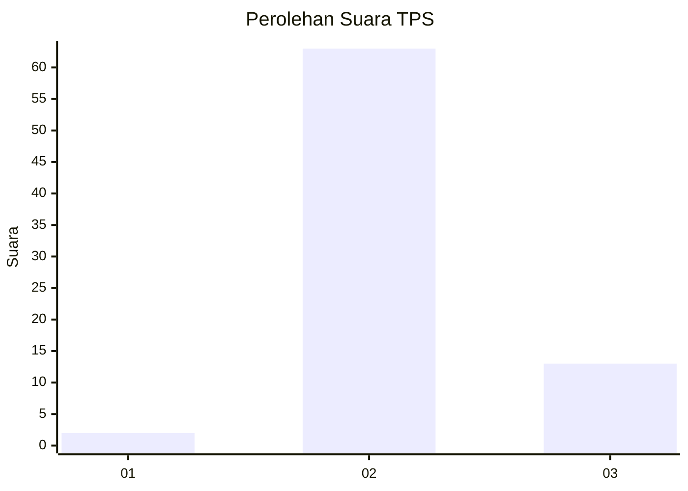
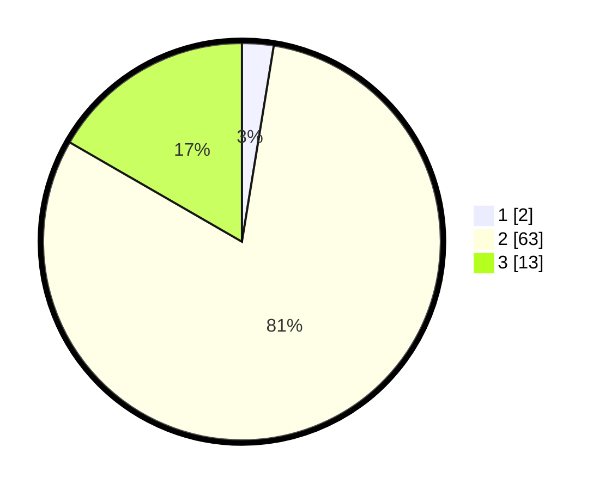

# Hasil

## Grafik

## Tabel

| No. | Nama Paslon    | Suara | Suara (raw) | Persentase |
|:--- |:-------------- | -----:| -----------:| ----------:|
| 1   | ANIES MUHAIMIN | 2     | [2][p-1]    | 2,56       |
| 2   | PRABOWO GIBRAN | 63    | [63][p-2]   | 80,77      |
| 3   | GANJAR MAHFUD  | 13    | [13][p-3]   | 16,67      |

[p-1]: https://github.com/gigit-pemilu/pemilu-2024/blob/main/pilpres/hitung-suara/sub/12-sumatera-utara/sub/14-nias-selatan/sub/07-amandraya/sub/2023-loloabolo/sub/002-tps/sub/paslon-1.txt
[p-2]: https://github.com/gigit-pemilu/pemilu-2024/blob/main/pilpres/hitung-suara/sub/12-sumatera-utara/sub/14-nias-selatan/sub/07-amandraya/sub/2023-loloabolo/sub/002-tps/sub/paslon-2.txt
[p-3]: https://github.com/gigit-pemilu/pemilu-2024/blob/main/pilpres/hitung-suara/sub/12-sumatera-utara/sub/14-nias-selatan/sub/07-amandraya/sub/2023-loloabolo/sub/002-tps/sub/paslon-3.txt

## Foto C Plano

https://sirekap-obj-formc.kpu.go.id/17dc/pemilu/ppwp/12/14/07/20/23/1214072023002-20240215-133037--e8ccb65f-7beb-4dcb-9220-28a991adb34e.jpg

https://sirekap-obj-formc.kpu.go.id/17dc/pemilu/ppwp/12/14/07/20/23/1214072023002-20240215-133235--4780bac2-af9d-4310-be1c-8f9cd89d2531.jpg

https://sirekap-obj-formc.kpu.go.id/17dc/pemilu/ppwp/12/14/07/20/23/1214072023002-20240215-131712--079a906c-84ed-4ecc-a232-e7ef7e7be2c9.jpg

## Metadata

| Key        | Value               |
| ---------- | ------------------- |
| Time Stamp | 2024-02-15 23:29:50 |

