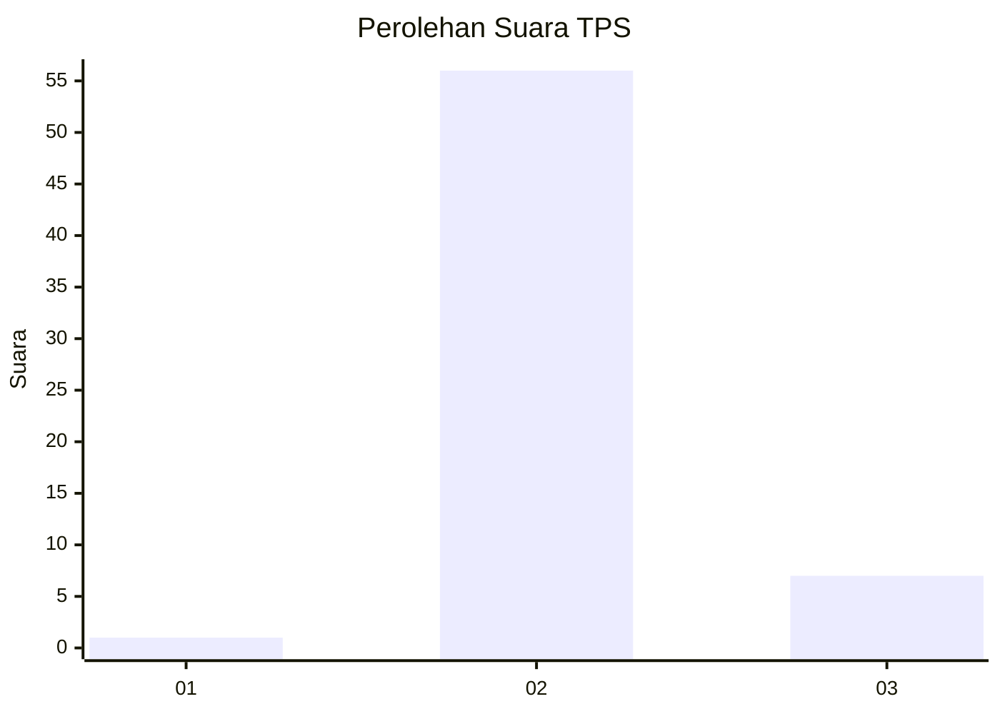
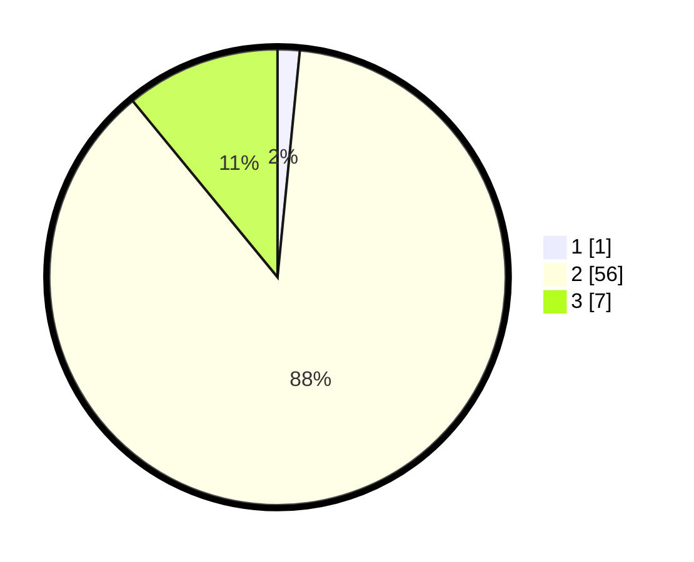

# Hasil

## Grafik

## Tabel

| No. | Nama Paslon    | Suara | Suara (raw) | Persentase |
|:--- |:-------------- | -----:| -----------:| ----------:|
| 1   | ANIES MUHAIMIN | 1     | [1][p-1]    | 1,56       |
| 2   | PRABOWO GIBRAN | 56    | [56][p-2]   | 87,50      |
| 3   | GANJAR MAHFUD  | 7     | [7][p-3]    | 10,94      |

[p-1]: https://github.com/gigit-pemilu/pemilu-2024-12-sumatera-utara/blob/main/pilpres/hitung-suara/sub/12-sumatera-utara/sub/14-nias-selatan/sub/07-amandraya/sub/2026-sirofi/sub/002-tps/sub/paslon-1.txt
[p-2]: https://github.com/gigit-pemilu/pemilu-2024-12-sumatera-utara/blob/main/pilpres/hitung-suara/sub/12-sumatera-utara/sub/14-nias-selatan/sub/07-amandraya/sub/2026-sirofi/sub/002-tps/sub/paslon-2.txt
[p-3]: https://github.com/gigit-pemilu/pemilu-2024-12-sumatera-utara/blob/main/pilpres/hitung-suara/sub/12-sumatera-utara/sub/14-nias-selatan/sub/07-amandraya/sub/2026-sirofi/sub/002-tps/sub/paslon-3.txt

## Foto C Plano

https://sirekap-obj-formc.kpu.go.id/de53/pemilu/ppwp/12/14/07/20/26/1214072026002-20240215-091411--55bcaf17-ad14-48a4-be28-d82707dc5fe0.jpg

https://sirekap-obj-formc.kpu.go.id/de53/pemilu/ppwp/12/14/07/20/26/1214072026002-20240215-091452--c50b0b7e-0797-4937-9faa-7800186984fd.jpg

https://sirekap-obj-formc.kpu.go.id/de53/pemilu/ppwp/12/14/07/20/26/1214072026002-20240215-091608--fcd2ef97-8494-49f8-abd1-231bf36e87ca.jpg

## Metadata

| Key        | Value               |
| ---------- | ------------------- |
| Time Stamp | 2024-02-15 19:00:26 |

