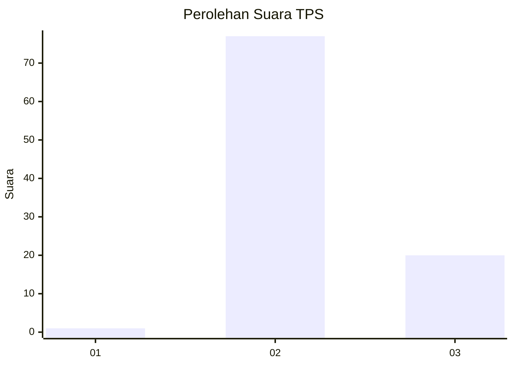

# Hasil

## Grafik

## Tabel

| No. | Nama Paslon    | Suara | Suara (raw) | Persentase |
|:--- |:-------------- | -----:| -----------:| ----------:|
| 1   | ANIES MUHAIMIN | 1     | [1][p-1]    | 1,02       |
| 2   | PRABOWO GIBRAN | 77    | [77][p-2]   | 78,57      |
| 3   | GANJAR MAHFUD  | 20    | [20][p-3]   | 20,41      |

[p-1]: https://github.com/gigit-pemilu/pemilu-2024/blob/main/pilpres/hitung-suara/sub/12-sumatera-utara/sub/14-nias-selatan/sub/07-amandraya/sub/2029-boholu/sub/001-tps/sub/paslon-1.txt
[p-2]: https://github.com/gigit-pemilu/pemilu-2024/blob/main/pilpres/hitung-suara/sub/12-sumatera-utara/sub/14-nias-selatan/sub/07-amandraya/sub/2029-boholu/sub/001-tps/sub/paslon-2.txt
[p-3]: https://github.com/gigit-pemilu/pemilu-2024/blob/main/pilpres/hitung-suara/sub/12-sumatera-utara/sub/14-nias-selatan/sub/07-amandraya/sub/2029-boholu/sub/001-tps/sub/paslon-3.txt

## Foto C Plano

https://sirekap-obj-formc.kpu.go.id/c5bf/pemilu/ppwp/12/14/07/20/29/1214072029001-20240215-100131--a13fe377-b789-47e0-8a52-1f5c73ac4085.jpg

https://sirekap-obj-formc.kpu.go.id/c5bf/pemilu/ppwp/12/14/07/20/29/1214072029001-20240215-100248--f26928af-71bb-4010-ade2-af1a8c7307cc.jpg

https://sirekap-obj-formc.kpu.go.id/c5bf/pemilu/ppwp/12/14/07/20/29/1214072029001-20240215-100421--30f42f21-6e26-4501-ae2f-ca921ef1f6a2.jpg

## Metadata

| Key        | Value               |
| ---------- | ------------------- |
| Time Stamp | 2024-02-15 23:29:50 |

