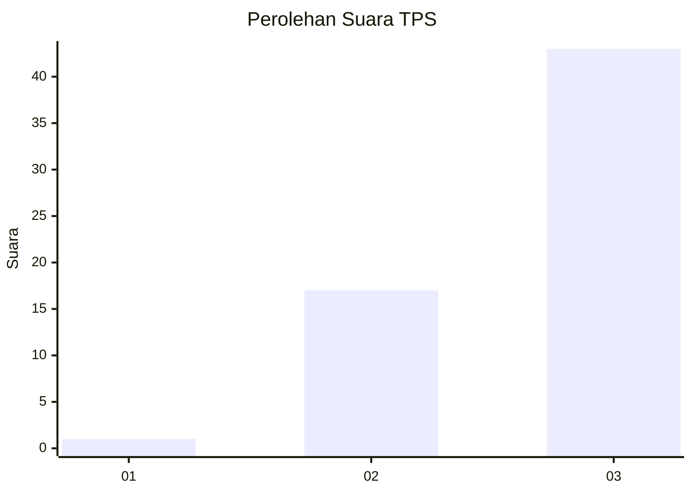
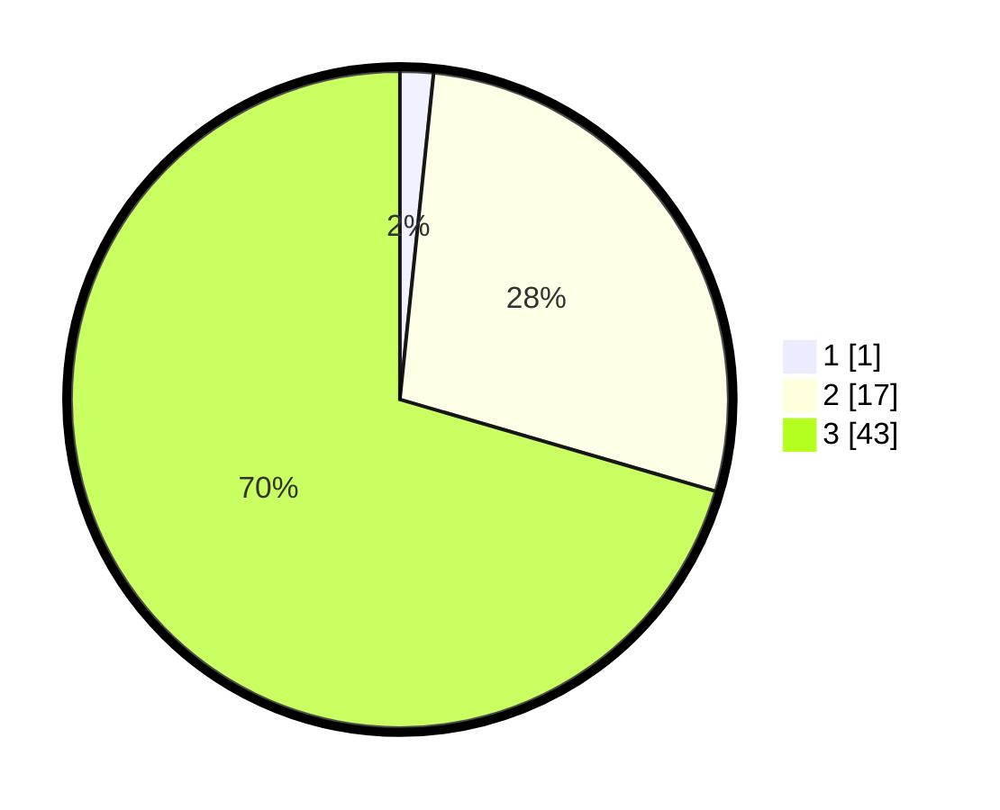

# Hasil

## Grafik

## Tabel

| No. | Nama Paslon    | Suara | Suara (raw) | Persentase |
|:--- |:-------------- | -----:| -----------:| ----------:|
| 1   | ANIES MUHAIMIN | 1     | [1][p-1]    | 1,64       |
| 2   | PRABOWO GIBRAN | 17    | [17][p-2]   | 27,87      |
| 3   | GANJAR MAHFUD  | 43    | [43][p-3]   | 70,49      |

[p-1]: https://github.com/gigit-pemilu/pemilu-2024-12-sumatera-utara/blob/main/pilpres/hitung-suara/sub/12-sumatera-utara/sub/14-nias-selatan/sub/07-amandraya/sub/2029-boholu/sub/002-tps/sub/paslon-1.txt
[p-2]: https://github.com/gigit-pemilu/pemilu-2024-12-sumatera-utara/blob/main/pilpres/hitung-suara/sub/12-sumatera-utara/sub/14-nias-selatan/sub/07-amandraya/sub/2029-boholu/sub/002-tps/sub/paslon-2.txt
[p-3]: https://github.com/gigit-pemilu/pemilu-2024-12-sumatera-utara/blob/main/pilpres/hitung-suara/sub/12-sumatera-utara/sub/14-nias-selatan/sub/07-amandraya/sub/2029-boholu/sub/002-tps/sub/paslon-3.txt

## Foto C Plano

https://sirekap-obj-formc.kpu.go.id/3080/pemilu/ppwp/12/14/07/20/29/1214072029002-20240215-110651--1805492e-e3f2-4f4f-bcab-ddbf4d149ffc.jpg

https://sirekap-obj-formc.kpu.go.id/3080/pemilu/ppwp/12/14/07/20/29/1214072029002-20240215-110801--34f70969-7b0d-4c22-bb17-2750486b03ac.jpg

https://sirekap-obj-formc.kpu.go.id/3080/pemilu/ppwp/12/14/07/20/29/1214072029002-20240215-110944--f0cf4242-d10a-4548-98c0-06244d4ce43c.jpg

## Metadata

| Key        | Value               |
| ---------- | ------------------- |
| Time Stamp | 2024-02-15 20:00:44 |

