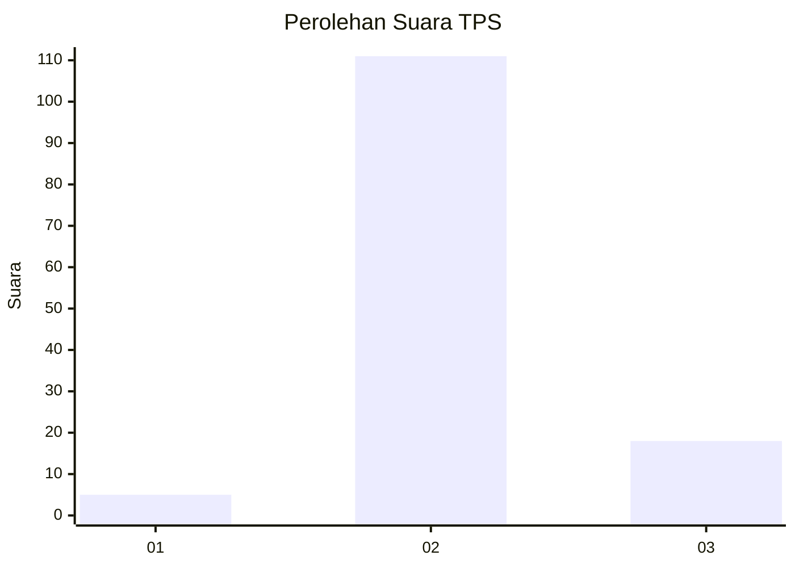
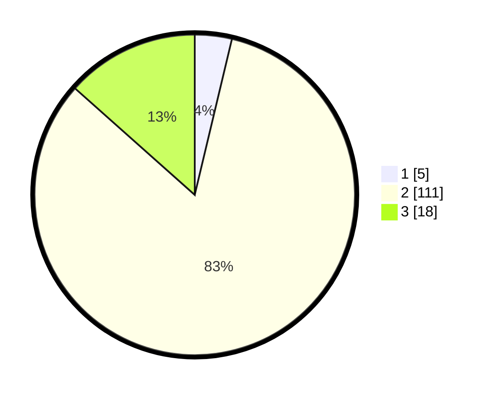

# Hasil

## Grafik

## Tabel

| No. | Nama Paslon    | Suara | Suara (raw) | Persentase |
|:--- |:-------------- | -----:| -----------:| ----------:|
| 1   | ANIES MUHAIMIN | 5     | [5][p-1]    | 3,73       |
| 2   | PRABOWO GIBRAN | 111   | [111][p-2]  | 82,84      |
| 3   | GANJAR MAHFUD  | 18    | [18][p-3]   | 13,43      |

[p-1]: https://github.com/gigit-pemilu/pemilu-2024-12-sumatera-utara/blob/main/pilpres/hitung-suara/sub/12-sumatera-utara/sub/14-nias-selatan/sub/07-amandraya/sub/2031-sinar-ino'o/sub/001-tps/sub/paslon-1.txt
[p-2]: https://github.com/gigit-pemilu/pemilu-2024-12-sumatera-utara/blob/main/pilpres/hitung-suara/sub/12-sumatera-utara/sub/14-nias-selatan/sub/07-amandraya/sub/2031-sinar-ino'o/sub/001-tps/sub/paslon-2.txt
[p-3]: https://github.com/gigit-pemilu/pemilu-2024-12-sumatera-utara/blob/main/pilpres/hitung-suara/sub/12-sumatera-utara/sub/14-nias-selatan/sub/07-amandraya/sub/2031-sinar-ino'o/sub/001-tps/sub/paslon-3.txt

## Foto C Plano

https://sirekap-obj-formc.kpu.go.id/d4b5/pemilu/ppwp/12/14/07/20/31/1214072031001-20240218-162208--50aa811f-3d70-4747-87f7-fef6fbfe6fa5.jpg

https://sirekap-obj-formc.kpu.go.id/d4b5/pemilu/ppwp/12/14/07/20/31/1214072031001-20240218-162324--6a7c1978-e5ac-4edf-b36a-44d022c15c3a.jpg

https://sirekap-obj-formc.kpu.go.id/d4b5/pemilu/ppwp/12/14/07/20/31/1214072031001-20240218-162412--27801053-e1c5-4040-8ba7-f6c2719d5f95.jpg

## Metadata

| Key        | Value               |
| ---------- | ------------------- |
| Time Stamp | 2024-02-20 12:00:00 |

