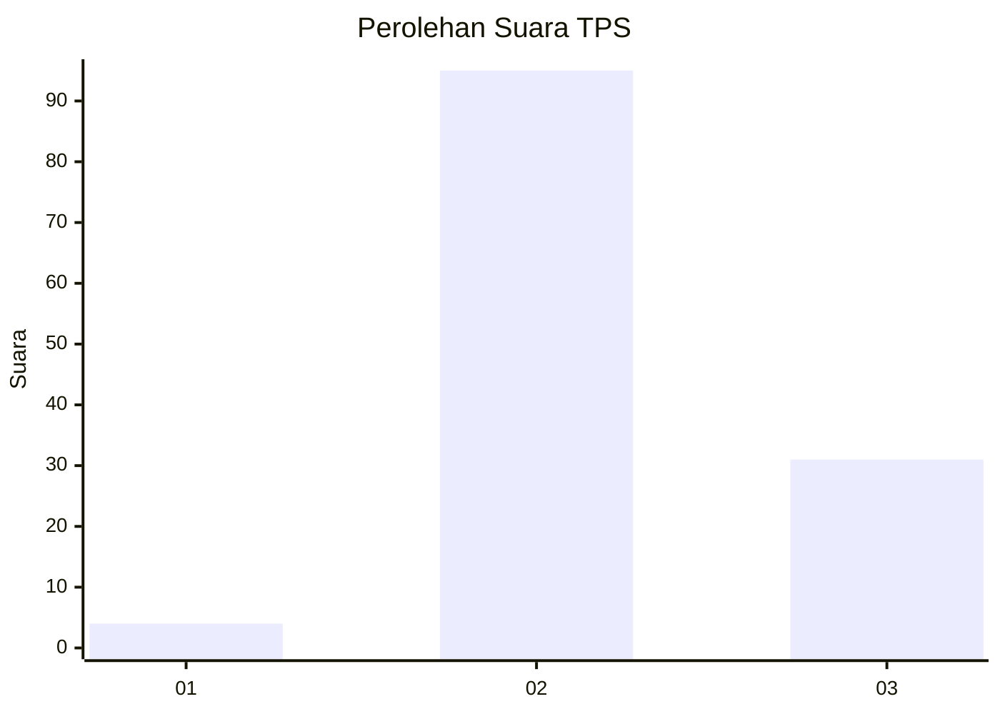
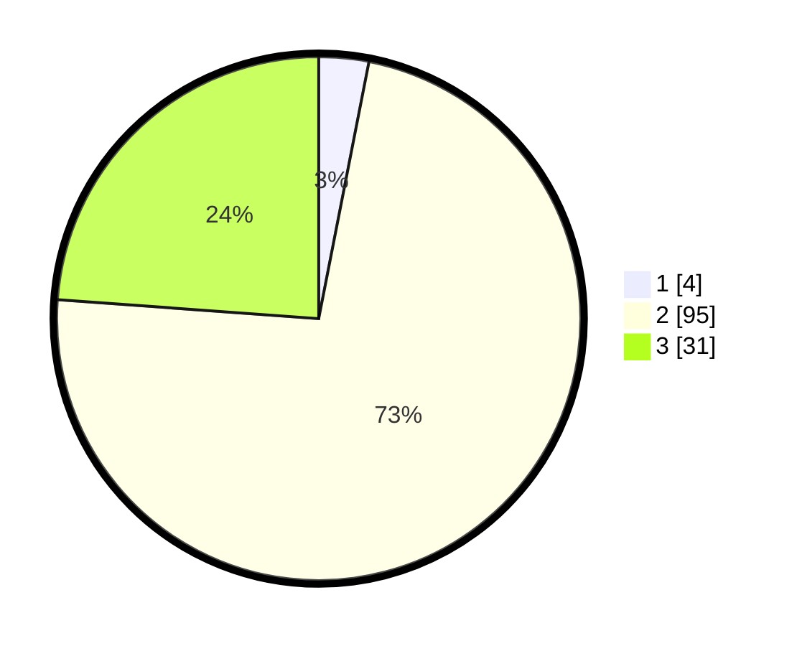

# Hasil

## Grafik

## Tabel

| No. | Nama Paslon    | Suara | Suara (raw) | Persentase |
|:--- |:-------------- | -----:| -----------:| ----------:|
| 1   | ANIES MUHAIMIN | 4     | [4][p-1]    | 3,08       |
| 2   | PRABOWO GIBRAN | 95    | [95][p-2]   | 73,08      |
| 3   | GANJAR MAHFUD  | 31    | [31][p-3]   | 23,85      |

[p-1]: https://github.com/gigit-pemilu/pemilu-2024-12-sumatera-utara/blob/main/pilpres/hitung-suara/sub/12-sumatera-utara/sub/14-nias-selatan/sub/08-lolowau/sub/2001-amuri/sub/001-tps/sub/paslon-1.txt
[p-2]: https://github.com/gigit-pemilu/pemilu-2024-12-sumatera-utara/blob/main/pilpres/hitung-suara/sub/12-sumatera-utara/sub/14-nias-selatan/sub/08-lolowau/sub/2001-amuri/sub/001-tps/sub/paslon-2.txt
[p-3]: https://github.com/gigit-pemilu/pemilu-2024-12-sumatera-utara/blob/main/pilpres/hitung-suara/sub/12-sumatera-utara/sub/14-nias-selatan/sub/08-lolowau/sub/2001-amuri/sub/001-tps/sub/paslon-3.txt

## Foto C Plano

https://sirekap-obj-formc.kpu.go.id/eca3/pemilu/ppwp/12/14/08/20/01/1214082001001-20240218-135432--da064cf6-be7c-43fe-bd07-e22448a4def0.jpg

https://sirekap-obj-formc.kpu.go.id/eca3/pemilu/ppwp/12/14/08/20/01/1214082001001-20240215-035710--fd8564e6-36b8-4876-a5b5-8fce13d058ae.jpg

https://sirekap-obj-formc.kpu.go.id/eca3/pemilu/ppwp/12/14/08/20/01/1214082001001-20240215-035938--7f0badd1-10d8-417a-8d5d-75f6d2c7bd91.jpg

## Metadata

| Key        | Value               |
| ---------- | ------------------- |
| Time Stamp | 2024-02-19 06:16:00 |

