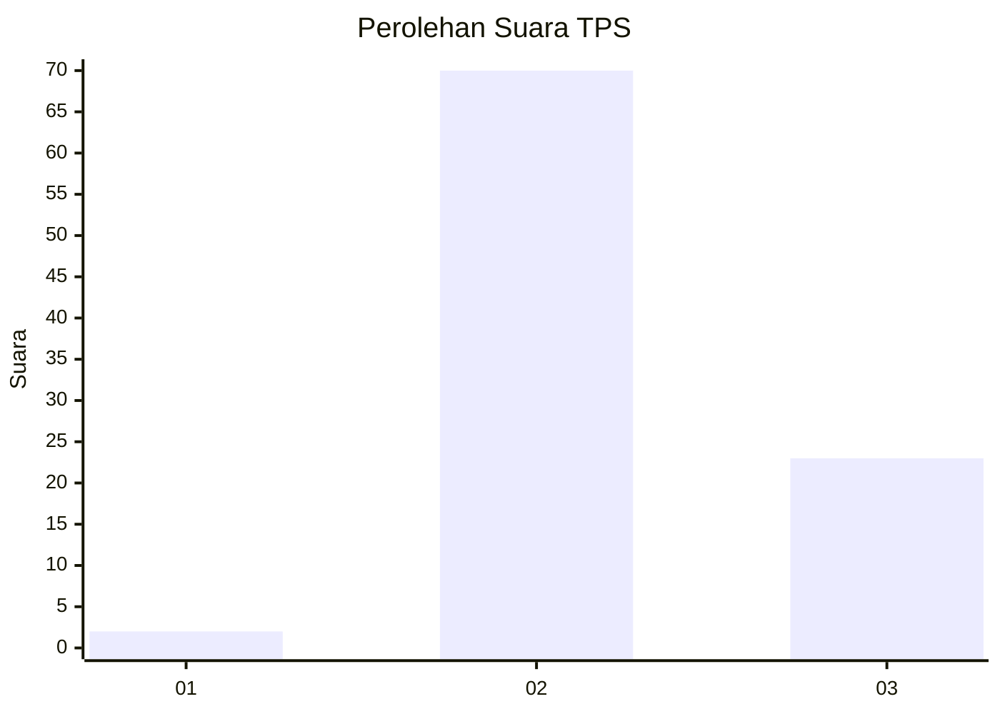
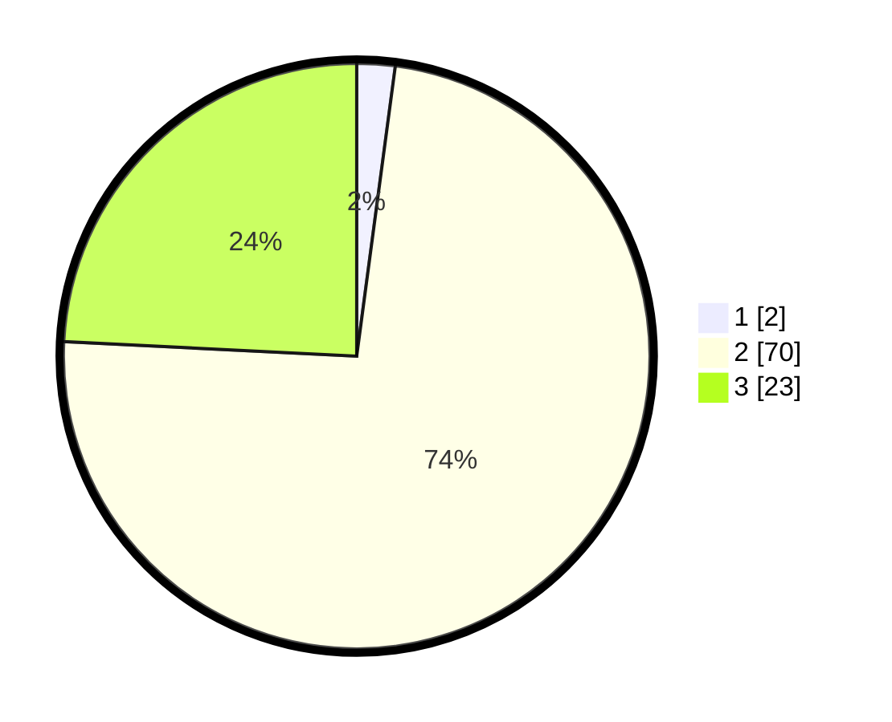

# Hasil

## Grafik

## Tabel

| No. | Nama Paslon    | Suara | Suara (raw) | Persentase |
|:--- |:-------------- | -----:| -----------:| ----------:|
| 1   | ANIES MUHAIMIN | 2     | [2][p-1]    | 2,11       |
| 2   | PRABOWO GIBRAN | 70    | [70][p-2]   | 73,68      |
| 3   | GANJAR MAHFUD  | 23    | [23][p-3]   | 24,21      |

[p-1]: https://github.com/gigit-pemilu/pemilu-2024/blob/main/pilpres/hitung-suara/sub/12-sumatera-utara/sub/14-nias-selatan/sub/08-lolowau/sub/2009-hilifadolo/sub/004-tps/sub/paslon-1.txt
[p-2]: https://github.com/gigit-pemilu/pemilu-2024/blob/main/pilpres/hitung-suara/sub/12-sumatera-utara/sub/14-nias-selatan/sub/08-lolowau/sub/2009-hilifadolo/sub/004-tps/sub/paslon-2.txt
[p-3]: https://github.com/gigit-pemilu/pemilu-2024/blob/main/pilpres/hitung-suara/sub/12-sumatera-utara/sub/14-nias-selatan/sub/08-lolowau/sub/2009-hilifadolo/sub/004-tps/sub/paslon-3.txt

## Foto C Plano

https://sirekap-obj-formc.kpu.go.id/5405/pemilu/ppwp/12/14/08/20/09/1214082009004-20240218-155954--4fc03b0b-b3d4-47dc-a2f8-6c9e26fb3c8a.jpg

https://sirekap-obj-formc.kpu.go.id/5405/pemilu/ppwp/12/14/08/20/09/1214082009004-20240218-160110--113b6913-025b-4794-8f33-63e9908ac4f3.jpg

https://sirekap-obj-formc.kpu.go.id/5405/pemilu/ppwp/12/14/08/20/09/1214082009004-20240218-160144--33f71287-502a-4833-845e-60f558455405.jpg

## Metadata

| Key        | Value               |
| ---------- | ------------------- |
| Time Stamp | 2024-02-20 12:00:00 |

