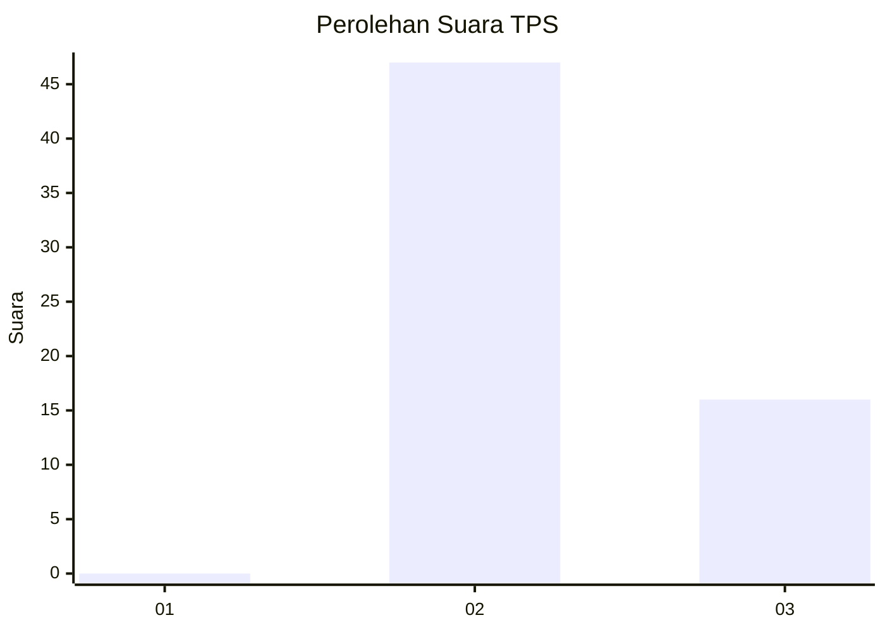
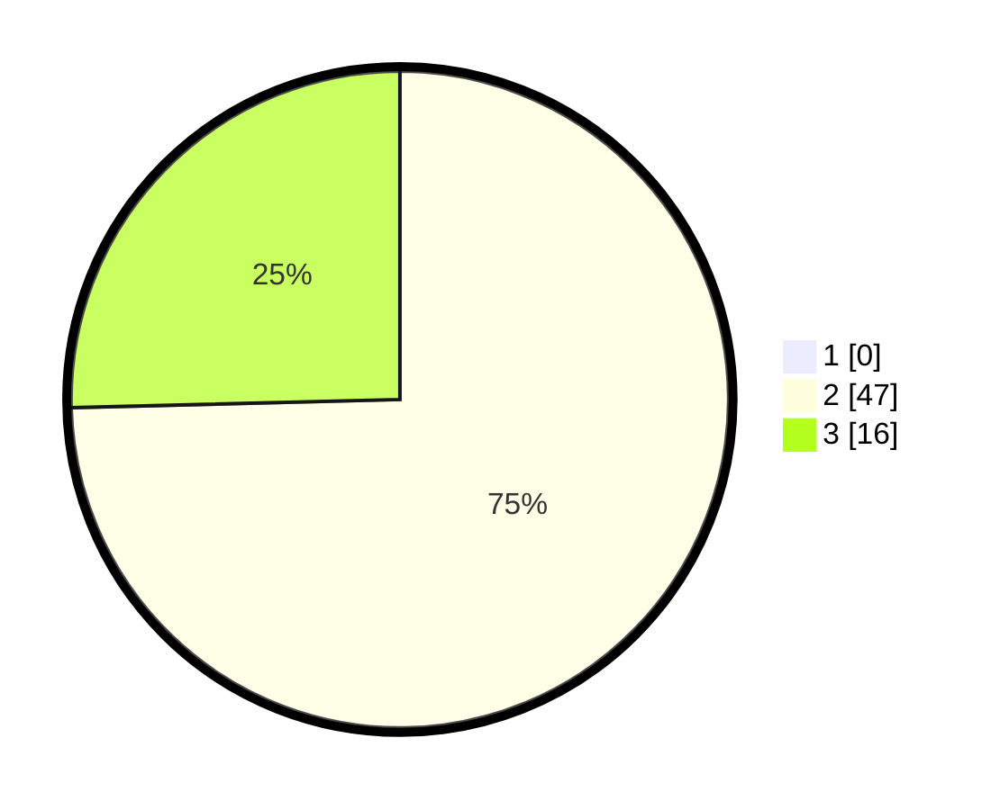

# Hasil

## Grafik

## Tabel

| No. | Nama Paslon    | Suara | Suara (raw) | Persentase |
|:--- |:-------------- | -----:| -----------:| ----------:|
| 1   | ANIES MUHAIMIN | 0     | [0][p-1]    | 0,00       |
| 2   | PRABOWO GIBRAN | 47    | [47][p-2]   | 74,60      |
| 3   | GANJAR MAHFUD  | 16    | [16][p-3]   | 25,40      |

[p-1]: https://github.com/gigit-pemilu/pemilu-2024-12-sumatera-utara/blob/main/pilpres/hitung-suara/sub/12-sumatera-utara/sub/14-nias-selatan/sub/08-lolowau/sub/2016-lolowau/sub/004-tps/sub/paslon-1.txt
[p-2]: https://github.com/gigit-pemilu/pemilu-2024-12-sumatera-utara/blob/main/pilpres/hitung-suara/sub/12-sumatera-utara/sub/14-nias-selatan/sub/08-lolowau/sub/2016-lolowau/sub/004-tps/sub/paslon-2.txt
[p-3]: https://github.com/gigit-pemilu/pemilu-2024-12-sumatera-utara/blob/main/pilpres/hitung-suara/sub/12-sumatera-utara/sub/14-nias-selatan/sub/08-lolowau/sub/2016-lolowau/sub/004-tps/sub/paslon-3.txt

## Foto C Plano

https://sirekap-obj-formc.kpu.go.id/3b5c/pemilu/ppwp/12/14/08/20/16/1214082016004-20240215-122245--5b79e2ff-1935-4f1a-a140-4974ef4aa4b8.jpg

https://sirekap-obj-formc.kpu.go.id/3b5c/pemilu/ppwp/12/14/08/20/16/1214082016004-20240214-204704--f4d35934-a1e6-4f90-b598-f9b614cdb512.jpg

https://sirekap-obj-formc.kpu.go.id/3b5c/pemilu/ppwp/12/14/08/20/16/1214082016004-20240215-122532--75d7f68b-f582-43a8-813b-363b3ffa6638.jpg

## Metadata

| Key        | Value               |
| ---------- | ------------------- |
| Time Stamp | 2024-02-15 18:00:26 |

