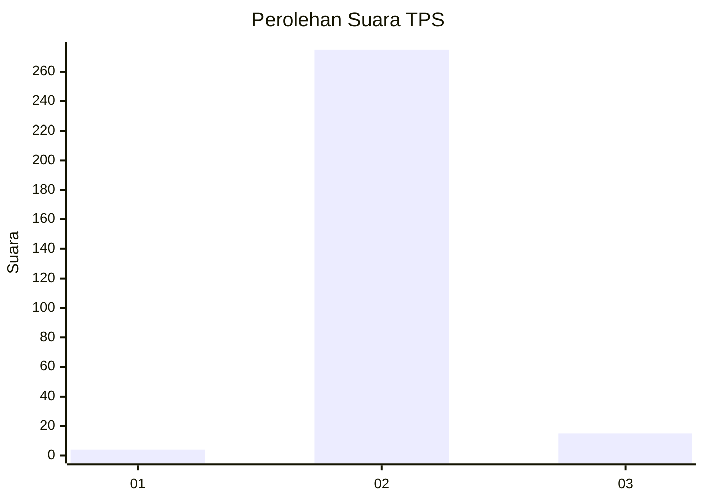
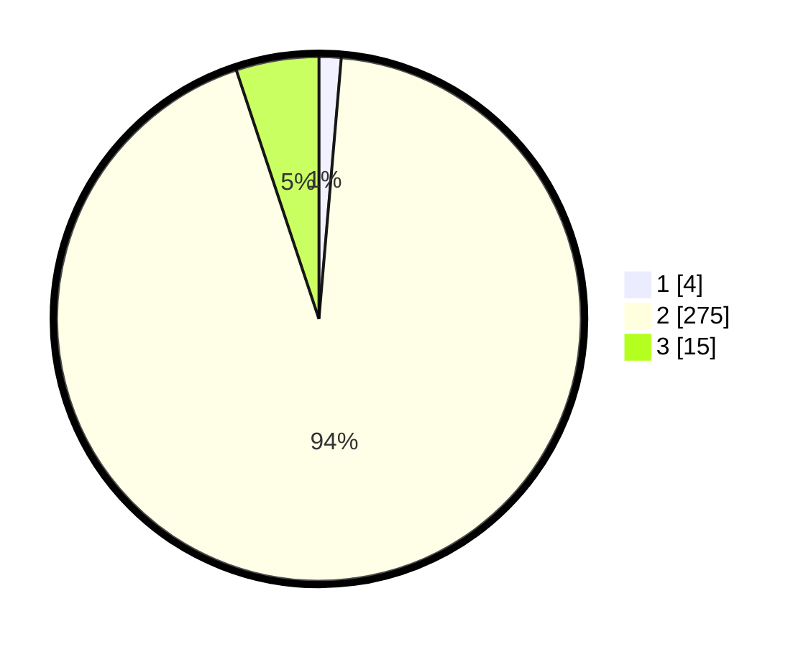

# Hasil

## Grafik

## Tabel

| No. | Nama Paslon    | Suara | Suara (raw) | Persentase |
|:--- |:-------------- | -----:| -----------:| ----------:|
| 1   | ANIES MUHAIMIN | 4     | [4][p-1]    | 1,36       |
| 2   | PRABOWO GIBRAN | 275   | [275][p-2]  | 93,54      |
| 3   | GANJAR MAHFUD  | 15    | [15][p-3]   | 5,10       |

[p-1]: https://github.com/gigit-pemilu/pemilu-2024/blob/main/pilpres/hitung-suara/sub/12-sumatera-utara/sub/14-nias-selatan/sub/09-susua/sub/2001-sifalago-susua/sub/005-tps/sub/paslon-1.txt
[p-2]: https://github.com/gigit-pemilu/pemilu-2024/blob/main/pilpres/hitung-suara/sub/12-sumatera-utara/sub/14-nias-selatan/sub/09-susua/sub/2001-sifalago-susua/sub/005-tps/sub/paslon-2.txt
[p-3]: https://github.com/gigit-pemilu/pemilu-2024/blob/main/pilpres/hitung-suara/sub/12-sumatera-utara/sub/14-nias-selatan/sub/09-susua/sub/2001-sifalago-susua/sub/005-tps/sub/paslon-3.txt

## Foto C Plano

https://sirekap-obj-formc.kpu.go.id/420e/pemilu/ppwp/12/14/09/20/01/1214092001005-20240215-180252--264ac520-b6b0-4cc4-a551-3f21405dc49c.jpg

https://sirekap-obj-formc.kpu.go.id/420e/pemilu/ppwp/12/14/09/20/01/1214092001005-20240215-180430--9e075832-376e-4414-889a-ca7219f45b23.jpg

## Metadata

| Key        | Value               |
| ---------- | ------------------- |
| Time Stamp | 2024-02-15 21:30:27 |

