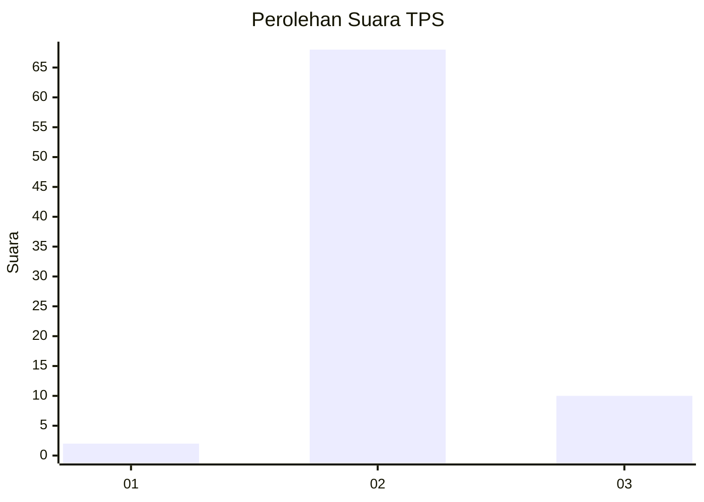
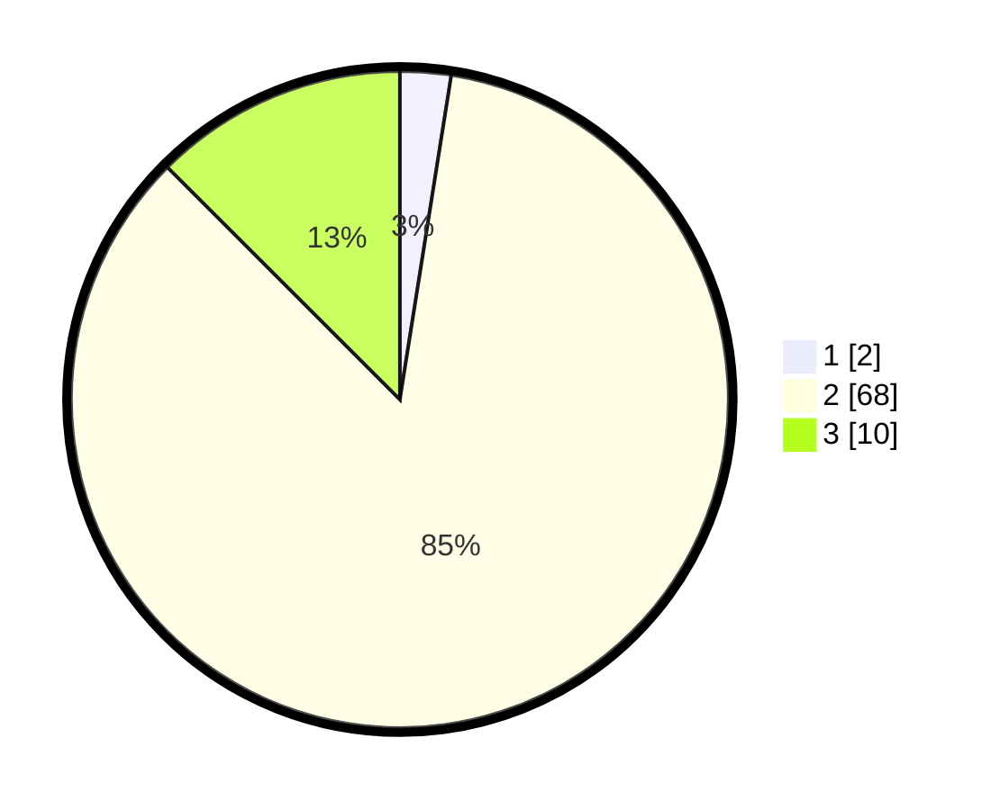

# Hasil

## Grafik

## Tabel

| No. | Nama Paslon    | Suara | Suara (raw) | Persentase |
|:--- |:-------------- | -----:| -----------:| ----------:|
| 1   | ANIES MUHAIMIN | 2     | [2][p-1]    | 2,50       |
| 2   | PRABOWO GIBRAN | 68    | [68][p-2]   | 85,00      |
| 3   | GANJAR MAHFUD  | 10    | [10][p-3]   | 12,50      |

[p-1]: https://github.com/gigit-pemilu/pemilu-2024-12-sumatera-utara/blob/main/pilpres/hitung-suara/sub/12-sumatera-utara/sub/14-nias-selatan/sub/09-susua/sub/2003-hiliana'a-susua/sub/001-tps/sub/paslon-1.txt
[p-2]: https://github.com/gigit-pemilu/pemilu-2024-12-sumatera-utara/blob/main/pilpres/hitung-suara/sub/12-sumatera-utara/sub/14-nias-selatan/sub/09-susua/sub/2003-hiliana'a-susua/sub/001-tps/sub/paslon-2.txt
[p-3]: https://github.com/gigit-pemilu/pemilu-2024-12-sumatera-utara/blob/main/pilpres/hitung-suara/sub/12-sumatera-utara/sub/14-nias-selatan/sub/09-susua/sub/2003-hiliana'a-susua/sub/001-tps/sub/paslon-3.txt

## Foto C Plano

https://sirekap-obj-formc.kpu.go.id/32ea/pemilu/ppwp/12/14/09/20/03/1214092003001-20240219-133653--96907b7e-2800-4517-a969-281603ebdd90.jpg

https://sirekap-obj-formc.kpu.go.id/32ea/pemilu/ppwp/12/14/09/20/03/1214092003001-20240219-133208--1e867944-c716-4f4d-a299-4d1d7cf85a37.jpg

https://sirekap-obj-formc.kpu.go.id/32ea/pemilu/ppwp/12/14/09/20/03/1214092003001-20240219-142822--589ff0eb-44d5-4c5e-9b9d-cccbe5f01214.jpg

## Metadata

| Key        | Value               |
| ---------- | ------------------- |
| Time Stamp | 2024-02-20 12:00:00 |

