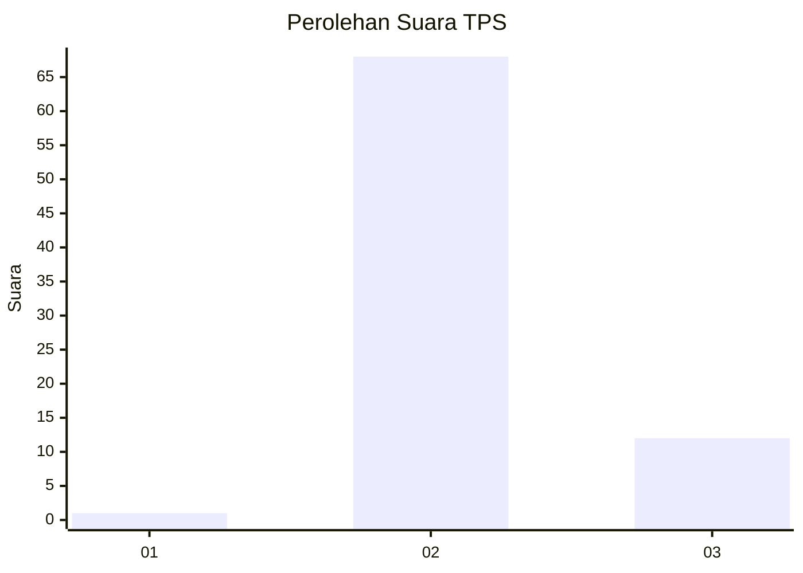
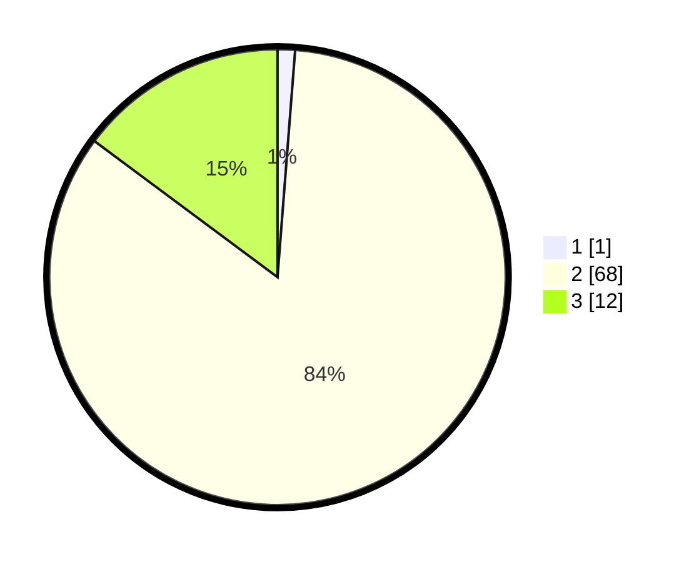

# Hasil

## Grafik

## Tabel

| No. | Nama Paslon    | Suara | Suara (raw) | Persentase |
|:--- |:-------------- | -----:| -----------:| ----------:|
| 1   | ANIES MUHAIMIN | 1     | [1][p-1]    | 1,23       |
| 2   | PRABOWO GIBRAN | 68    | [68][p-2]   | 83,95      |
| 3   | GANJAR MAHFUD  | 12    | [12][p-3]   | 14,81      |

[p-1]: https://github.com/gigit-pemilu/pemilu-2024-12-sumatera-utara/blob/main/pilpres/hitung-suara/sub/12-sumatera-utara/sub/14-nias-selatan/sub/09-susua/sub/2006-hilimboho/sub/001-tps/sub/paslon-1.txt
[p-2]: https://github.com/gigit-pemilu/pemilu-2024-12-sumatera-utara/blob/main/pilpres/hitung-suara/sub/12-sumatera-utara/sub/14-nias-selatan/sub/09-susua/sub/2006-hilimboho/sub/001-tps/sub/paslon-2.txt
[p-3]: https://github.com/gigit-pemilu/pemilu-2024-12-sumatera-utara/blob/main/pilpres/hitung-suara/sub/12-sumatera-utara/sub/14-nias-selatan/sub/09-susua/sub/2006-hilimboho/sub/001-tps/sub/paslon-3.txt

## Foto C Plano

https://sirekap-obj-formc.kpu.go.id/0735/pemilu/ppwp/12/14/09/20/06/1214092006001-20240215-145622--fd2d3ec6-d3fc-4533-afa0-4b6019a4c589.jpg

https://sirekap-obj-formc.kpu.go.id/0735/pemilu/ppwp/12/14/09/20/06/1214092006001-20240215-145644--2352a8d9-37d8-4ef3-b308-65d1eb3051fb.jpg

https://sirekap-obj-formc.kpu.go.id/0735/pemilu/ppwp/12/14/09/20/06/1214092006001-20240215-150108--f96473bf-7115-4f25-99b9-abd7dbfc1938.jpg

## Metadata

| Key        | Value               |
| ---------- | ------------------- |
| Time Stamp | 2024-02-15 18:30:25 |

