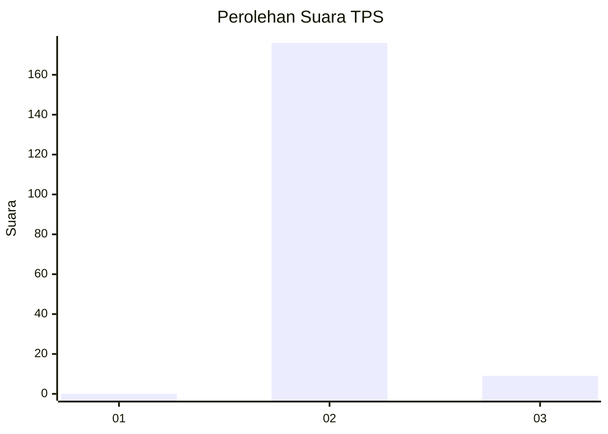
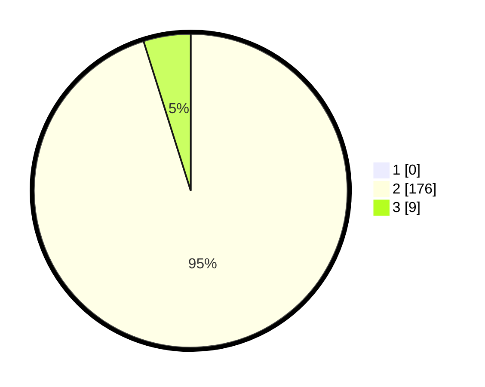

# Hasil

## Grafik

## Tabel

| No. | Nama Paslon    | Suara | Suara (raw) | Persentase |
|:--- |:-------------- | -----:| -----------:| ----------:|
| 1   | ANIES MUHAIMIN | 0     | [0][p-1]    | 0,00       |
| 2   | PRABOWO GIBRAN | 176   | [176][p-2]  | 95,14      |
| 3   | GANJAR MAHFUD  | 9     | [9][p-3]    | 4,86       |

[p-1]: https://github.com/gigit-pemilu/pemilu-2024/blob/main/pilpres/hitung-suara/sub/12-sumatera-utara/sub/14-nias-selatan/sub/09-susua/sub/2009-hilidanayao/sub/003-tps/sub/paslon-1.txt
[p-2]: https://github.com/gigit-pemilu/pemilu-2024/blob/main/pilpres/hitung-suara/sub/12-sumatera-utara/sub/14-nias-selatan/sub/09-susua/sub/2009-hilidanayao/sub/003-tps/sub/paslon-2.txt
[p-3]: https://github.com/gigit-pemilu/pemilu-2024/blob/main/pilpres/hitung-suara/sub/12-sumatera-utara/sub/14-nias-selatan/sub/09-susua/sub/2009-hilidanayao/sub/003-tps/sub/paslon-3.txt

## Foto C Plano

https://sirekap-obj-formc.kpu.go.id/7f5c/pemilu/ppwp/12/14/09/20/09/1214092009003-20240216-112544--1bd47c58-c530-4eb0-aa05-f774a89eeacd.jpg

https://sirekap-obj-formc.kpu.go.id/7f5c/pemilu/ppwp/12/14/09/20/09/1214092009003-20240216-112716--d9c07f5f-dc53-4fe2-8b36-98323f40f8c7.jpg

https://sirekap-obj-formc.kpu.go.id/7f5c/pemilu/ppwp/12/14/09/20/09/1214092009003-20240216-112900--4c47dd4c-bd5b-404d-8532-39a44e150e07.jpg

## Metadata

| Key        | Value               |
| ---------- | ------------------- |
| Time Stamp | 2024-02-20 12:00:00 |

