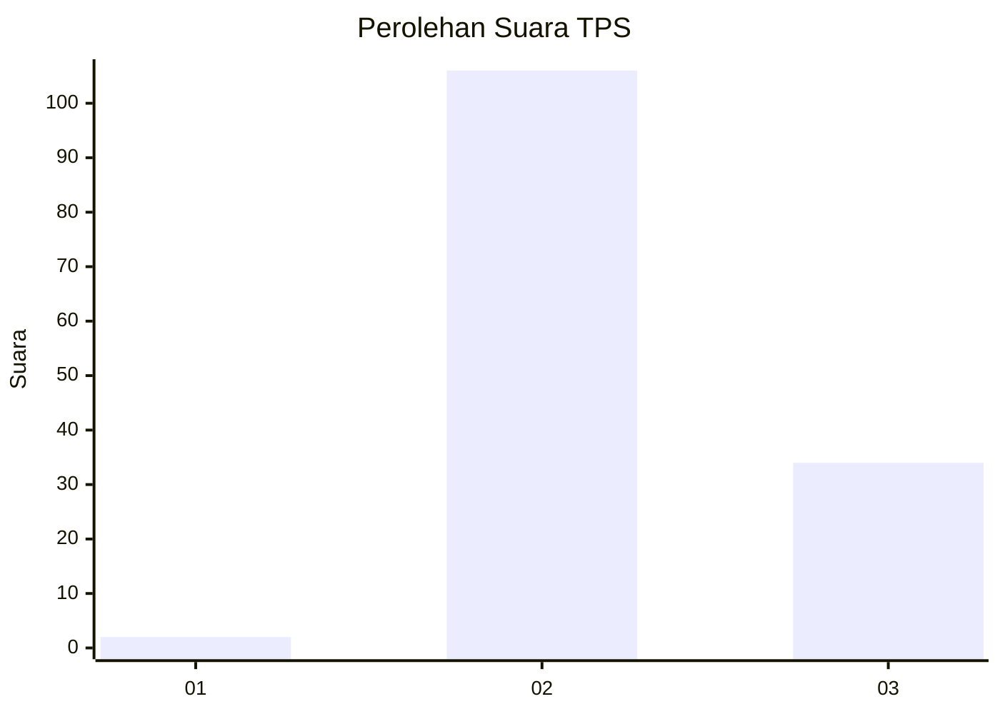
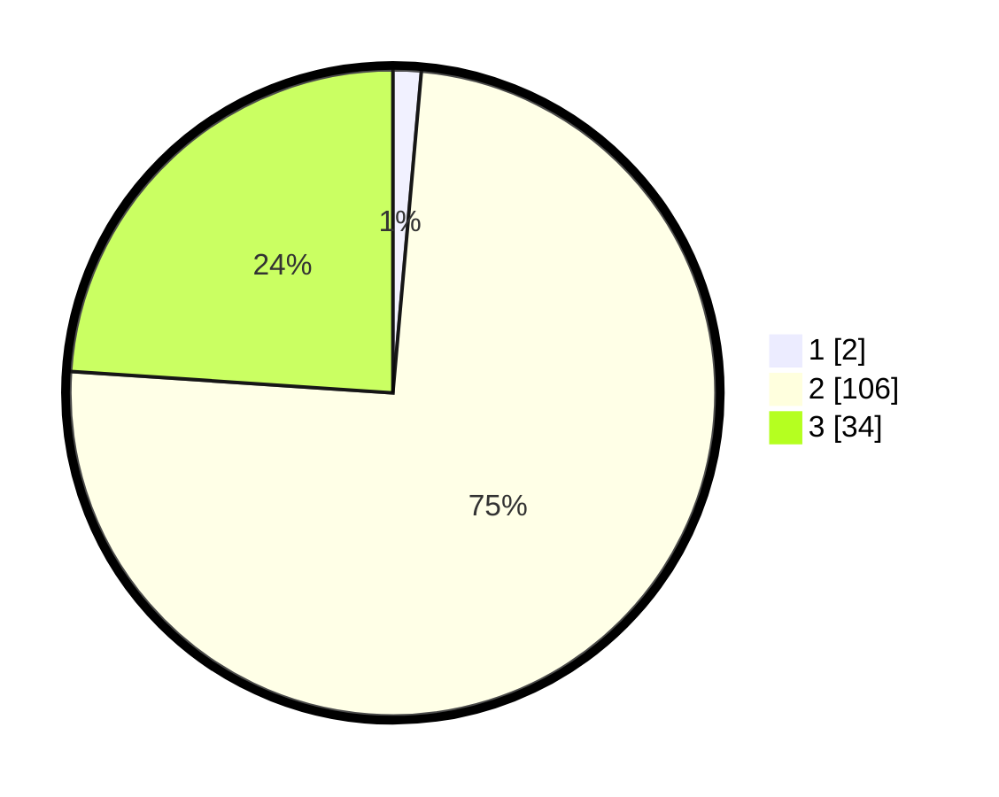

# Hasil

## Grafik

## Tabel

| No. | Nama Paslon    | Suara | Suara (raw) | Persentase |
|:--- |:-------------- | -----:| -----------:| ----------:|
| 1   | ANIES MUHAIMIN | 2     | [2][p-1]    | 1,41       |
| 2   | PRABOWO GIBRAN | 106   | [106][p-2]  | 74,65      |
| 3   | GANJAR MAHFUD  | 34    | [34][p-3]   | 23,94      |

[p-1]: https://github.com/gigit-pemilu/pemilu-2024-12-sumatera-utara/blob/main/pilpres/hitung-suara/sub/12-sumatera-utara/sub/14-nias-selatan/sub/10-maniamolo/sub/2003-hilifalawu/sub/003-tps/sub/paslon-1.txt
[p-2]: https://github.com/gigit-pemilu/pemilu-2024-12-sumatera-utara/blob/main/pilpres/hitung-suara/sub/12-sumatera-utara/sub/14-nias-selatan/sub/10-maniamolo/sub/2003-hilifalawu/sub/003-tps/sub/paslon-2.txt
[p-3]: https://github.com/gigit-pemilu/pemilu-2024-12-sumatera-utara/blob/main/pilpres/hitung-suara/sub/12-sumatera-utara/sub/14-nias-selatan/sub/10-maniamolo/sub/2003-hilifalawu/sub/003-tps/sub/paslon-3.txt

## Foto C Plano

https://sirekap-obj-formc.kpu.go.id/b3d8/pemilu/ppwp/12/14/10/20/03/1214102003003-20240215-100757--47468c1a-d970-4f98-841f-078705f7b738.jpg

https://sirekap-obj-formc.kpu.go.id/b3d8/pemilu/ppwp/12/14/10/20/03/1214102003003-20240215-100423--b2d20b72-9398-4e6e-ab43-a141b8b7d90d.jpg

https://sirekap-obj-formc.kpu.go.id/b3d8/pemilu/ppwp/12/14/10/20/03/1214102003003-20240215-100548--077a34c4-88f8-430c-a3d4-8fb81f7d8d84.jpg

## Metadata

| Key        | Value               |
| ---------- | ------------------- |
| Time Stamp | 2024-02-15 18:30:25 |

