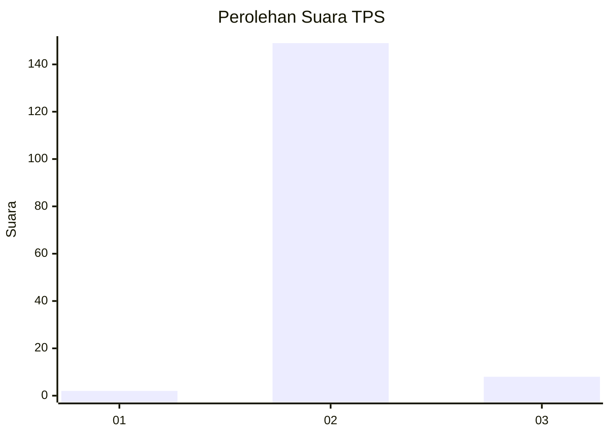
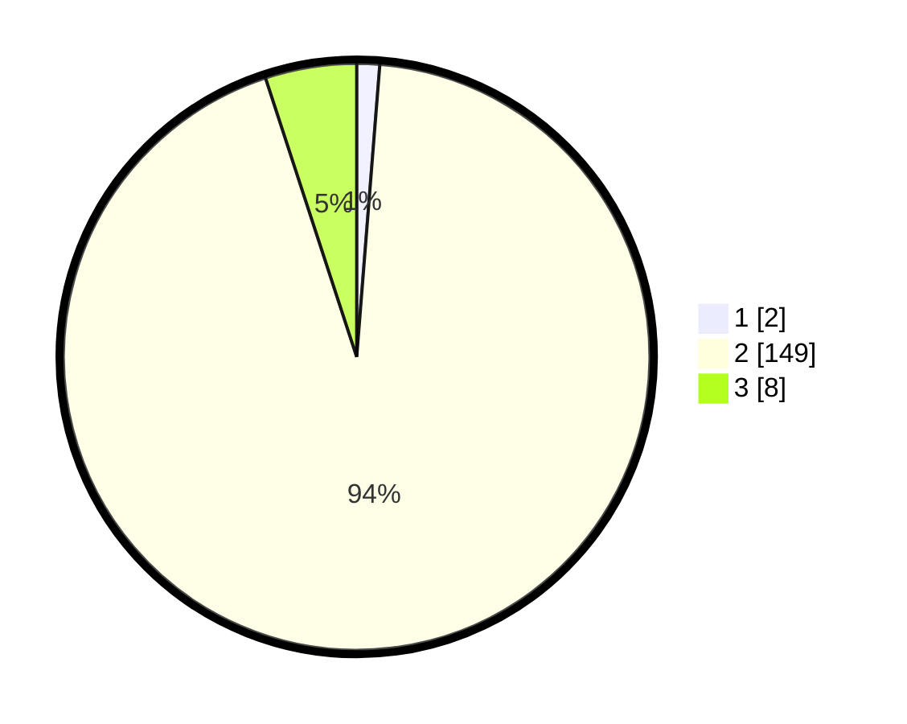

# Hasil

## Grafik

## Tabel

| No. | Nama Paslon    | Suara | Suara (raw) | Persentase |
|:--- |:-------------- | -----:| -----------:| ----------:|
| 1   | ANIES MUHAIMIN | 2     | [2][p-1]    | 1,26       |
| 2   | PRABOWO GIBRAN | 149   | [149][p-2]  | 93,71      |
| 3   | GANJAR MAHFUD  | 8     | [8][p-3]    | 5,03       |

[p-1]: https://github.com/gigit-pemilu/pemilu-2024/blob/main/pilpres/hitung-suara/sub/12-sumatera-utara/sub/14-nias-selatan/sub/10-maniamolo/sub/2008-bonia-hilisimaetano/sub/001-tps/sub/paslon-1.txt
[p-2]: https://github.com/gigit-pemilu/pemilu-2024/blob/main/pilpres/hitung-suara/sub/12-sumatera-utara/sub/14-nias-selatan/sub/10-maniamolo/sub/2008-bonia-hilisimaetano/sub/001-tps/sub/paslon-2.txt
[p-3]: https://github.com/gigit-pemilu/pemilu-2024/blob/main/pilpres/hitung-suara/sub/12-sumatera-utara/sub/14-nias-selatan/sub/10-maniamolo/sub/2008-bonia-hilisimaetano/sub/001-tps/sub/paslon-3.txt

## Foto C Plano

https://sirekap-obj-formc.kpu.go.id/f112/pemilu/ppwp/12/14/10/20/08/1214102008001-20240215-123540--c66a26fb-34df-4fb3-9567-af46673d1843.jpg

https://sirekap-obj-formc.kpu.go.id/f112/pemilu/ppwp/12/14/10/20/08/1214102008001-20240215-122236--de22401d-6eb2-4d7b-b022-dda5fa0e6726.jpg

https://sirekap-obj-formc.kpu.go.id/f112/pemilu/ppwp/12/14/10/20/08/1214102008001-20240215-122623--7398864d-aff4-4d28-a653-1173b5bff762.jpg

## Metadata

| Key        | Value               |
| ---------- | ------------------- |
| Time Stamp | 2024-02-15 23:29:50 |

