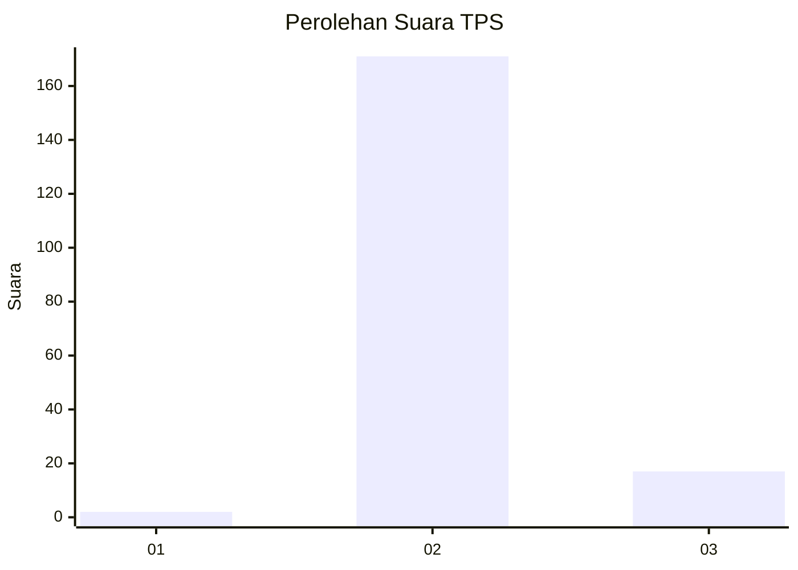
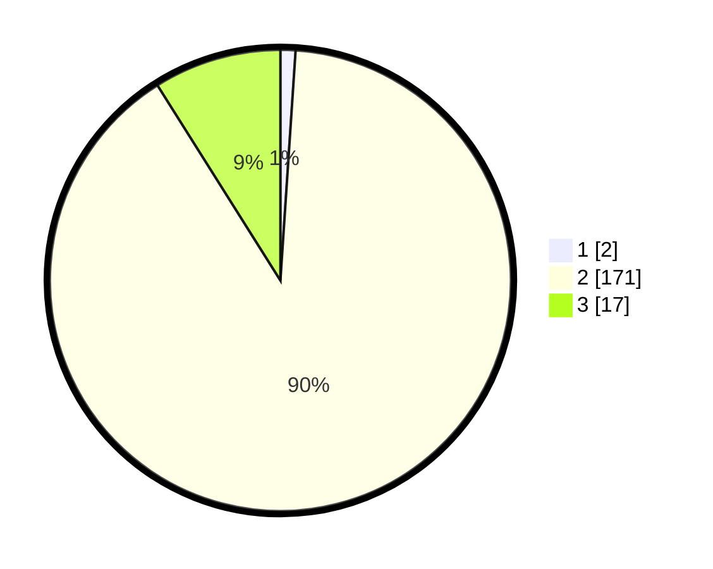

# Hasil

## Grafik

## Tabel

| No. | Nama Paslon    | Suara | Suara (raw) | Persentase |
|:--- |:-------------- | -----:| -----------:| ----------:|
| 1   | ANIES MUHAIMIN | 2     | [2][p-1]    | 1,05       |
| 2   | PRABOWO GIBRAN | 171   | [171][p-2]  | 90,00      |
| 3   | GANJAR MAHFUD  | 17    | [17][p-3]   | 8,95       |

[p-1]: https://github.com/gigit-pemilu/pemilu-2024/blob/main/pilpres/hitung-suara/sub/12-sumatera-utara/sub/14-nias-selatan/sub/10-maniamolo/sub/2008-bonia-hilisimaetano/sub/002-tps/sub/paslon-1.txt
[p-2]: https://github.com/gigit-pemilu/pemilu-2024/blob/main/pilpres/hitung-suara/sub/12-sumatera-utara/sub/14-nias-selatan/sub/10-maniamolo/sub/2008-bonia-hilisimaetano/sub/002-tps/sub/paslon-2.txt
[p-3]: https://github.com/gigit-pemilu/pemilu-2024/blob/main/pilpres/hitung-suara/sub/12-sumatera-utara/sub/14-nias-selatan/sub/10-maniamolo/sub/2008-bonia-hilisimaetano/sub/002-tps/sub/paslon-3.txt

## Foto C Plano

https://sirekap-obj-formc.kpu.go.id/bbcb/pemilu/ppwp/12/14/10/20/08/1214102008002-20240215-112131--d5a36c51-f8f8-443b-bb8e-866596d74022.jpg

https://sirekap-obj-formc.kpu.go.id/bbcb/pemilu/ppwp/12/14/10/20/08/1214102008002-20240215-104557--26f523a8-0ea0-44d2-b08f-cb8d4562f4ec.jpg

https://sirekap-obj-formc.kpu.go.id/bbcb/pemilu/ppwp/12/14/10/20/08/1214102008002-20240215-112546--80f72b71-5fe3-4d26-bb65-8cc592b9eee5.jpg

## Metadata

| Key        | Value               |
| ---------- | ------------------- |
| Time Stamp | 2024-02-15 23:29:50 |

