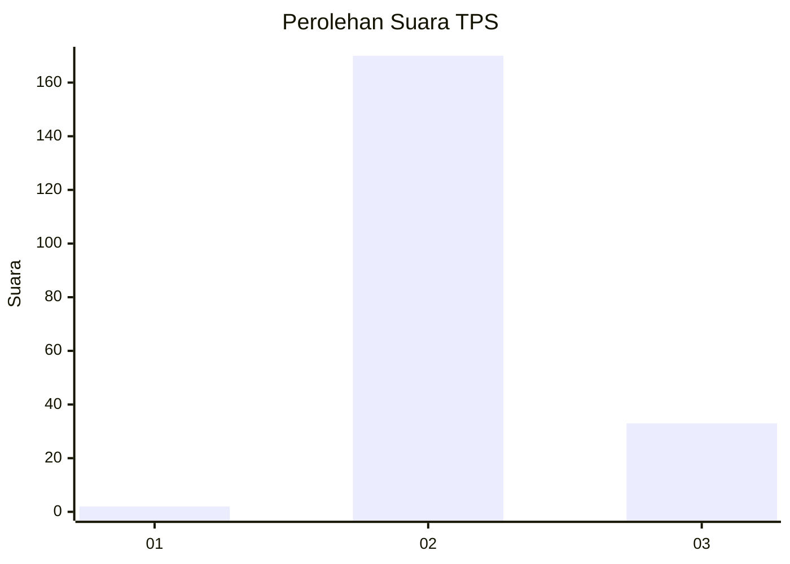
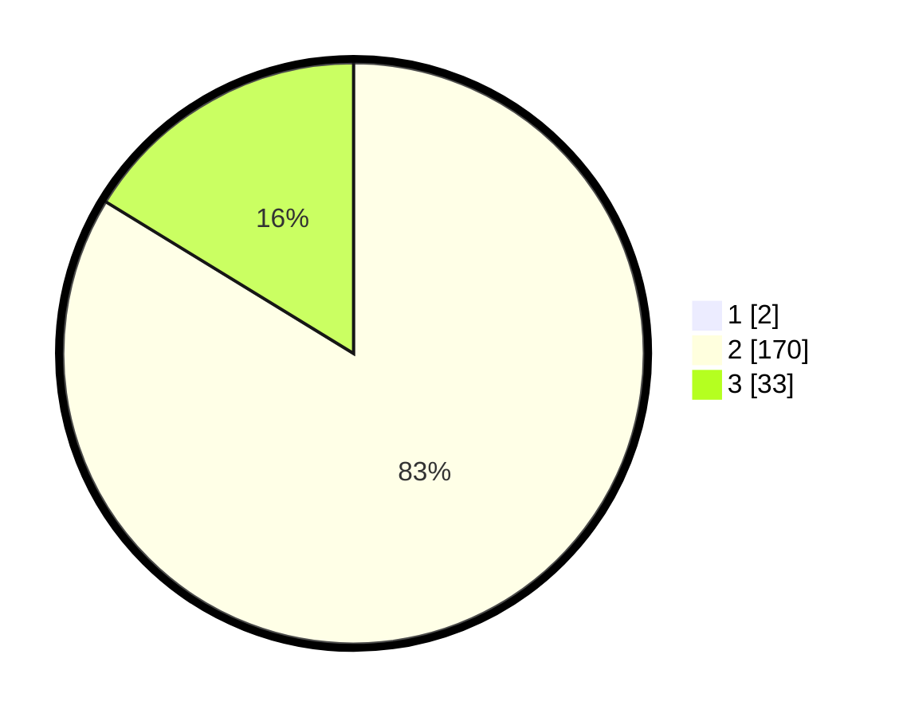

# Hasil

## Grafik

## Tabel

| No. | Nama Paslon    | Suara | Suara (raw) | Persentase |
|:--- |:-------------- | -----:| -----------:| ----------:|
| 1   | ANIES MUHAIMIN | 2     | [2][p-1]    | 0,98       |
| 2   | PRABOWO GIBRAN | 170   | [170][p-2]  | 82,93      |
| 3   | GANJAR MAHFUD  | 33    | [33][p-3]   | 16,10      |

[p-1]: https://github.com/gigit-pemilu/pemilu-2024/blob/main/pilpres/hitung-suara/sub/12-sumatera-utara/sub/14-nias-selatan/sub/10-maniamolo/sub/2009-ndraso-hilisimaetano/sub/001-tps/sub/paslon-1.txt
[p-2]: https://github.com/gigit-pemilu/pemilu-2024/blob/main/pilpres/hitung-suara/sub/12-sumatera-utara/sub/14-nias-selatan/sub/10-maniamolo/sub/2009-ndraso-hilisimaetano/sub/001-tps/sub/paslon-2.txt
[p-3]: https://github.com/gigit-pemilu/pemilu-2024/blob/main/pilpres/hitung-suara/sub/12-sumatera-utara/sub/14-nias-selatan/sub/10-maniamolo/sub/2009-ndraso-hilisimaetano/sub/001-tps/sub/paslon-3.txt

## Foto C Plano

https://sirekap-obj-formc.kpu.go.id/f50f/pemilu/ppwp/12/14/10/20/09/1214102009001-20240215-154553--85214fb6-3e90-4750-a2ef-a92b8f0591a6.jpg

https://sirekap-obj-formc.kpu.go.id/f50f/pemilu/ppwp/12/14/10/20/09/1214102009001-20240215-155237--b5f21602-b393-4ec0-9359-593d4756d048.jpg

https://sirekap-obj-formc.kpu.go.id/f50f/pemilu/ppwp/12/14/10/20/09/1214102009001-20240215-152636--7a108ef5-82c2-4b70-82cd-213859d9cfb7.jpg

## Metadata

| Key        | Value               |
| ---------- | ------------------- |
| Time Stamp | 2024-02-15 21:01:18 |

