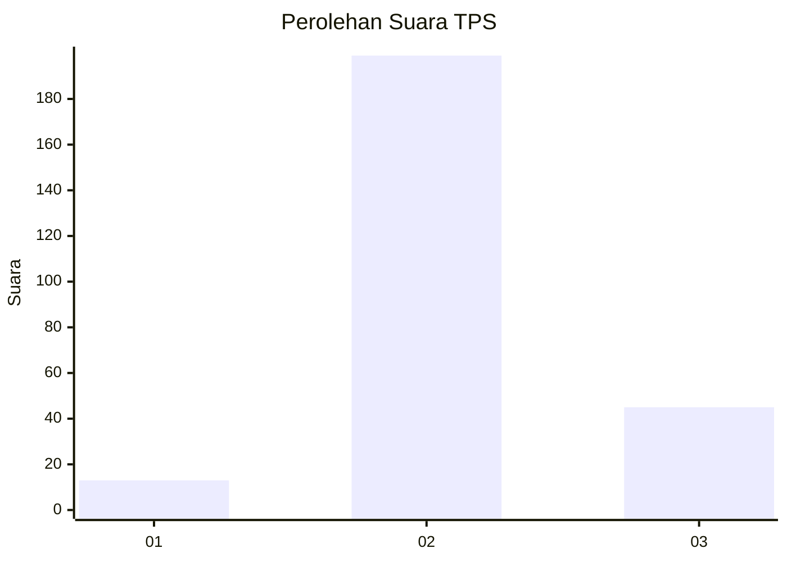

# Hasil

## Grafik

## Tabel

| No. | Nama Paslon    | Suara | Suara (raw) | Persentase |
|:--- |:-------------- | -----:| -----------:| ----------:|
| 1   | ANIES MUHAIMIN | 13    | [13][p-1]   | 5,06       |
| 2   | PRABOWO GIBRAN | 199   | [199][p-2]  | 77,43      |
| 3   | GANJAR MAHFUD  | 45    | [45][p-3]   | 17,51      |

[p-1]: https://github.com/gigit-pemilu/pemilu-2024/blob/main/pilpres/hitung-suara/sub/12-sumatera-utara/sub/14-nias-selatan/sub/10-maniamolo/sub/2013-hiliaurifa-hilisimaetano/sub/002-tps/sub/paslon-1.txt
[p-2]: https://github.com/gigit-pemilu/pemilu-2024/blob/main/pilpres/hitung-suara/sub/12-sumatera-utara/sub/14-nias-selatan/sub/10-maniamolo/sub/2013-hiliaurifa-hilisimaetano/sub/002-tps/sub/paslon-2.txt
[p-3]: https://github.com/gigit-pemilu/pemilu-2024/blob/main/pilpres/hitung-suara/sub/12-sumatera-utara/sub/14-nias-selatan/sub/10-maniamolo/sub/2013-hiliaurifa-hilisimaetano/sub/002-tps/sub/paslon-3.txt

## Foto C Plano

https://sirekap-obj-formc.kpu.go.id/9533/pemilu/ppwp/12/14/10/20/13/1214102013002-20240215-103450--1f6b0465-46da-48be-93fd-1057868f1075.jpg

https://sirekap-obj-formc.kpu.go.id/9533/pemilu/ppwp/12/14/10/20/13/1214102013002-20240215-103725--8828fe21-6c0f-457e-8cab-c52d4f7f891b.jpg

https://sirekap-obj-formc.kpu.go.id/9533/pemilu/ppwp/12/14/10/20/13/1214102013002-20240215-104357--81593b90-541c-4bd3-bdb0-9fb1081130e8.jpg

## Metadata

| Key        | Value               |
| ---------- | ------------------- |
| Time Stamp | 2024-02-15 22:30:27 |

