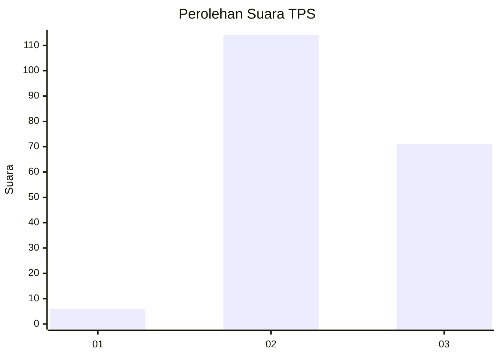
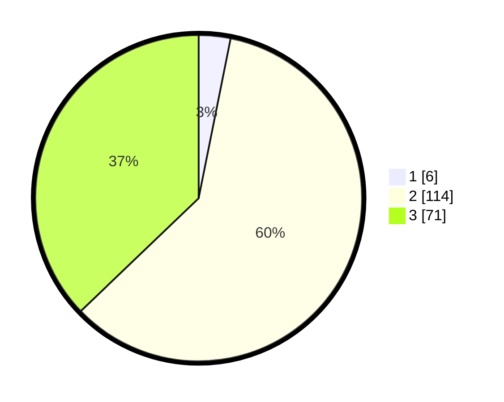

# Hasil

## Grafik

## Tabel

| No. | Nama Paslon    | Suara | Suara (raw) | Persentase |
|:--- |:-------------- | -----:| -----------:| ----------:|
| 1   | ANIES MUHAIMIN | 6     | [6][p-1]    | 3,14       |
| 2   | PRABOWO GIBRAN | 114   | [114][p-2]  | 59,69      |
| 3   | GANJAR MAHFUD  | 71    | [71][p-3]   | 37,17      |

[p-1]: https://github.com/gigit-pemilu/pemilu-2024/blob/main/pilpres/hitung-suara/sub/12-sumatera-utara/sub/14-nias-selatan/sub/11-hilimegai/sub/2001-togizita/sub/001-tps/sub/paslon-1.txt
[p-2]: https://github.com/gigit-pemilu/pemilu-2024/blob/main/pilpres/hitung-suara/sub/12-sumatera-utara/sub/14-nias-selatan/sub/11-hilimegai/sub/2001-togizita/sub/001-tps/sub/paslon-2.txt
[p-3]: https://github.com/gigit-pemilu/pemilu-2024/blob/main/pilpres/hitung-suara/sub/12-sumatera-utara/sub/14-nias-selatan/sub/11-hilimegai/sub/2001-togizita/sub/001-tps/sub/paslon-3.txt

## Foto C Plano

https://sirekap-obj-formc.kpu.go.id/bba9/pemilu/ppwp/12/14/11/20/01/1214112001001-20240215-110329--275ec9f2-aac2-453b-a5fd-533f452d9503.jpg

https://sirekap-obj-formc.kpu.go.id/bba9/pemilu/ppwp/12/14/11/20/01/1214112001001-20240215-110452--c7137020-924f-4c93-a261-4f94533dba7f.jpg

https://sirekap-obj-formc.kpu.go.id/bba9/pemilu/ppwp/12/14/11/20/01/1214112001001-20240215-112006--c2c1ac04-9b4a-4db9-a4fe-45989c8dc97b.jpg

## Metadata

| Key        | Value               |
| ---------- | ------------------- |
| Time Stamp | 2024-02-15 21:30:27 |

