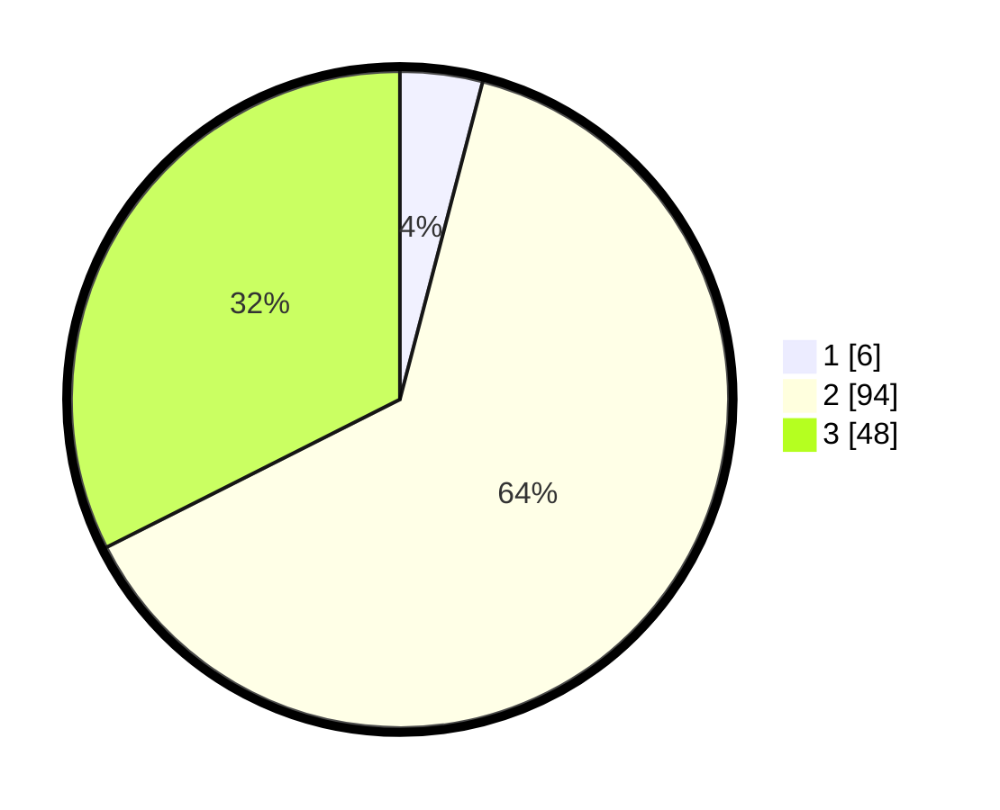

# Hasil

## Grafik

## Tabel

| No. | Nama Paslon    | Suara | Suara (raw) | Persentase |
|:--- |:-------------- | -----:| -----------:| ----------:|
| 1   | ANIES MUHAIMIN | 6     | [6][p-1]    | 4,05       |
| 2   | PRABOWO GIBRAN | 94    | [94][p-2]   | 63,51      |
| 3   | GANJAR MAHFUD  | 48    | [48][p-3]   | 32,43      |

[p-1]: https://github.com/gigit-pemilu/pemilu-2024/blob/main/pilpres/hitung-suara/sub/12-sumatera-utara/sub/14-nias-selatan/sub/11-hilimegai/sub/2001-togizita/sub/002-tps/sub/paslon-1.txt
[p-2]: https://github.com/gigit-pemilu/pemilu-2024/blob/main/pilpres/hitung-suara/sub/12-sumatera-utara/sub/14-nias-selatan/sub/11-hilimegai/sub/2001-togizita/sub/002-tps/sub/paslon-2.txt
[p-3]: https://github.com/gigit-pemilu/pemilu-2024/blob/main/pilpres/hitung-suara/sub/12-sumatera-utara/sub/14-nias-selatan/sub/11-hilimegai/sub/2001-togizita/sub/002-tps/sub/paslon-3.txt

## Foto C Plano

https://sirekap-obj-formc.kpu.go.id/1910/pemilu/ppwp/12/14/11/20/01/1214112001002-20240215-185229--b432ff95-49f8-4d4b-b0c2-f23a52bf1a02.jpg

https://sirekap-obj-formc.kpu.go.id/1910/pemilu/ppwp/12/14/11/20/01/1214112001002-20240215-163449--d07bda12-9578-41ba-bd7e-6d4ee1739994.jpg

https://sirekap-obj-formc.kpu.go.id/1910/pemilu/ppwp/12/14/11/20/01/1214112001002-20240215-163657--2778cdd2-e4cb-4be7-83ff-ad474d6f2b15.jpg

## Metadata

| Key        | Value               |
| ---------- | ------------------- |
| Time Stamp | 2024-02-15 21:01:18 |

