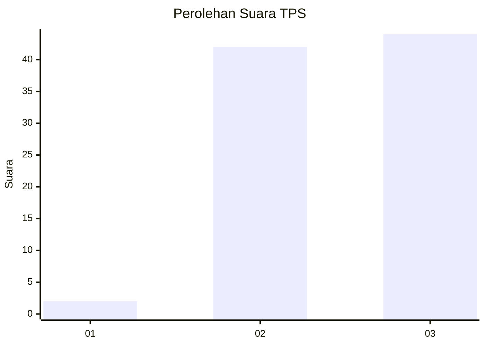
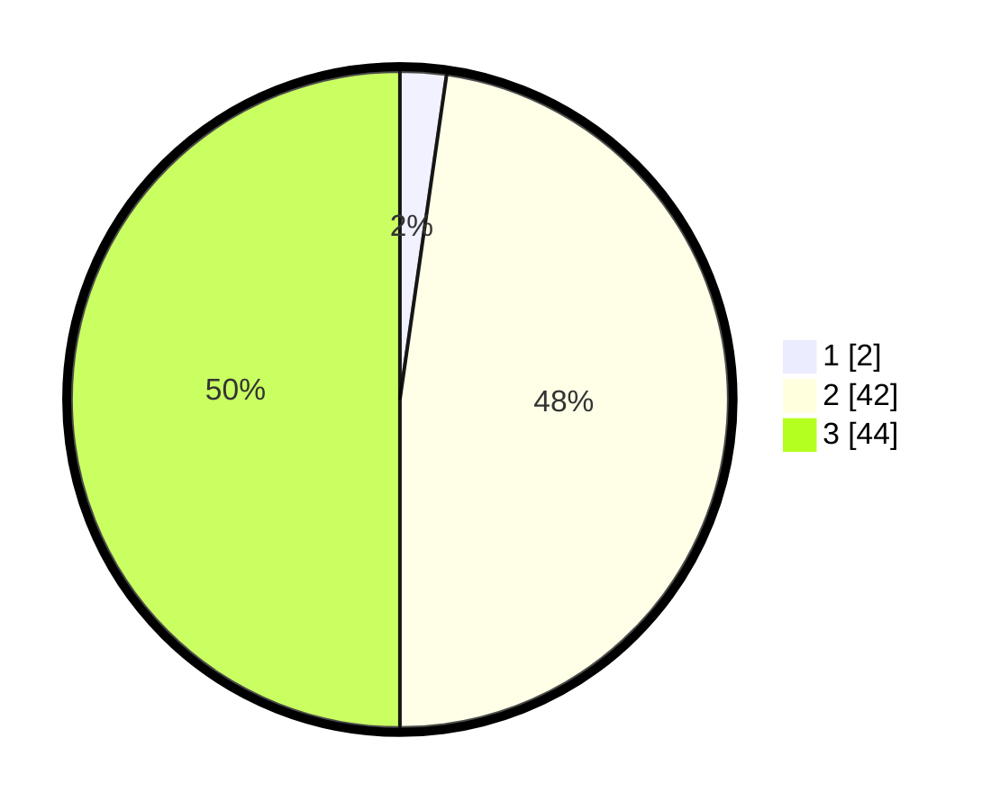

# Hasil

## Grafik

## Tabel

| No. | Nama Paslon    | Suara | Suara (raw) | Persentase |
|:--- |:-------------- | -----:| -----------:| ----------:|
| 1   | ANIES MUHAIMIN | 2     | [2][p-1]    | 2,27       |
| 2   | PRABOWO GIBRAN | 42    | [42][p-2]   | 47,73      |
| 3   | GANJAR MAHFUD  | 44    | [44][p-3]   | 50,00      |

[p-1]: https://github.com/gigit-pemilu/pemilu-2024-12-sumatera-utara/blob/main/pilpres/hitung-suara/sub/12-sumatera-utara/sub/14-nias-selatan/sub/11-hilimegai/sub/2002-soledua/sub/001-tps/sub/paslon-1.txt
[p-2]: https://github.com/gigit-pemilu/pemilu-2024-12-sumatera-utara/blob/main/pilpres/hitung-suara/sub/12-sumatera-utara/sub/14-nias-selatan/sub/11-hilimegai/sub/2002-soledua/sub/001-tps/sub/paslon-2.txt
[p-3]: https://github.com/gigit-pemilu/pemilu-2024-12-sumatera-utara/blob/main/pilpres/hitung-suara/sub/12-sumatera-utara/sub/14-nias-selatan/sub/11-hilimegai/sub/2002-soledua/sub/001-tps/sub/paslon-3.txt

## Foto C Plano

https://sirekap-obj-formc.kpu.go.id/9724/pemilu/ppwp/12/14/11/20/02/1214112002001-20240215-025929--7f602db0-dbce-49eb-836a-77bf5271c5eb.jpg

https://sirekap-obj-formc.kpu.go.id/9724/pemilu/ppwp/12/14/11/20/02/1214112002001-20240215-030011--22e60242-5781-4cef-8593-863484c394ad.jpg

https://sirekap-obj-formc.kpu.go.id/9724/pemilu/ppwp/12/14/11/20/02/1214112002001-20240215-030057--7da30589-adbe-47be-9097-b4491d53f621.jpg

## Metadata

| Key        | Value               |
| ---------- | ------------------- |
| Time Stamp | 2024-02-15 23:29:50 |

