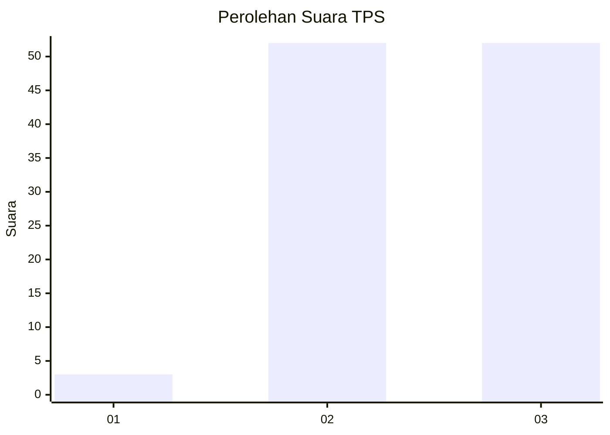
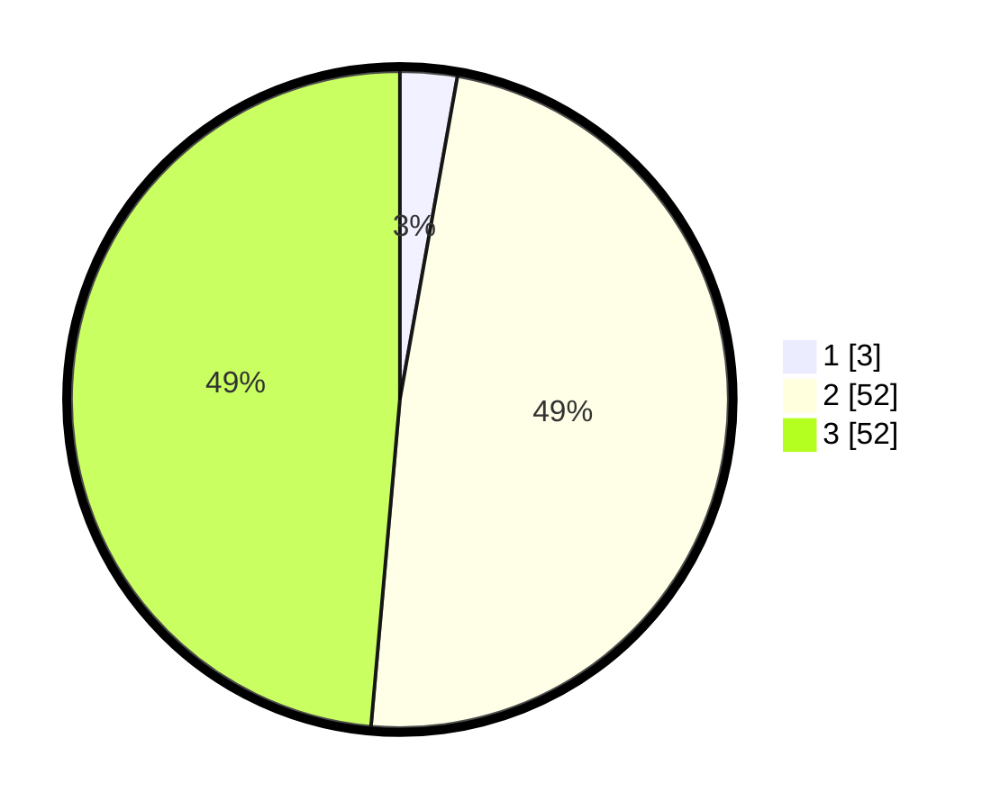

# Hasil

## Grafik

## Tabel

| No. | Nama Paslon    | Suara | Suara (raw) | Persentase |
|:--- |:-------------- | -----:| -----------:| ----------:|
| 1   | ANIES MUHAIMIN | 3     | [3][p-1]    | 2,80       |
| 2   | PRABOWO GIBRAN | 52    | [52][p-2]   | 48,60      |
| 3   | GANJAR MAHFUD  | 52    | [52][p-3]   | 48,60      |

[p-1]: https://github.com/gigit-pemilu/pemilu-2024/blob/main/pilpres/hitung-suara/sub/12-sumatera-utara/sub/14-nias-selatan/sub/11-hilimegai/sub/2002-soledua/sub/002-tps/sub/paslon-1.txt
[p-2]: https://github.com/gigit-pemilu/pemilu-2024/blob/main/pilpres/hitung-suara/sub/12-sumatera-utara/sub/14-nias-selatan/sub/11-hilimegai/sub/2002-soledua/sub/002-tps/sub/paslon-2.txt
[p-3]: https://github.com/gigit-pemilu/pemilu-2024/blob/main/pilpres/hitung-suara/sub/12-sumatera-utara/sub/14-nias-selatan/sub/11-hilimegai/sub/2002-soledua/sub/002-tps/sub/paslon-3.txt

## Foto C Plano

https://sirekap-obj-formc.kpu.go.id/809c/pemilu/ppwp/12/14/11/20/02/1214112002002-20240214-195234--38c3145c-28f6-4f8e-a7b6-f4728d70a233.jpg

https://sirekap-obj-formc.kpu.go.id/809c/pemilu/ppwp/12/14/11/20/02/1214112002002-20240214-195438--de728d13-d2fe-4e5e-81ae-c0a2e160b8a8.jpg

https://sirekap-obj-formc.kpu.go.id/809c/pemilu/ppwp/12/14/11/20/02/1214112002002-20240214-221708--61462415-2e37-4906-a50c-3c2fbd8155af.jpg

## Metadata

| Key        | Value               |
| ---------- | ------------------- |
| Time Stamp | 2024-02-15 23:29:50 |

