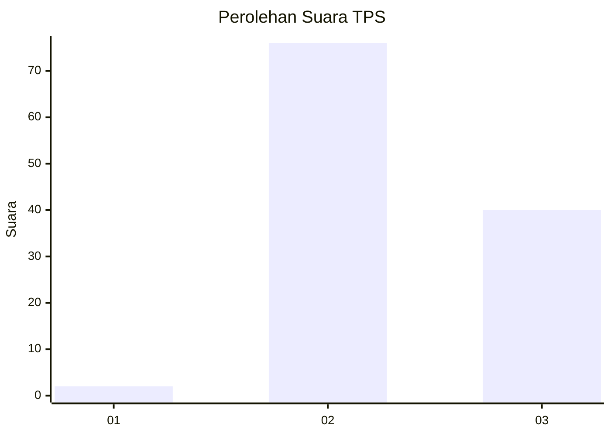
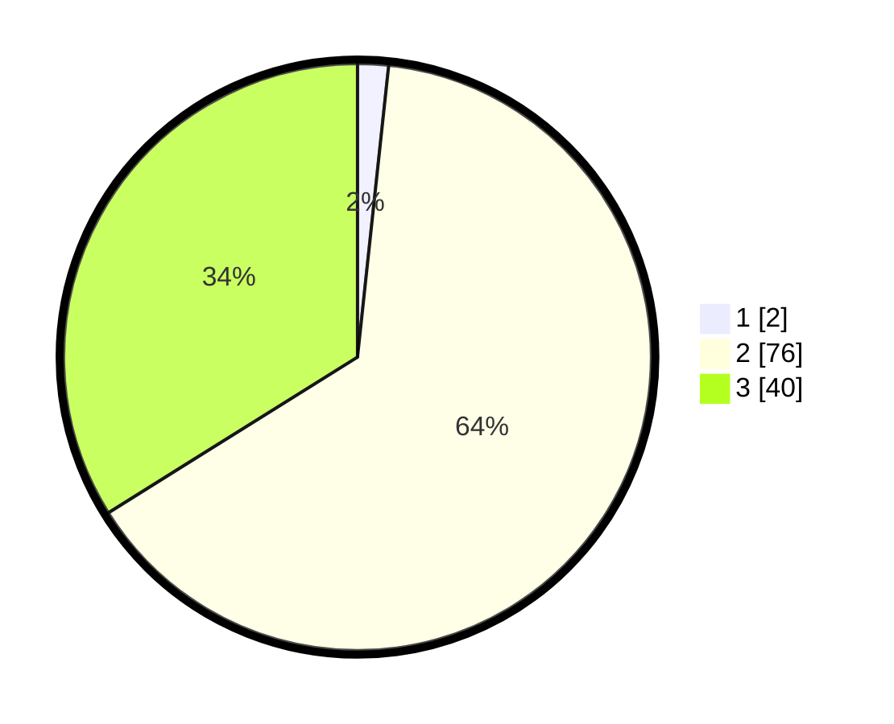

# Hasil

## Grafik

## Tabel

| No. | Nama Paslon    | Suara | Suara (raw) | Persentase |
|:--- |:-------------- | -----:| -----------:| ----------:|
| 1   | ANIES MUHAIMIN | 2     | [2][p-1]    | 1,69       |
| 2   | PRABOWO GIBRAN | 76    | [76][p-2]   | 64,41      |
| 3   | GANJAR MAHFUD  | 40    | [40][p-3]   | 33,90      |

[p-1]: https://github.com/gigit-pemilu/pemilu-2024/blob/main/pilpres/hitung-suara/sub/12-sumatera-utara/sub/14-nias-selatan/sub/11-hilimegai/sub/2003-bawosalo'o-dao-dao/sub/001-tps/sub/paslon-1.txt
[p-2]: https://github.com/gigit-pemilu/pemilu-2024/blob/main/pilpres/hitung-suara/sub/12-sumatera-utara/sub/14-nias-selatan/sub/11-hilimegai/sub/2003-bawosalo'o-dao-dao/sub/001-tps/sub/paslon-2.txt
[p-3]: https://github.com/gigit-pemilu/pemilu-2024/blob/main/pilpres/hitung-suara/sub/12-sumatera-utara/sub/14-nias-selatan/sub/11-hilimegai/sub/2003-bawosalo'o-dao-dao/sub/001-tps/sub/paslon-3.txt

## Foto C Plano

https://sirekap-obj-formc.kpu.go.id/48a8/pemilu/ppwp/12/14/11/20/03/1214112003001-20240219-170113--011f3df6-6fb7-46af-ad74-ced42c660563.jpg

https://sirekap-obj-formc.kpu.go.id/48a8/pemilu/ppwp/12/14/11/20/03/1214112003001-20240219-170159--b9cf8f70-693e-4bc3-80a2-086afc3565f7.jpg

https://sirekap-obj-formc.kpu.go.id/48a8/pemilu/ppwp/12/14/11/20/03/1214112003001-20240219-170258--44c14f34-90e5-4533-be53-149fba28ebef.jpg

## Metadata

| Key        | Value               |
| ---------- | ------------------- |
| Time Stamp | 2024-02-20 12:00:00 |

