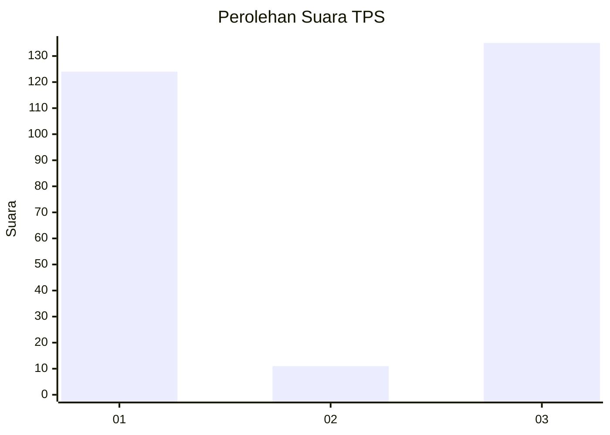
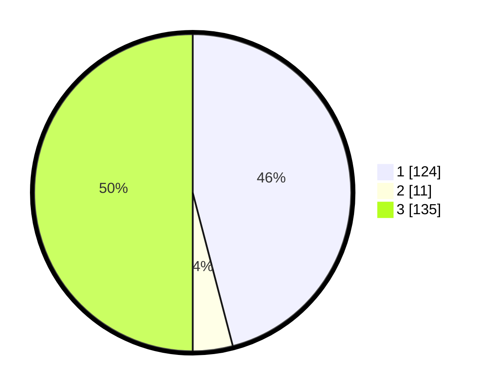

# Hasil

## Grafik

## Tabel

| No. | Nama Paslon    | Suara | Suara (raw) | Persentase |
|:--- |:-------------- | -----:| -----------:| ----------:|
| 1   | ANIES MUHAIMIN | 124   | [124][p-1]  | 45,93      |
| 2   | PRABOWO GIBRAN | 11    | [11][p-2]   | 4,07       |
| 3   | GANJAR MAHFUD  | 135   | [135][p-3]  | 50,00      |

[p-1]: https://github.com/gigit-pemilu/pemilu-2024-12-sumatera-utara/blob/main/pilpres/hitung-suara/sub/12-sumatera-utara/sub/14-nias-selatan/sub/11-hilimegai/sub/2003-bawosalo'o-dao-dao/sub/002-tps/sub/paslon-1.txt
[p-2]: https://github.com/gigit-pemilu/pemilu-2024-12-sumatera-utara/blob/main/pilpres/hitung-suara/sub/12-sumatera-utara/sub/14-nias-selatan/sub/11-hilimegai/sub/2003-bawosalo'o-dao-dao/sub/002-tps/sub/paslon-2.txt
[p-3]: https://github.com/gigit-pemilu/pemilu-2024-12-sumatera-utara/blob/main/pilpres/hitung-suara/sub/12-sumatera-utara/sub/14-nias-selatan/sub/11-hilimegai/sub/2003-bawosalo'o-dao-dao/sub/002-tps/sub/paslon-3.txt

## Foto C Plano

https://sirekap-obj-formc.kpu.go.id/8822/pemilu/ppwp/12/14/11/20/03/1214112003002-20240215-043738--082cf713-3c3e-4838-9d1a-720d94b3d3cb.jpg

https://sirekap-obj-formc.kpu.go.id/8822/pemilu/ppwp/12/14/11/20/03/1214112003002-20240215-050613--352d6215-475e-4903-a537-2ad826673102.jpg

https://sirekap-obj-formc.kpu.go.id/8822/pemilu/ppwp/12/14/11/20/03/1214112003002-20240215-050806--aff3970b-9139-428f-93b0-aefda663f894.jpg

## Metadata

| Key        | Value               |
| ---------- | ------------------- |
| Time Stamp | 2024-02-25 16:00:00 |

