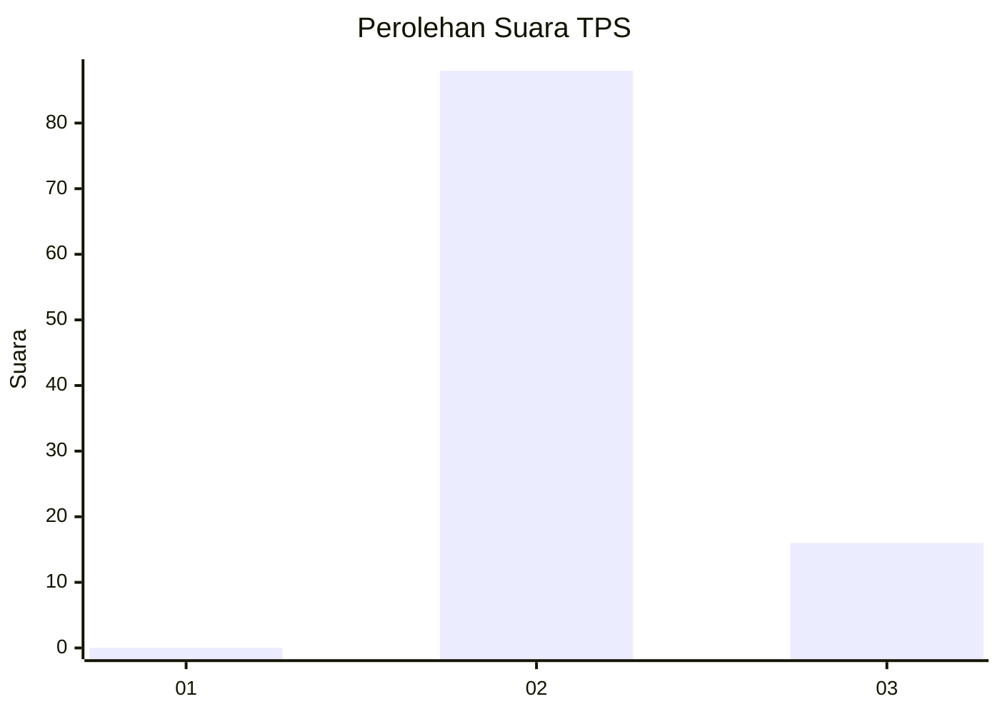
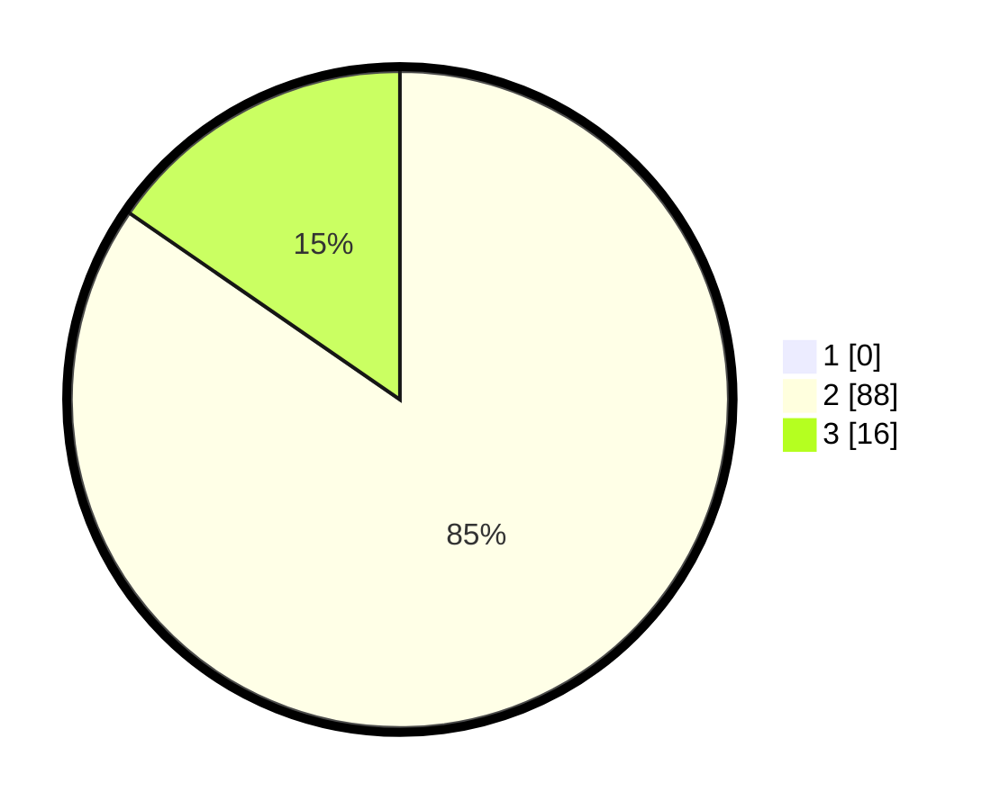

# Hasil

## Grafik

## Tabel

| No. | Nama Paslon    | Suara | Suara (raw) | Persentase |
|:--- |:-------------- | -----:| -----------:| ----------:|
| 1   | ANIES MUHAIMIN | 0     | [0][p-1]    | 0,00       |
| 2   | PRABOWO GIBRAN | 88    | [88][p-2]   | 84,62      |
| 3   | GANJAR MAHFUD  | 16    | [16][p-3]   | 15,38      |

[p-1]: https://github.com/gigit-pemilu/pemilu-2024/blob/main/pilpres/hitung-suara/sub/12-sumatera-utara/sub/14-nias-selatan/sub/11-hilimegai/sub/2011-soledua-ii/sub/002-tps/sub/paslon-1.txt
[p-2]: https://github.com/gigit-pemilu/pemilu-2024/blob/main/pilpres/hitung-suara/sub/12-sumatera-utara/sub/14-nias-selatan/sub/11-hilimegai/sub/2011-soledua-ii/sub/002-tps/sub/paslon-2.txt
[p-3]: https://github.com/gigit-pemilu/pemilu-2024/blob/main/pilpres/hitung-suara/sub/12-sumatera-utara/sub/14-nias-selatan/sub/11-hilimegai/sub/2011-soledua-ii/sub/002-tps/sub/paslon-3.txt

## Foto C Plano

https://sirekap-obj-formc.kpu.go.id/2f22/pemilu/ppwp/12/14/11/20/11/1214112011002-20240215-000420--fa249347-0c60-45ff-964d-537538d82a48.jpg

https://sirekap-obj-formc.kpu.go.id/2f22/pemilu/ppwp/12/14/11/20/11/1214112011002-20240215-000549--b894b784-2f3b-4c2d-8d4a-02d96767c827.jpg

https://sirekap-obj-formc.kpu.go.id/2f22/pemilu/ppwp/12/14/11/20/11/1214112011002-20240215-084822--6641c109-b4e9-4be0-b6d4-9d8607c382fa.jpg

## Metadata

| Key        | Value               |
| ---------- | ------------------- |
| Time Stamp | 2024-02-15 15:00:29 |

