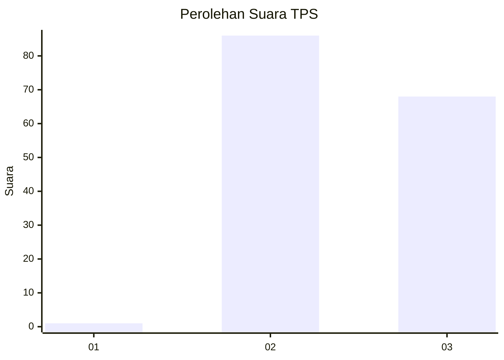
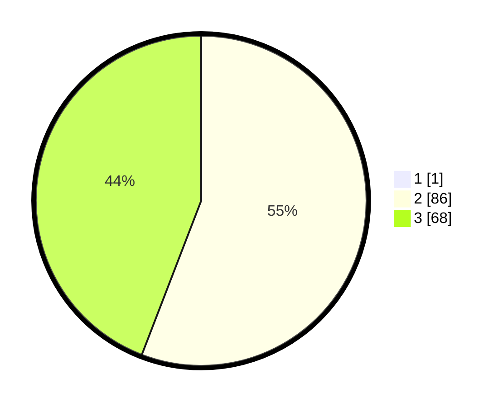

# Hasil

## Grafik

## Tabel

| No. | Nama Paslon    | Suara | Suara (raw) | Persentase |
|:--- |:-------------- | -----:| -----------:| ----------:|
| 1   | ANIES MUHAIMIN | 1     | [1][p-1]    | 0,65       |
| 2   | PRABOWO GIBRAN | 86    | [86][p-2]   | 55,48      |
| 3   | GANJAR MAHFUD  | 68    | [68][p-3]   | 43,87      |

[p-1]: https://github.com/gigit-pemilu/pemilu-2024-12-sumatera-utara/blob/main/pilpres/hitung-suara/sub/12-sumatera-utara/sub/14-nias-selatan/sub/12-toma/sub/2001-hilisataro/sub/001-tps/sub/paslon-1.txt
[p-2]: https://github.com/gigit-pemilu/pemilu-2024-12-sumatera-utara/blob/main/pilpres/hitung-suara/sub/12-sumatera-utara/sub/14-nias-selatan/sub/12-toma/sub/2001-hilisataro/sub/001-tps/sub/paslon-2.txt
[p-3]: https://github.com/gigit-pemilu/pemilu-2024-12-sumatera-utara/blob/main/pilpres/hitung-suara/sub/12-sumatera-utara/sub/14-nias-selatan/sub/12-toma/sub/2001-hilisataro/sub/001-tps/sub/paslon-3.txt

## Foto C Plano

https://sirekap-obj-formc.kpu.go.id/6d25/pemilu/ppwp/12/14/12/20/01/1214122001001-20240215-041329--a868801c-0555-401b-a101-8b2c60971bf9.jpg

https://sirekap-obj-formc.kpu.go.id/6d25/pemilu/ppwp/12/14/12/20/01/1214122001001-20240215-042418--552b8f48-0b9e-4f1c-afd6-fb6a63ce6132.jpg

https://sirekap-obj-formc.kpu.go.id/6d25/pemilu/ppwp/12/14/12/20/01/1214122001001-20240215-041739--9a81b472-94b7-4cec-8770-209dc8d6f8a8.jpg

## Metadata

| Key        | Value               |
| ---------- | ------------------- |
| Time Stamp | 2024-02-16 13:30:32 |

