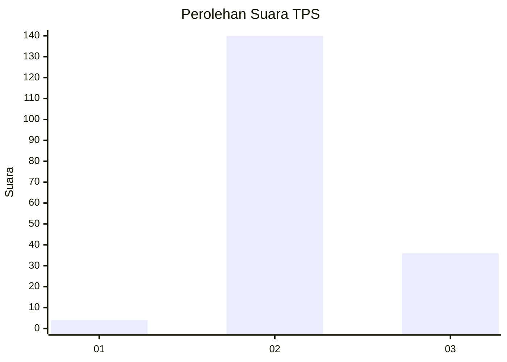

# Hasil

## Grafik

## Tabel

| No. | Nama Paslon    | Suara | Suara (raw) | Persentase |
|:--- |:-------------- | -----:| -----------:| ----------:|
| 1   | ANIES MUHAIMIN | 4     | [4][p-1]    | 2,22       |
| 2   | PRABOWO GIBRAN | 140   | [140][p-2]  | 77,78      |
| 3   | GANJAR MAHFUD  | 36    | [36][p-3]   | 20,00      |

[p-1]: https://github.com/gigit-pemilu/pemilu-2024/blob/main/pilpres/hitung-suara/sub/12-sumatera-utara/sub/14-nias-selatan/sub/12-toma/sub/2001-hilisataro/sub/003-tps/sub/paslon-1.txt
[p-2]: https://github.com/gigit-pemilu/pemilu-2024/blob/main/pilpres/hitung-suara/sub/12-sumatera-utara/sub/14-nias-selatan/sub/12-toma/sub/2001-hilisataro/sub/003-tps/sub/paslon-2.txt
[p-3]: https://github.com/gigit-pemilu/pemilu-2024/blob/main/pilpres/hitung-suara/sub/12-sumatera-utara/sub/14-nias-selatan/sub/12-toma/sub/2001-hilisataro/sub/003-tps/sub/paslon-3.txt

## Foto C Plano

https://sirekap-obj-formc.kpu.go.id/d2cd/pemilu/ppwp/12/14/12/20/01/1214122001003-20240215-025420--f2a4755c-cf30-4cfa-835c-4b684a9f7043.jpg

https://sirekap-obj-formc.kpu.go.id/d2cd/pemilu/ppwp/12/14/12/20/01/1214122001003-20240215-030002--99284e94-4827-4531-9a04-323294f36c61.jpg

https://sirekap-obj-formc.kpu.go.id/d2cd/pemilu/ppwp/12/14/12/20/01/1214122001003-20240215-030303--8538ee7d-5107-4d60-a640-f5fa344f9173.jpg

## Metadata

| Key        | Value               |
| ---------- | ------------------- |
| Time Stamp | 2024-02-15 15:00:29 |

