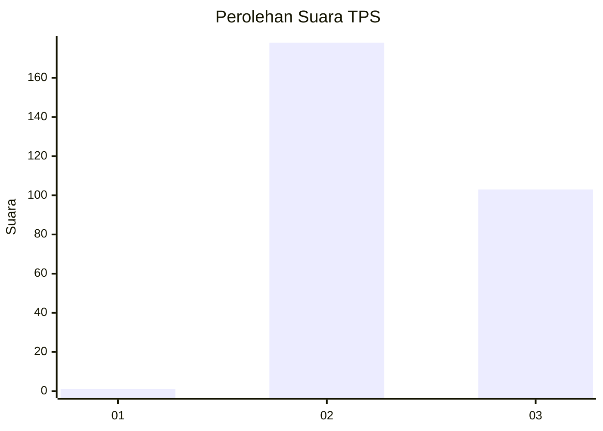
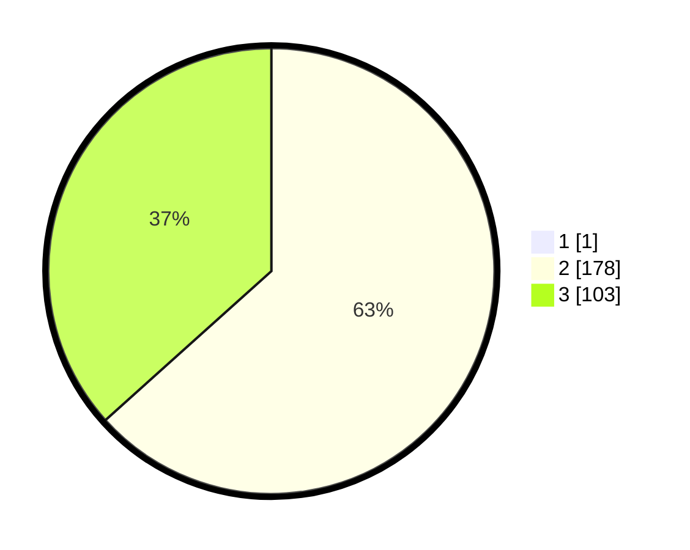

# Hasil

## Grafik

## Tabel

| No. | Nama Paslon    | Suara | Suara (raw) | Persentase |
|:--- |:-------------- | -----:| -----------:| ----------:|
| 1   | ANIES MUHAIMIN | 1     | [1][p-1]    | 0,35       |
| 2   | PRABOWO GIBRAN | 178   | [178][p-2]  | 63,12      |
| 3   | GANJAR MAHFUD  | 103   | [103][p-3]  | 36,52      |

[p-1]: https://github.com/gigit-pemilu/pemilu-2024-12-sumatera-utara/blob/main/pilpres/hitung-suara/sub/12-sumatera-utara/sub/14-nias-selatan/sub/12-toma/sub/2001-hilisataro/sub/004-tps/sub/paslon-1.txt
[p-2]: https://github.com/gigit-pemilu/pemilu-2024-12-sumatera-utara/blob/main/pilpres/hitung-suara/sub/12-sumatera-utara/sub/14-nias-selatan/sub/12-toma/sub/2001-hilisataro/sub/004-tps/sub/paslon-2.txt
[p-3]: https://github.com/gigit-pemilu/pemilu-2024-12-sumatera-utara/blob/main/pilpres/hitung-suara/sub/12-sumatera-utara/sub/14-nias-selatan/sub/12-toma/sub/2001-hilisataro/sub/004-tps/sub/paslon-3.txt

## Foto C Plano

https://sirekap-obj-formc.kpu.go.id/3346/pemilu/ppwp/12/14/12/20/01/1214122001004-20240215-080541--aca0009b-7a63-4db5-91f1-0b456d309f1d.jpg

https://sirekap-obj-formc.kpu.go.id/3346/pemilu/ppwp/12/14/12/20/01/1214122001004-20240215-080848--1ba6361f-5ba1-4803-8e87-b67e487ec9d9.jpg

https://sirekap-obj-formc.kpu.go.id/3346/pemilu/ppwp/12/14/12/20/01/1214122001004-20240215-081056--5e95b1b2-8cac-4594-8553-f899115e4a5f.jpg

## Metadata

| Key        | Value               |
| ---------- | ------------------- |
| Time Stamp | 2024-02-15 15:00:29 |

