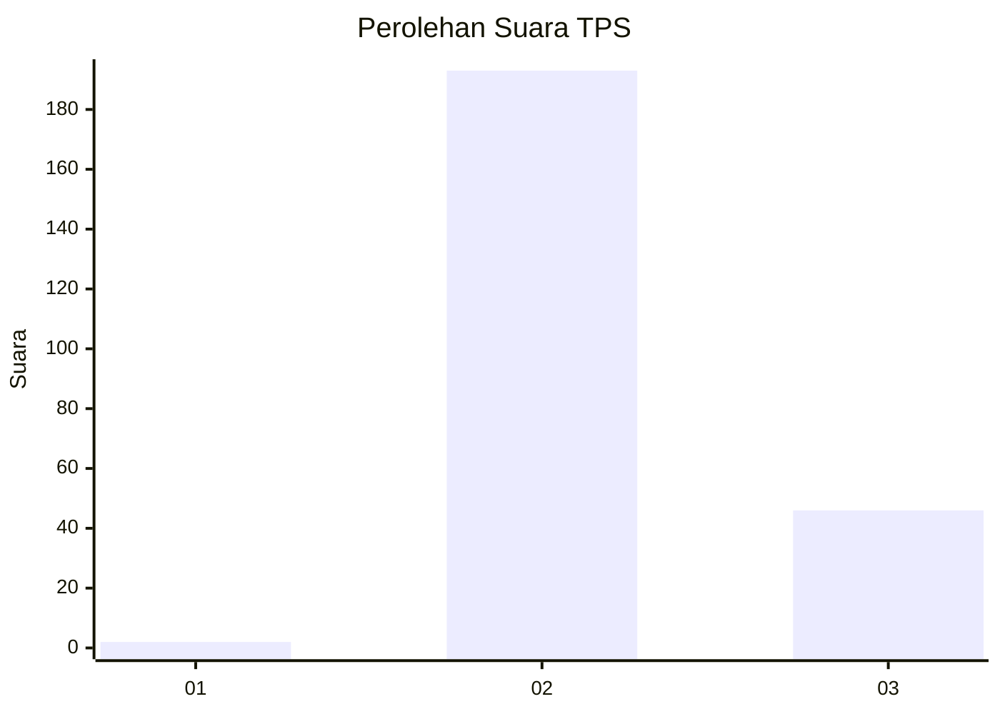
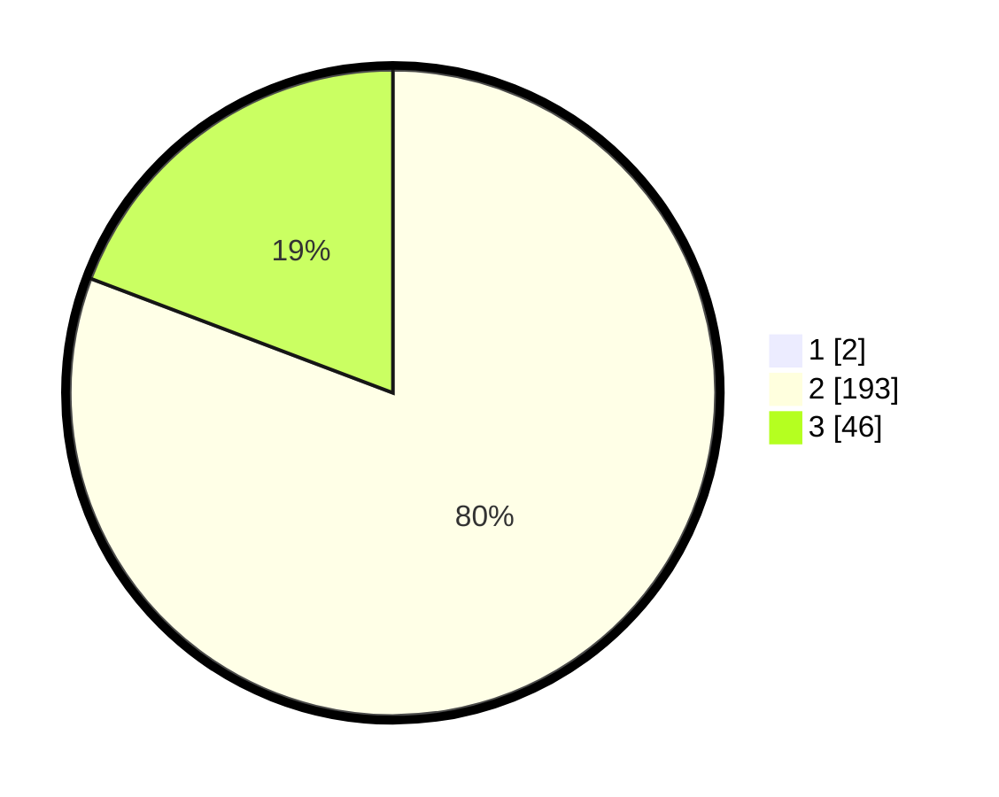

# Hasil

## Grafik

## Tabel

| No. | Nama Paslon    | Suara | Suara (raw) | Persentase |
|:--- |:-------------- | -----:| -----------:| ----------:|
| 1   | ANIES MUHAIMIN | 2     | [2][p-1]    | 0,83       |
| 2   | PRABOWO GIBRAN | 193   | [193][p-2]  | 80,08      |
| 3   | GANJAR MAHFUD  | 46    | [46][p-3]   | 19,09      |

[p-1]: https://github.com/gigit-pemilu/pemilu-2024-12-sumatera-utara/blob/main/pilpres/hitung-suara/sub/12-sumatera-utara/sub/14-nias-selatan/sub/12-toma/sub/2002-hilinamoniha/sub/001-tps/sub/paslon-1.txt
[p-2]: https://github.com/gigit-pemilu/pemilu-2024-12-sumatera-utara/blob/main/pilpres/hitung-suara/sub/12-sumatera-utara/sub/14-nias-selatan/sub/12-toma/sub/2002-hilinamoniha/sub/001-tps/sub/paslon-2.txt
[p-3]: https://github.com/gigit-pemilu/pemilu-2024-12-sumatera-utara/blob/main/pilpres/hitung-suara/sub/12-sumatera-utara/sub/14-nias-selatan/sub/12-toma/sub/2002-hilinamoniha/sub/001-tps/sub/paslon-3.txt

## Foto C Plano

https://sirekap-obj-formc.kpu.go.id/224f/pemilu/ppwp/12/14/12/20/02/1214122002001-20240215-101251--9ca87513-1ddd-44a4-98ec-e3177521a53c.jpg

https://sirekap-obj-formc.kpu.go.id/224f/pemilu/ppwp/12/14/12/20/02/1214122002001-20240215-101430--2c6495f1-1b34-40b0-b404-7703f740d67b.jpg

https://sirekap-obj-formc.kpu.go.id/224f/pemilu/ppwp/12/14/12/20/02/1214122002001-20240215-101703--3cc191cf-737c-4c86-ba7b-f7f881c9e689.jpg

## Metadata

| Key        | Value               |
| ---------- | ------------------- |
| Time Stamp | 2024-02-15 21:30:27 |

